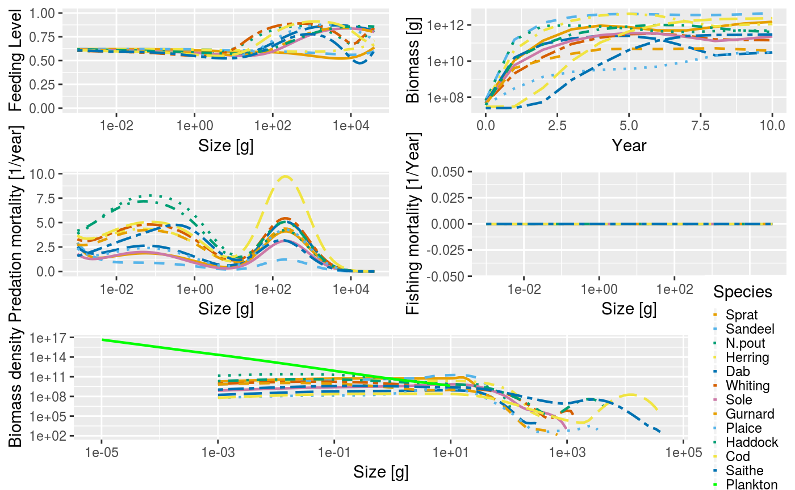

<!-- README.md is generated from README.Rmd. Please edit that file -->

# mizer

[](https://cran.r-project.org/package=mizer)
[](https://travis-ci.org/sizespectrum/mizer)
[](https://codecov.io/github/sizespectrum/mizer?branch=master)
[](https://cran.r-project.org/package=mizer)
[](http://www.rdocumentation.org/packages/mizer)

Mizer is an R package to run multi-species size-spectrum models of fish
communities. The package has been developed to model marine ecosystems
that are subject to fishing. However, it may also be appropriate for
other ecosystems.

The package contains routines and functions to allow users to set up an
ecosystem model, and then project it through time under different
fishing strategies. Methods are included to explore the results,
including plots and calculation of community indicators such as the
slope of the size spectrum. Size-based models can be complicated so
mizer contains many default options that can be easily changed by the
user.

Mizer can also be used to create web apps that allow users to explore
models without the need to install R. An [example of such an
app](https://mizer.shinyapps.io/selectivity/) investigates the effect of
switching to a gear with a T90 extension net to reduce the catches of
undersize hake and red mullet

Mizer is still under active development, currently funded by the
European Commission Horizon 2020 Research and Innovation Programme under
Grant Agreement No. 634495 for the project MINOUW
(<http://minouw-project.eu/>) and the Australian Research Council
Discovery Project (“Rewiring Marine Food Webs”).

Does your project or publication use mizer? If so, we’d love to know.
You can also join our Google Discussion group here:
<https://groups.google.com/forum/#!forum/size-spectrum-models>

## Installation

The package is on [CRAN](https://cran.r-project.org/package=mizer) and
therefore available from R’s build-it package manager.

``` r
# Install release version from CRAN
install.packages("mizer")

# Alternatively, install development version from GitHub
devtools::install_github("sizespectrum/mizer")
```

## Example

The following code loads the mizer package, loads some information about
species in the North Sea that comes as an example with the package, sets
up the parameters for the mizer model, and runs a simulation for 10
years.

``` r
library(mizer)
data(NS_species_params)
data(inter)
params <- set_multispecies_model(NS_species_params, inter)
sim <- project(params, t_max = 10, effort = 0)
```

The results of the simulation can then be analysed, for example via
plots:

``` r
plot(sim)
```

<!-- -->

See the accompanying [Get
started](https://sizespectrum.org/mizer/dev/articles/mizer.html)
page for more details on how the package works, including detailed
examples.
