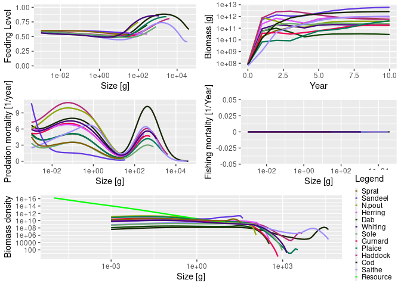

<!-- README.md is generated from README.Rmd. Please edit that file -->

<div style="text-align: center;">


[](https://cran.r-project.org/package=mizer)
[](https://cran.r-project.org/package=mizer)
[](https://cran.r-project.org/package=mizer)
[](https://app.codecov.io/github/sizespectrum/mizer?branch=master)

</div>

Mizer is an R package to run [dynamic multi-species size-spectrum
models](#dynamic-multi-species-size-spectrum-models) of fish
communities. The package has been developed to model marine ecosystems
that are subject to fishing. However, it may also be appropriate for
other aquatic ecosystems. By providing a framework for multi-species
fisheries modelling as an R package, mizer enhances the accessibility,
usability, and reproducibility of models, and thus aims to facilitate
collaboration and innovation.

The package contains functions that allow you to set up an ecosystem
model and then project it through time under different fishing
strategies. Methods are included to explore the results, including plots
and calculations of community indicators such as the slope of the size
spectrum. Size-based models can be complicated, so mizer contains many
default options that you can however change when needed.

<a href="https://sizespectrum.org/mizer/reference/figures/mizer_workflow.png" target="_blank">

</a>

<!-- Mizer can also be used to create web apps that allow users to explore models -->

<!-- without the need to install R. An [example of such an -->

<!-- app](https://mizer.shinyapps.io/selectivity/) investigates the effect of -->

<!-- switching to a gear with a T90 extension net to reduce the catches of undersize -->

<!-- hake and red mullet -->

Mizer has been supporting research in marine ecology and fisheries
science since 2014 ([see
publications](https://sizespectrum.org/mizer/articles/publications.html)).
Mizer is still under active development. Version 2.0 has increased the
user-friendliness and the flexibility of the framework. Contributions
from the user community are very welcome. There is a sister package
called [mizerExperimental](https://sizespectrum.org/mizerExperimental/)
where user contributions can be checked out and receive feedback from
the community. Example mizer models can be contributed to
[mizerExamples](https://sizespectrum.org/mizerExamples/). Follow us on
[twitter](https://x.com/mizer_model) and read our
[blog](https://blog.mizer.sizespectrum.org) to stay up-to-date with new
developments. Does your project or publication use mizer? If so, we
would love to know.

Recent work on mizer was funded by the European Commission Horizon 2020
Research and Innovation Programme under Grant Agreement No 634495 for
the project MINOUW (<http://minouw-project.eu/>) and the Australian
Research Council Discovery Project [Rewiring Marine Food
Webs](https://marinesocioecology.org/projects/rewiring-marine-food-webs-predicting-consequences-of-species-distribution-shifts-on-marine-communities/).

## Installation

The package is on [CRAN](https://cran.r-project.org/package=mizer) and
therefore available from R’s built-in package manager.

``` r
# Install latest released version from CRAN
install.packages("mizer")

# Alternatively, install the development version from GitHub
remotes::install_github("sizespectrum/mizer")
```

## Example

The following code loads the mizer package, loads some information about
species in the North Sea that comes as an example with the package, sets
up the parameters for the mizer model, and runs a simulation for 10
years.

``` r
library(mizer)
params <- newMultispeciesParams(NS_species_params, NS_interaction)
sim <- project(params, t_max = 10, effort = 0)
```

The results of the simulation can then be analysed, for example via
plots:

``` r
plot(sim)
```

<!-- -->

See the accompanying [Get
started](https://sizespectrum.org/mizer/articles/mizer.html) page for
more details on how the package works, including detailed examples.

<a href="https://sizespectrum.org/mizer/reference/figures/size_spectrum.png" target="_blank">

</a>

## Dynamic multi-species size-spectrum model

Size-based multi-species models are important for fisheries science
because they provide a more realistic and accurate representation of the
dynamics of fish populations and the ecosystems in which they live. In
contrast to traditional single-species models, which consider a single
fish stock as an isolated unit, size-based multi-species models account
for the fact that fish populations are part of a larger ecosystem and
interact with other species through predation, competition, and other
ecological processes.

One of the key advantages of size-based multi-species models is that
they provide a more comprehensive understanding of the impacts of
fishing on fish populations and ecosystems. By considering the size
distribution of different fish species, these models can capture the
effects of fishing on both target and non-target species, and on
different life stages of a species. This is particularly important for
species that are caught as bycatch or that are indirectly affected by
fishing through changes in their food web.

Another advantage of size-based multi-species models is that they can be
used to investigate the effects of environmental changes and other
perturbations on fish populations and ecosystems. For example, these
models can be used to explore the impacts of climate change on the
distribution and abundance of fish populations, or the effects of
habitat loss or pollution on fish communities. Because mizer is a
mechanistic model, it can deduce the complex population-level changes
that we are interested in from the simpler changes in the physiological
rates and feeding interactions of individual fish species.

Overall, size-based multi-species models provide a more comprehensive
and realistic framework for understanding the dynamics of fish
populations and ecosystems, and for developing effective fisheries
management strategies that account for the complex interactions among
species and their environment.


A mizer model captures the interactions between species. The growth
rates of fish are determined by the availability of prey and the death
rates are influenced by the abundance of predators, as well as fishing.
The model starts with the individual-level physiological rates for each
species, as well as the predation preferences, and deduces the
population-level dynamics from these. Thus quantities like fish diets
and fisheries yields emerge dynamically and can be projected into the
future.

Because a mizer model tracks the size of individuals as they grow up
over several orders of magnitude from their egg size to their maximum
size, it correctly tracks the ontogenetic diet shifts. An individual
typically moves through several trophic levels during its life time.
This is often not correctly captured in other multi-species models.

A mizer model can be set up with only a small amount of information
because it uses allometric scaling relations and size-based feeding
rules to choose sensible defaults for unknown parameters.

Setting up a new multi-species mizer model is a two-step process,
similar to what may be familiar from Ecopath with Ecosim: First one
calibrates the model to describe a steady state that is in agreement
with current observations (as in Ecopath), then one chooses the
additional parameters that determine the dynamics away from the steady
state (as in Ecosim). This model can then be used to investigate future
effects of changes in fishing policy or of environmental stressors.

## A strong theoretical basis

One big advantage of a mizer model is that it is based on a strong
mathematical foundation. This allows a degree of a priori understanding
of the behaviour of the model that is absent in many other multi-species
models. This theoretical foundation is well presented in the book “Fish
Ecology, Evolution, and Exploitation” by Ken Andersen.

It is interesting to think of the marine ecosystem as a transport system
that moves biomass from the size of primary producers (mostly
unicellular plankton) up to the sizes of fish that humans like to
consume. Each fish that grows up from egg size to maturity by eating
smaller individuals is like a car on this biomass highway. The yield of
our fisheries depend on this traffic flowing smoothly and without
traffic jams.

An analogy with road traffic may be helpful:

<a href="https://sizespectrum.org/mizer/reference/figures/traffic_jam.png" target="_blank">

</a>

In road traffic, if traffic density gets too high in a section of the
highway, drivers slow down, which leads to a pile-up producing even
higher traffic density, leading to further slow-down in a potentially
vicious cycle known as a traffic jam. Traffic management that ignores
how the traffic density affects traffic speed fails. Luckily our
mathematical understanding of transport equations has made practical
contributions to managing traffic in ways that produce smoother traffic
flow and hence higher throughput.

Mizer implements the transport equations for marine ecosystems. The
potential for traffic jams is the same: if for example there is a high
density of predators of a particular size, which all have preference for
prey of a particular smaller size, then due to competition for that prey
the growth of those predators slows down, leading to a pile-up which
leads to further depletion of prey, leading to further slow-down, in a
potentially vicious cycle.

Luckily, the natural ecosystem has evolved to facilitate very smooth
traffic on this biomass highway, with resultant high productivity. This
state is characterised by an approximate power-law shape of the biomass
size spectrum. The purpose of mizer is to allow us to understand how
various stressors, like fishing or climate change, affect the size
spectrum and hence the flow of biomass and the productivity and
resilience of the marine ecosystem. Mizer allows us to investigate how
size-based fisheries management strategies can be used to keep the
ecosystem close to its natural productive state.
