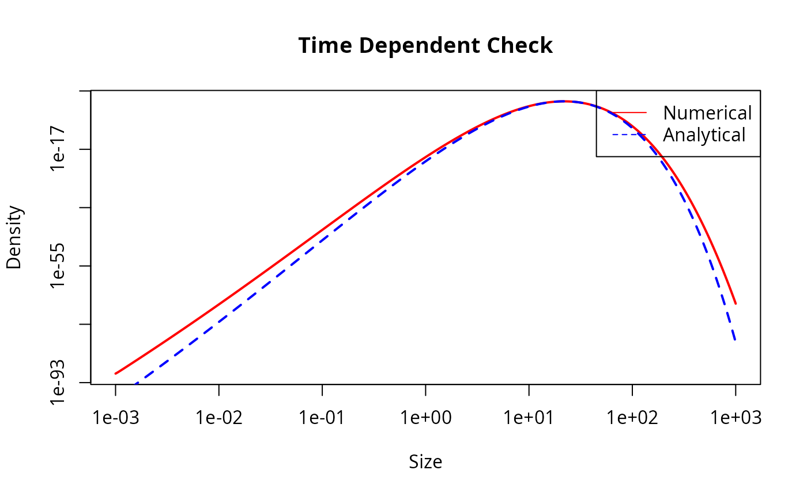
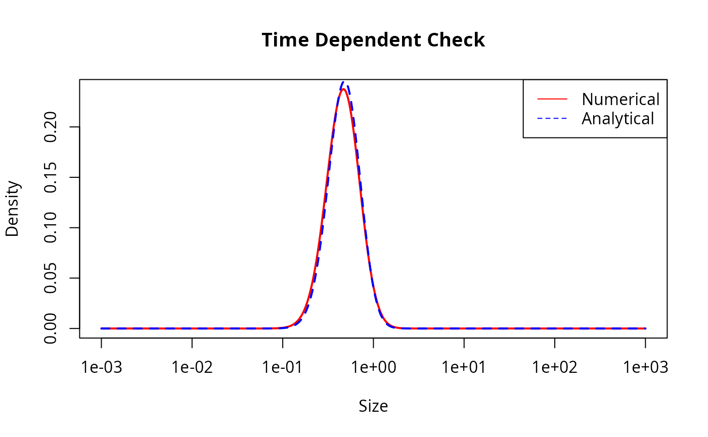
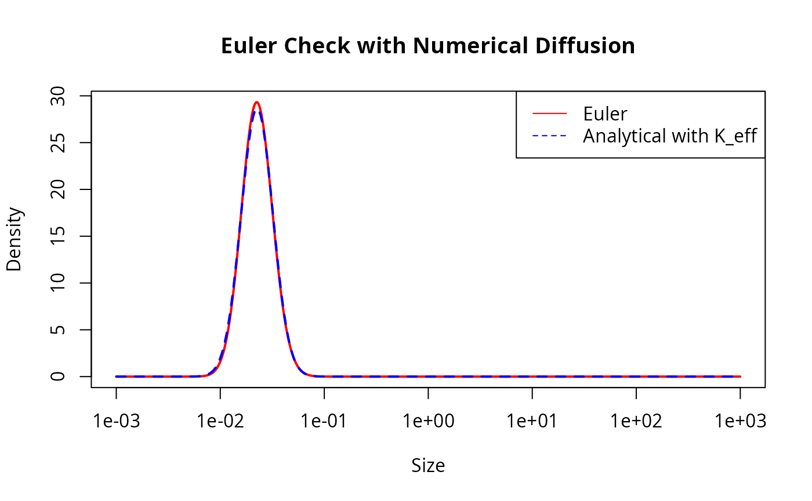
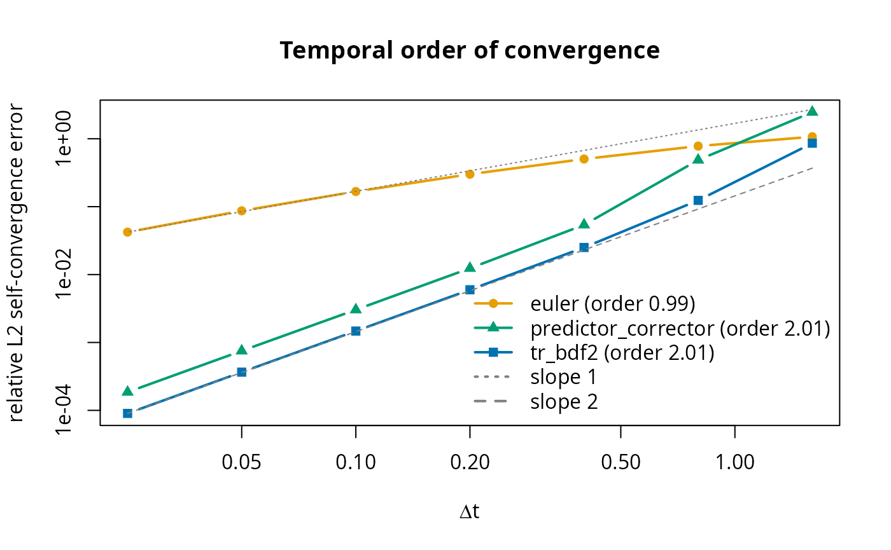
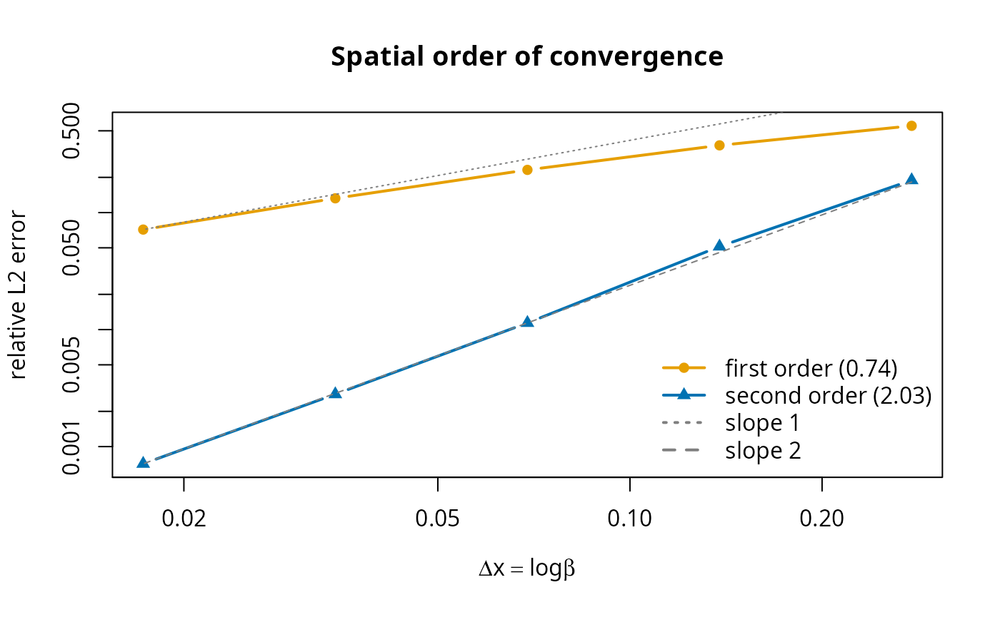

# Analytic Test

This vignette describes an analytical test for the transport equation
solver used in mizer.

## The transport equation

The time evolution of the size spectrum \\N(w)\\ is described by the
McKendrick-von Foerster equation with an added diffusion term:

\\\begin{equation} \frac{\partial N}{\partial t} +
\frac{\partial}{\partial w} \left( g N - \frac{1}{2}\frac{\partial(D
N)}{\partial w} \right) = -\mu N, \end{equation}\\

where \\g(w)\\ is the growth rate, \\\mu(w)\\ is the mortality rate and
\\D(w)\\ is the diffusion rate.

We will look for a solutions when the rates are power laws of the form:

\\\begin{align} g(w) &= A w^p, \\ \mu(w) &= B w^{p-1}, \\ D(w) &= K
w^{p+1}. \end{align}\\

## Analytical steady-state solution

We try a power-law ansatz for the solution: \\ N(w) = C w^{-\lambda}. \\
Substituting these forms into the transport equation at steady state
(\\\partial N / \partial t = 0\\):

\\ \frac{\partial}{\partial w} \left( A w^p C w^{-\lambda} -
\frac{1}{2}\frac{\partial}{\partial w}(K w^{p+1} C w^{-\lambda}) \right)
= - B w^{p-1} C w^{-\lambda}. \\

We simplify the term inside the derivative: \\ D N = K C
w^{p+1-\lambda}, \\ \\ \frac{\partial(D N)}{\partial w} = K C
(p+1-\lambda) w^{p-\lambda}, \\ \\ g N - \frac{1}{2}\frac{\partial(D
N)}{\partial w} = \left( A - \frac{1}{2} K (p+1-\lambda) \right) C
w^{p-\lambda}.\\ Thus the flux is \\J = J_0 w^{p-\lambda}\\ with \\J_0 =
C \left( A - \frac{1}{2} K (p+1-\lambda) \right)\\.

Differentiating the flux with respect to \\w\\ gives \\ \frac{\partial
J}{\partial w} = J_0 (p-\lambda) w^{p-\lambda-1}. \\

The RHS is \\ -\mu N = - B C w^{p-1-\lambda}. \\

Equating LHS and RHS gives \\ C \left( A - \frac{1}{2} K (p+1-\lambda)
\right) (p-\lambda) w^{p-\lambda-1} = - B C w^{p-\lambda-1}. \\

Dividing by \\C w^{p-\lambda-1}\\ (assuming \\C \neq 0\\ and \\w \neq
0\\): \\ \left( A - \frac{1}{2} K (p+1-\lambda) \right) (p-\lambda) + B
= 0. \\

Let \\x = p - \lambda\\. Then \\p + 1 - \lambda = x + 1\\. The equation
becomes: \\ \left( A - \frac{1}{2} K (x+1) \right) x + B = 0. \\ or,
equivalently, \\ Ax - \frac{1}{2} K x^2 - \frac{1}{2} K x + B = 0. \\ We
multiply by -2: \\ K x^2 - (2A - K) x - 2B = 0. \\

This is a quadratic equation for \\x = p - \lambda\\. The solutions are:
\\ x = \frac{(2A - K) \pm \sqrt{(2A - K)^2 + 8KB}}{2K}.\\

We are interested in the solution that corresponds to the limit of small
diffusion \\K \to 0\\. In that limit, \\g N \sim C A w^{p-\lambda}\\ and
\\\frac{\partial (gN)}{\partial w} \sim C A (p-\lambda)
w^{p-\lambda-1}\\. The transport equation without diffusion is
\\\frac{\partial (gN)}{\partial w} = -\mu N\\. \\ A (p-\lambda) = -B
\implies x = p-\lambda = -B/A. \\ Since \\A, B \> 0\\, \\x\\ should be
negative. Let’s check the roots. \\(2A-K)^2 + 8KB \> (2A-K)^2\\, so the
square root is larger than \\\|2A-K\|\\. The term \\(2A-K)\\ is positive
for small \\K\\. The positive root is \\\frac{(2A-K) +
\text{larger}}{2K} \> 0\\. The negative root is \\\frac{(2A-K) -
\text{larger}}{2K} \< 0\\. So we need the negative root:

\\ \begin{split} \lambda &= p - \frac{(2A - K) - \sqrt{(2A - K)^2 +
8KB}}{2K}\\ &=p + \frac{4B}{(2A - K) + \sqrt{(2A - K)^2 + 8KB}}.
\end{split} \\ The second expression above is better for numerical
evaluation because it avoids the subtraction of two similarly sized
numbers.

### Numerical verification

We verify this analytical solution by considering a single species in
mizer and checking if the
[`project()`](https://sizespectrum.org/mizer/reference/project.md)
function keeps the system in this steady state. First we set up a mizer
model with the power law rates:

``` r

library(mizer)

# Parameters
p <- 0.7
A <- 1
B <- 0.5
K <- 0.1

# Calculate lambda
# coefficients for K x^2 - (2A - K) x - 2B = 0
a_quad <- K
b_quad <- -(2*A - K)
c_quad <- -2*B

det <- b_quad^2 - 4 * a_quad * c_quad
x <- 4 * B / (-b_quad + sqrt(det))
lambda <- p + x

# Set up mizer params
# We create a dummy species
sp <- data.frame(species = "Test",
                 w_max = 1000,
                 w_mat = 100)
params <- newMultispeciesParams(sp, no_w = 1000, min_w = 1e-3,
                                info_level = 0)

# Set initial N to analytical solution
initialN(params) <- matrix(w(params)^(-lambda), nrow = 1, byrow = TRUE)

# Define custom rate functions
# Growth
start_growth <- function(params, ...) {
    matrix(A * params@w^p, nrow = 1, byrow = TRUE)
}
params <- setRateFunction(params, "EGrowth", "start_growth")

# Mort
start_mort <- function(params, ...) {
    matrix(B * params@w^(p - 1), nrow = 1, byrow = TRUE)
}
params <- setRateFunction(params, "Mort", "start_mort")

# Diffusion
ext_diffusion(params)[1, ] <- K * w(params)^(p + 1)

# RDD (Constant Flux)
params@species_params$constant_reproduction <- getRequiredRDD(params)
params <- setRateFunction(params, "RDD", "constantRDD")
```

We can now project this forward in time and check that the result stays
the same.

``` r

# Run project
# We verify that N stays constant.
sim <- project(params, t_max = 1, dt = 0.1, method = "predictor-corrector")

# Compare final N with initial N
n0 <- initialN(params)[1, ]
n1 <- finalN(sim)[1, ]

# Plot
plot(w(params), n0, log="xy", type="l", col="blue", lwd=2, 
     main="Comparison of numerical and analytical solution",
     xlab="Size", ylab="Density")
lines(w(params), n1, col="red", lty=2, lwd=2)
legend("topright", legend=c("Analytical", "Numerical"), 
       col=c("blue", "red"), lty=c(1, 2))
```



``` r


# Calculate relative error
rel_err <- abs(n1 - n0) / n0
# ignore last 100 bins because they are affected by the right boundary
max_rel_err <- max(rel_err[1:980])
print(paste("Maximum relative error:", max_rel_err))
#> [1] "Maximum relative error: 0.00596547751519771"

if (max_rel_err < 0.01) {
  print("Test passed: Numerical solution stays close to analytical steady state.")
} else {
  print("Test failed: Numerical solution deviates from analytical steady state.")
}
#> [1] "Test passed: Numerical solution stays close to analytical steady state."
```

## Time-dependent analytical solution

To facilitate an analytical solution for time-dependent problems, we
first transform the size variable \\w\\ to a new variable \\x\\: \\ x =
\frac{w^{1-p}}{1-p}. \\ Assuming \\p \neq 1\\. Then \\w =
((1-p)x)^{\frac{1}{1-p}}\\ and \\\frac{dx}{dw} = w^{-p}\\.

We define the density in \\x\\-space, \\\tilde{N}(x, t)\\, such that
\\\tilde{N}(x, t) dx = N(w, t) dw\\. Thus \\ \tilde{N}(x, t) = N(w, t)
\frac{dw}{dx} = N(w, t) w^p. \\

Substituting this into the transport equation and simplifying leads to a
PDE of the form: \\ \frac{\partial \tilde{N}}{\partial t} = V x
\frac{\partial^2 \tilde{N}}{\partial x^2} + (V - U) \frac{\partial
\tilde{N}}{\partial x} - \frac{b}{x} \tilde{N} ,\\ where \\U = A -
\frac{1}{2}K\\, \\V = \frac{1}{2} K (1-p)\\, \\b = \frac{B}{1-p}\\.

The fundamental solution (Green’s function) for this equation,
describing the evolution of an initial Dirac delta distribution
\\\tilde{N}(x, 0) = \delta(x - x_0)\\, is given by \\ G(x, t; x_0) =
\frac{1}{Vt} \left( \frac{x}{x_0} \right)^{\frac{U}{2V}} \exp\left(
-\frac{x+x_0}{Vt} \right) I\_\nu \left( \frac{2\sqrt{xx_0}}{Vt} \right),
\\ where \\I\_\nu\\ is the modified Bessel function of the first kind of
order \\\nu\\, given by \\ \nu = \frac{1}{V} \sqrt{U^2 + 4Vb} .\\

The solution in terms of the original size distribution \\N(w, t)\\ is
then \\ N(w, t) = G(x(w), t; x(w_0)) w^{-p} .\\

### Numerical verification

We verify this time-dependent solution by starting the simulation with
the analytical distribution at a small time \\t\_{start} \> 0\\ (to
avoid the singularity at \\t=0\\) and projecting it to a later time
\\t\_{end}\\.

``` r

# Function to calculate N analytic
N_analytic <- function(w, t, w0, t0, K_eff = 0.1) {
  # Parameters
  p <- 0.7
  A <- 1
  B <- 0.5
  
  # Transformed parameters
  U <- A - 0.5 * K_eff
  V <- 0.5 * K_eff * (1 - p)
  b <- B / (1 - p)
  nu <- sqrt((U/V)^2 + 4 * b / V)

  # Time elapsed
  dt <- t - t0
  if (dt <= 0) stop("t must be greater than t0")
  
  # Transform to x
  x <- w^(1 - p) / (1 - p)
  x0 <- w0^(1 - p) / (1 - p)
  
  # Argument for Bessel
  z <- 2 * sqrt(x * x0) / (V * dt)
  
  # Logarithm of N_tilde using scaled Bessel to avoid overflow
  bessel_scaled <- besselI(z, nu, expon.scaled = TRUE)
  
  log_N_tilde <- -log(V * dt) + 
                 (U / (2 * V)) * log(x / x0) - 
                 (x + x0) / (V * dt) + 
                 z + 
                 log(bessel_scaled)
  
  N_tilde <- exp(log_N_tilde)
  
  # Transform back to N(w)
  N <- N_tilde * w^(-p)
  
  return(N)
}
```

``` r

# Initial Condition
w0 <- 1e-2
t_start <- 0.1
t_end <- 2

# Set initial N from analytical solution
initial_n <- N_analytic(w(params), t_start, w0, 0)
initialN(params) <- matrix(initial_n, nrow = 1, byrow = TRUE)
```

We can simplify the left boundary condition because it is far enough
away from the Gaussian for us to set the solution to 0 there.

``` r

# Set RDD to 0
params@species_params$constant_reproduction <- 0
params <- setRateFunction(params, "RDD", "constantRDD")
```

Now we project forward in time.

``` r

# Run project
sim <- project(params, t_max = t_end - t_start, dt = 0.05,
               t_save = t_end - t_start,
               method = "predictor-corrector")

# Compare
final_n_num <- finalN(sim)[1, ]
final_n_ana <- N_analytic(w(params), t_end, w0, 0)

# Plot
plot(w(params), final_n_num, log = "x", type = "l", col = "red", lwd = 2, 
     main = "Time Dependent Check", xlab = "Size", ylab = "Density")

lines(w(params), final_n_ana, col = "blue", lty = 2, lwd = 2)
legend("topright", legend = c("Numerical", "Analytical"),
       col = c("red", "blue"), lty = c(1, 2))
```



This looks good but let us also look at the agreement quantitatively:

``` r

# Robust comparison metrics
# 1. Total Abundance (Conservation)
total_n_num <- sum(final_n_num * params@dw)
total_n_ana <- sum(final_n_ana * params@dw)
rel_err_total <- abs(total_n_num - total_n_ana) / total_n_ana

# 2. Peak Location
peak_idx_num <- which.max(final_n_num)
peak_idx_ana <- which.max(final_n_ana)
peak_w_num <- w(params)[peak_idx_num]
peak_w_ana <- w(params)[peak_idx_ana]
rel_err_peak_loc <- abs(peak_w_num - peak_w_ana) / peak_w_ana

# 3. Peak Height
peak_val_num <- max(final_n_num)
peak_val_ana <- max(final_n_ana)
rel_err_peak_val <- abs(peak_val_num - peak_val_ana) / peak_val_ana

print(paste("Total Abundance Error:", rel_err_total))
#> [1] "Total Abundance Error: 0.00480520170128005"
print(paste("Peak Location Error:", rel_err_peak_loc))
#> [1] "Peak Location Error: 0.0406391712906862"
print(paste("Peak Height Error:", rel_err_peak_val))
#> [1] "Peak Height Error: 0.0323776398076434"

# Pass conditions: 
#   < 0.5% abundance error, 
#   < 5% location shift, 
#   < 4% height difference (diffusive flattening)
if (rel_err_total < 0.005 && 
    rel_err_peak_loc < 0.05 && 
    rel_err_peak_val < 0.04) {
  print("Time-dependent test passed.")
} else {
  print("Time-dependent test failed.")
}
#> [1] "Time-dependent test passed."
```

## Numerical diffusion

### In the Euler method

The Euler method uses a first-order upwind treatment of the advective
growth term. This introduces numerical diffusion. For locally constant
growth rate and grid spacing, the expected numerical diffusion is \\
D\_\mathrm{num} \approx g(w) \Delta w + g(w)^2 \Delta t. \\

On the logarithmic mizer grid we have approximately \\\Delta w =
(\beta\_\mathrm{grid} - 1)w\\. To keep the analytical solution in the
same power-law family, we use the special case \\p = 1\\. Then \\g(w) =
A w\\ and both numerical diffusion terms scale like \\w^2\\: \\
D\_\mathrm{num}(w) \approx \left(A(\beta\_\mathrm{grid} - 1) + A^2
\Delta t\right)w^2. \\ So the Euler method with physical diffusion \\K
w^2\\ should behave like the continuous equation with \\ K\_\mathrm{eff}
= K + A(\beta\_\mathrm{grid} - 1) + A^2 \Delta t. \\

For \\p = 1\\ the transformed variable is \\x = \log w\\. The density
\\\tilde N(x, t) = w N(w, t)\\ satisfies an advection-diffusion equation
with constant diffusion and constant mortality. The Green’s function is
therefore a lognormal density: \\ N(w,t) = \frac{\exp\[-B(t-t_0)\]}{w}
\phi\left(\log w;\\ \log w_0 + \left(A -
\frac{K\_\mathrm{eff}}{2}\right)(t-t_0), K\_\mathrm{eff}(t-t_0)\right),
\\ where \\\phi(x; m, v)\\ is the normal density with mean \\m\\ and
variance \\v\\.

``` r

# Parameters for the Euler numerical diffusion check
p_euler <- 1
A_euler <- 1
B_euler <- 0.5
K_euler <- 0.1
dt_euler <- 0.01

N_lognormal <- function(w, t, w0, t0, K_eff) {
    dt <- t - t0
    if (dt <= 0) stop("t must be greater than t0")
    
    x <- log(w)
    mean_x <- log(w0) + (A_euler - 0.5 * K_eff) * dt
    
    exp(-B_euler * dt) *
        dnorm(x, mean = mean_x, sd = sqrt(K_eff * dt)) / w
}

start_growth_euler <- function(params, ...) {
    matrix(A_euler * params@w^p_euler, nrow = 1, byrow = TRUE)
}

start_mort_euler <- function(params, ...) {
    matrix(B_euler * params@w^(p_euler - 1), nrow = 1, byrow = TRUE)
}

params_euler <- newMultispeciesParams(sp, no_w = 1000, min_w = 1e-3,
                                      info_level = 0)
params_euler <- setRateFunction(params_euler, "EGrowth",
                                "start_growth_euler")
params_euler <- setRateFunction(params_euler, "Mort", "start_mort_euler")
ext_diffusion(params_euler)[1, ] <- K_euler * w(params_euler)^2

# The pulse stays well away from the left boundary, so no recruitment enters.
params_euler@species_params$constant_reproduction <- 0
params_euler <- setRateFunction(params_euler, "RDD", "constantRDD")

beta_grid <- w(params_euler)[2] / w(params_euler)[1]
K_num <- A_euler * (beta_grid - 1) + A_euler^2 * dt_euler
K_eff <- K_euler + K_num

w0_euler <- 1e-2
t_start_euler <- 0.1
t_end_euler <- 1

initial_n_euler <- N_lognormal(w(params_euler), t_start_euler, w0_euler,
                               0, K_eff)
initialN(params_euler) <- matrix(initial_n_euler, nrow = 1, byrow = TRUE)
```

We project with the Euler method and compare against the exact solution
with the effective diffusion coefficient.

``` r

sim_euler <- project(params_euler,
                     t_max = t_end_euler - t_start_euler,
                     dt = dt_euler,
                     t_save = t_end_euler - t_start_euler,
                     t_start = t_start_euler,
                     method = "euler",
                     progress_bar = FALSE)

final_n_euler <- finalN(sim_euler)[1, ]
final_n_euler_ana <- N_lognormal(w(params_euler), t_end_euler, w0_euler,
                                 0, K_eff)

plot(w(params_euler), final_n_euler, log = "x", type = "l", col = "red",
     lwd = 2, main = "Euler Check with Numerical Diffusion",
     xlab = "Size", ylab = "Density")
lines(w(params_euler), final_n_euler_ana, col = "blue", lty = 2, lwd = 2)
legend("topright", legend = c("Euler", "Analytical with K_eff"),
       col = c("red", "blue"), lty = c(1, 2))
```



``` r

total_euler <- sum(final_n_euler * params_euler@dw)
total_euler_ana <- sum(final_n_euler_ana * params_euler@dw)
rel_err_total_euler <- abs(total_euler - total_euler_ana) / total_euler_ana

peak_idx_euler <- which.max(final_n_euler)
peak_idx_euler_ana <- which.max(final_n_euler_ana)
peak_w_euler <- w(params_euler)[peak_idx_euler]
peak_w_euler_ana <- w(params_euler)[peak_idx_euler_ana]
rel_err_peak_loc_euler <- abs(peak_w_euler - peak_w_euler_ana) /
    peak_w_euler_ana

peak_val_euler <- max(final_n_euler)
peak_val_euler_ana <- max(final_n_euler_ana)
rel_err_peak_val_euler <- abs(peak_val_euler - peak_val_euler_ana) /
    peak_val_euler_ana

print(paste("Expected numerical diffusion coefficient:", K_num))
#> [1] "Expected numerical diffusion coefficient: 0.0239254075588153"
print(paste("Effective diffusion coefficient:", K_eff))
#> [1] "Effective diffusion coefficient: 0.123925407558815"
print(paste("Total Abundance Error:", rel_err_total_euler))
#> [1] "Total Abundance Error: 0.00112189285798662"
print(paste("Peak Location Error:", rel_err_peak_loc_euler))
#> [1] "Peak Location Error: 0"
print(paste("Peak Height Error:", rel_err_peak_val_euler))
#> [1] "Peak Height Error: 0.0245757881629701"

if (rel_err_total_euler < 0.005 &&
    rel_err_peak_loc_euler < 0.005 &&
    rel_err_peak_val_euler < 0.05) {
  print("Euler numerical diffusion test passed.")
} else {
  print("Euler numerical diffusion test failed.")
}
#> [1] "Euler numerical diffusion test passed."
```

### In the predictor-corrector method

The first-order upwind discretisation of the growth term introduces
numerical diffusion even when the predictor-corrector time step is used.
For this method the leading-order time discretisation diffusion is
removed, so the expected additional diffusion is only the spatial
contribution \\D\_\mathrm{num}(w) \approx g(w) \Delta w.\\ On the
logarithmic mizer grid this has the same power-law form as the physical
diffusion: \\ D\_\mathrm{num}(w) \approx A(\beta\_\mathrm{grid} - 1)
w^{p+1}. \\ We can therefore check whether the agreement improves if the
exact solution is evaluated with \\K\_\mathrm{eff} = K +
A(\beta\_\mathrm{grid} - 1).\\

``` r

beta_grid <- w(params)[2] / w(params)[1]
K_num_pc <- A * (beta_grid - 1)
K_eff_pc <- K + K_num_pc

final_n_ana_pc <- N_analytic(w(params), t_end, w0, 0, K_eff_pc)

total_n_ana_pc <- sum(final_n_ana_pc * params@dw)
rel_err_total_pc <- abs(total_n_num - total_n_ana_pc) / total_n_ana_pc

peak_idx_ana_pc <- which.max(final_n_ana_pc)
peak_w_ana_pc <- w(params)[peak_idx_ana_pc]
rel_err_peak_loc_pc <- abs(peak_w_num - peak_w_ana_pc) / peak_w_ana_pc

peak_val_ana_pc <- max(final_n_ana_pc)
rel_err_peak_val_pc <- abs(peak_val_num - peak_val_ana_pc) / peak_val_ana_pc

print(paste("Predictor-corrector numerical diffusion coefficient:", K_num_pc))
#> [1] "Predictor-corrector numerical diffusion coefficient: 0.0139254075588153"
print(paste("Predictor-corrector effective diffusion coefficient:", K_eff_pc))
#> [1] "Predictor-corrector effective diffusion coefficient: 0.113925407558815"
print(paste("Adjusted Total Abundance Error:", rel_err_total_pc))
#> [1] "Adjusted Total Abundance Error: 0.00066753836710786"
print(paste("Adjusted Peak Location Error:", rel_err_peak_loc_pc))
#> [1] "Adjusted Peak Location Error: 0"
print(paste("Adjusted Peak Height Error:", rel_err_peak_val_pc))
#> [1] "Adjusted Peak Height Error: 0.0226085133793947"

if (rel_err_total_pc < rel_err_total &&
    rel_err_peak_loc_pc <= rel_err_peak_loc &&
    rel_err_peak_val_pc < rel_err_peak_val) {
  print("Accounting for numerical diffusion improves the agreement.")
} else {
  print("Accounting for numerical diffusion does not improve all metrics.")
}
#> [1] "Accounting for numerical diffusion improves the agreement."

# Pass conditions: 
#   < 0.5% abundance error, 
#   < 5% location shift, 
#   < 4% height difference (diffusive flattening)
if (rel_err_total_pc < 0.001 &&
    rel_err_peak_loc_pc < 1e-6 &&
    rel_err_peak_val_pc < 0.03) {
  print("Numerical diffusion test passed.")
} else {
  print("Numerical diffusion test failed.")
}
#> [1] "Numerical diffusion test passed."
```

## Order of convergence in time

[`project()`](https://sizespectrum.org/mizer/reference/project.md)
offers three time-stepping schemes (the `method` argument): the
first-order `"euler"` scheme and the two second-order schemes
`"predictor_corrector"` (a Crank-Nicolson corrector) and `"tr_bdf2"` (an
L-stable TR-BDF2 scheme). The time-dependent solution above lets us
verify these orders directly.

We cannot read the temporal order off a comparison with the analytic
solution, because that error is dominated by the **spatial** numerical
diffusion of the first-order upwind scheme (see the previous section),
which is independent of the time step and so does not vanish as \\\Delta
t \to 0\\. To isolate the **temporal** error we instead measure
self-convergence: for each method we compare the solution obtained with
time step \\\Delta t\\ against a reference solution of the *same* method
computed with a very small time step. The fixed spatial discretisation
error cancels in this difference, leaving only the time-discretisation
error, whose decay reveals the order of the scheme.

We project over a longer horizon than above, so that even the largest
steps we probe take several steps, and we sweep the step size over more
than two decades, from \\\Delta t = 1.6\\ down to \\\Delta t = 0.025\\.
The travelling pulse stays well within the grid over this horizon, so
the error norm, restricted to its bulk, is free of boundary effects.

``` r

elapsed <- 12.8            # length of the run (the pulse stays on the grid)
dt_ref  <- 0.025 / 8       # reference step, much finer than any tested step
dts     <- 1.6 / 2^(0:6)   # tested steps: 1.6, 0.8, ..., 0.025
methods <- c("euler", "predictor_corrector", "tr_bdf2")

wv <- w(params)
dwv <- params@dw

run_to_end <- function(method, dt) {
    sim <- project(params, t_max = elapsed, dt = dt, t_save = elapsed,
                   method = method, progress_bar = FALSE)
    finalN(sim)[1, ]
}

# Restrict the error norm to the bulk of the travelling pulse, away from the
# boundaries.
n_ana_end <- N_analytic(wv, t_start + elapsed, w0, 0)
mask <- n_ana_end > max(n_ana_end) * 1e-4
rel_L2 <- function(num, ref) {
    sqrt(sum((num[mask] - ref[mask])^2 * dwv[mask]) /
         sum(ref[mask]^2 * dwv[mask]))
}

err <- matrix(NA, length(dts), length(methods),
              dimnames = list(NULL, methods))
for (m in methods) {
    ref <- run_to_end(m, dt_ref)
    for (i in seq_along(dts)) {
        err[i, m] <- rel_L2(run_to_end(m, dts[i]), ref)
    }
}

# Fitted order over the asymptotic range (the coarsest step is outside it).
order_of <- function(m) {
    keep <- dts <= 0.1
    unname(coef(lm(log(err[keep, m]) ~ log(dts[keep])))[2])
}
ord <- sapply(methods, order_of)
print(round(ord, 2))
#>               euler predictor_corrector             tr_bdf2 
#>                0.99                2.01                2.01
```

The fitted slopes confirm the expected behaviour: `"euler"` is first
order while both `"predictor_corrector"` and `"tr_bdf2"` are second
order.

``` r

cols <- c(euler = "#E69F00", predictor_corrector = "#009E73",
          tr_bdf2 = "#0072B2")
pchs <- c(euler = 16, predictor_corrector = 17, tr_bdf2 = 15)

plot(NA, xlim = range(dts), ylim = range(err), log = "xy",
     xlab = expression(Delta * t),
     ylab = "relative L2 self-convergence error",
     main = "Temporal order of convergence")
for (m in methods) {
    lines(dts, err[, m], col = cols[m], pch = pchs[m], type = "b", lwd = 2)
}

# Slope-1 and slope-2 guide lines, anchored at the finest step.
i0 <- length(dts)
lines(dts, err[i0, "euler"]   * (dts / dts[i0])^1, lty = 3, col = "grey50")
lines(dts, err[i0, "tr_bdf2"] * (dts / dts[i0])^2, lty = 2, col = "grey50")

legend("bottomright", bty = "n",
       legend = c(sprintf("euler (order %.2f)", ord["euler"]),
                  sprintf("predictor_corrector (order %.2f)",
                          ord["predictor_corrector"]),
                  sprintf("tr_bdf2 (order %.2f)", ord["tr_bdf2"]),
                  "slope 1", "slope 2"),
       col = c(cols, "grey50", "grey50"),
       pch = c(pchs, NA, NA), lty = c(1, 1, 1, 3, 2), lwd = 2)
```



In the asymptotic range (small \\\Delta t\\) the two second-order curves
run parallel to the slope-2 guide line, four times more accurate for
each halving of the time step, whereas the `"euler"` curve follows the
slope-1 line. At the large steps the picture diverges sharply: the
`"predictor_corrector"` curve bends well above the slope-2 line and at
\\\Delta t = 1.6\\ its error exceeds one, because the Crank-Nicolson
corrector overshoots (rings) for large steps. The L-stable `"tr_bdf2"`
curve instead stays close to the slope-2 trend and remains an order of
magnitude more accurate there. This is the large-step robustness
discussed in the [Numerical
details](https://sizespectrum.org/mizer/articles/numerical_details.md)
vignette.

## Order of convergence in size

The previous section isolated the error in the time step. Here we
isolate the error in the **size** step and verify that
`second_order_w <- TRUE` turns the transport step from first to second
order in the grid spacing. With the default (`FALSE`) mizer uses the
first-order upwind advective flux, whose numerical diffusion scales like
\\g(w)\\w\log\beta\\. Setting `second_order_w <- TRUE` selects the
second-order finite-volume scheme (the `flux_limiter` flag) *and* the
bin-averaged sinks (the `bin_average` flag); both are needed, because
the second-order fluxes would otherwise be held back by a point-sampled
mortality (see the [Numerical
details](https://sizespectrum.org/mizer/articles/numerical_details.md)
vignette).

One thing changes in how we measure the error. In the second-order
scheme the finite-volume cells are the bins, so \\N_j\\ is the **cell
average** over \\\[w_j, w\_{j+1}\]\\, which equals the analytic value at
the cell centre \\w_j^c=\sqrt{w_j w\_{j+1}}\\ to second order — not the
value at the node \\w_j\\. We therefore set the initial condition and
compare against the analytic solution sampled at the cell centres; for
the first-order scheme, whose \\N_j\\ is a node value, we use the nodes.
(Using node values for the second-order field would re-introduce an
\\O(\Delta w)\\ node-versus-centre offset and mask the order.) We supply
the power-law mortality through the `z_ext` species parameter so that it
is bin-averaged when `bin_average` is on.

We refine the grid by increasing `no_w` and, as in the time-dependent
test above, project the analytic pulse from \\t\_{start}\\ to
\\t\_{end}\\ and measure the relative \\L^2\\ error against
`N_analytic`, restricted to the bulk of the pulse. The time step is kept
small and fixed with the second-order `tr_bdf2` method so that the
temporal error is negligible and the slope reflects the spatial order
alone.

``` r

build_sp <- function(no_w, second_order) {
    sp <- data.frame(species = "Test", w_max = 1000, w_mat = 100,
                     n = p, z0 = 0, z_ext = B, d = p - 1, D_ext = K)
    pr <- newMultispeciesParams(sp, no_w = no_w, min_w = 1e-3, info_level = 0)
    second_order_w(pr) <- second_order
    pr <- setRateFunction(pr, "EGrowth", "start_growth")
    pr@interaction[] <- 0           # no predation: total mortality is B w^(p-1)
    pr <- setExtMort(pr)
    pr@species_params$constant_reproduction <- 0
    setRateFunction(pr, "RDD", "constantRDD")
}

# Cell average (= cell-centre value) for the second-order scheme, node value for
# the first-order scheme.
ref_w <- function(pr, second_order) {
    wv <- w(pr)
    if (second_order) wv * sqrt(wv[2] / wv[1]) else wv
}

pulse_err <- function(no_w, second_order, dt = 0.0025) {
    pr <- build_sp(no_w, second_order)
    rw <- ref_w(pr, second_order)
    initialN(pr) <- matrix(N_analytic(rw, t_start, w0, 0), nrow = 1)
    sim <- project(pr, t_max = t_end - t_start, dt = dt,
                   t_save = t_end - t_start, method = "tr_bdf2",
                   progress_bar = FALSE)
    num <- finalN(sim)[1, ]
    ana <- N_analytic(rw, t_end, w0, 0)
    mask <- ana > max(ana) * 1e-3        # bulk of the pulse, away from boundaries
    sqrt(sum((num[mask] - ana[mask])^2 * pr@dw[mask]) /
         sum(ana[mask]^2 * pr@dw[mask]))
}

no_ws <- c(50, 100, 200, 400, 800)
dx <- log(1000 / 1e-3) / no_ws            # log-size grid spacing
err_first  <- sapply(no_ws, pulse_err, second_order = FALSE)
err_second <- sapply(no_ws, pulse_err, second_order = TRUE)

sp_order <- function(e) unname(coef(lm(log(e) ~ log(dx)))[2])
round(c(first_order = sp_order(err_first),
        second_order = sp_order(err_second)), 2)
#>  first_order second_order 
#>         0.74         2.03
```

The fitted slopes confirm that the default scheme is first order in the
size step while `second_order_w <- TRUE` is, indeed, second order.

``` r

plot(dx, err_first, log = "xy", type = "b", pch = 16, lwd = 2,
     col = "#E69F00", xlab = expression(Delta * x == log * beta),
     ylab = "relative L2 error", ylim = range(err_first, err_second),
     main = "Spatial order of convergence")
lines(dx, err_second, type = "b", pch = 17, lwd = 2, col = "#0072B2")

# slope-1 and slope-2 guide lines, anchored at the finest grid
i0 <- length(dx)
lines(dx, err_first[i0]  * (dx / dx[i0])^1, lty = 3, col = "grey50")
lines(dx, err_second[i0] * (dx / dx[i0])^2, lty = 2, col = "grey50")

legend("bottomright", bty = "n",
       legend = c(sprintf("first order (%.2f)", sp_order(err_first)),
                  sprintf("second order (%.2f)", sp_order(err_second)),
                  "slope 1", "slope 2"),
       col = c("#E69F00", "#0072B2", "grey50", "grey50"),
       pch = c(16, 17, NA, NA), lty = c(1, 1, 3, 2), lwd = 2)
```



The first-order curve runs parallel to the slope-1 guide line — halving
the grid spacing only halves the error — while the second-order curve
follows the slope-2 line, four times more accurate for each halving of
\\\Delta x\\, and is already an order of magnitude more accurate at
these resolutions. (The travelling pulse has a peak, where the van Leer
limiter falls back to first order; over the resolutions shown that
single-cell contribution stays below the smooth \\O(\Delta x^2)\\ error
of the bulk. The `"centred"` reconstruction, which keeps second order
even at the peak, gives an almost identical slope here.)

For the **steady-state** power law we set each model up at the steady
state of its own discretisation with \[steadySingleSpecies()\] and
compare to the exact power law sampled at the same reference sizes.

``` r

steady_err <- function(no_w, second_order) {
    pr <- build_sp(no_w, second_order)
    rw <- ref_w(pr, second_order)
    initialN(pr) <- matrix(rw^(-lambda), nrow = 1)
    pr@species_params$constant_reproduction <- getRequiredRDD(pr)
    pr <- setRateFunction(pr, "RDD", "constantRDD")
    pr <- steadySingleSpecies(pr, keep = "egg")
    num <- initialN(pr)[1, ]
    ana <- rw^(-lambda)
    no <- length(num)
    mask <- seq_len(no) > 0.05 * no & seq_len(no) < 0.85 * no
    sqrt(sum((num[mask] - ana[mask])^2 * pr@dw[mask]) /
         sum(ana[mask]^2 * pr@dw[mask]))
}

err_ss_first  <- sapply(no_ws, steady_err, second_order = FALSE)
err_ss_second <- sapply(no_ws, steady_err, second_order = TRUE)
round(c(first_order = sp_order(err_ss_first),
        second_order = sp_order(err_ss_second)), 2)
#>  first_order second_order 
#>         0.95         1.35
```

Again the first-order steady state converges at first order and the
second-order scheme faster; the second-order slope approaches 2 as the
grid is refined, the small shortfall coming from the first-order upwind
treatment that both schemes keep at the non-smooth recruitment boundary,
which the steady state feels through the reproduction influx there.
