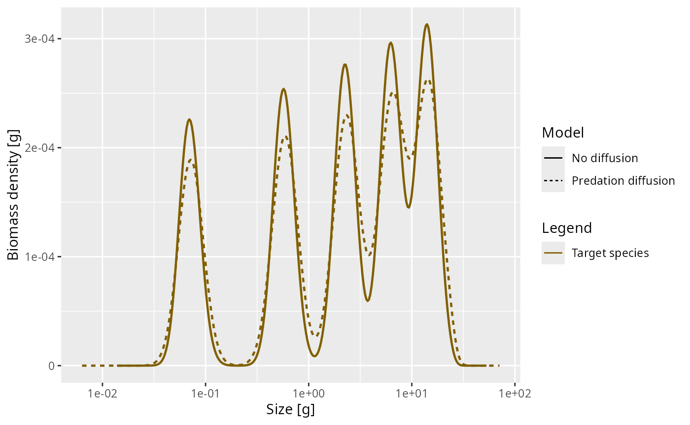
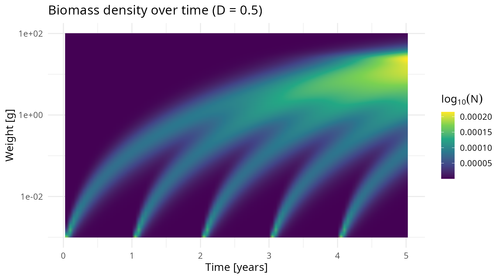

# Cohort dynamics and diffusion

## Introduction

In this vignette we explore how yearly cohorts of fish evolve over time
in a single-species size-spectrum model. We will drive the model with a
short burst of reproductive flux once a year, creating distinct cohorts.
We will then visualise how these cohorts grow through the size spectrum
and how the diffusion rate affects the spreading of the cohorts over
time.

Diffusion in the size-spectrum model represents individual variability
in growth rates. Without diffusion, all individuals born at the same
time grow at the same deterministic rate and remain together as a sharp
cohort. With diffusion, individuals spread out in size, causing the
cohort to broaden as it ages.

``` r

library(mizer)
library(ggplot2)
library(plotly)
```

## Setting up the model

We start by creating a single-species model using
[`newSingleSpeciesParams()`](https://sizespectrum.org/mizer/reference/newSingleSpeciesParams.md).
This sets up a species embedded in a power-law background community, so
that the encounter rate scales as \\w^{3/4}\\ and the mortality rate
scales as \$w^{-1/4}.

``` r

params <- newSingleSpeciesParams(h = 10, no_w = 400)
```

## Pulsed reproduction

To create distinct yearly cohorts, we need reproduction to happen in
short bursts rather than continuously. We achieve this by writing a
custom density-dependent reproduction rate function (RDD function) that
only allows reproduction during a brief window at the start of each
year.

The RDD function receives the current time `t` as an argument. We use
this to turn reproduction on only during a short window at the start of
each year and off at all other times. To maintain the same total annual
egg production, we scale up the rate during the pulse to compensate for
its short duration.

``` r

# Custom RDD function: pulsed reproduction using a fixed rate
pulse_width <- 0.1  # Reproduce during first 10% of each year

annual_pulse_RDD <- function(rdi, species_params, t, ...) {
    frac <- t %% 1
    if (frac < pulse_width) {
        rdd <- rdi # to get vector of right length
        rdd[] <- 1 - cos(frac / pulse_width * 2 * pi)
        return(rdd)
    } else {
        return(0 * rdi)
    }
}
params <- setRateFunction(params, "RDD", "annual_pulse_RDD")
```

Of course this is not a realistic way to model seasonal reproduction. A
more realistic approach is being developed in
[mizerSeasonal](https://gustavdelius.github.io/mizerSeasonal/). But it
is good enough for our purpose here of studying the evolution of yearly
cohorts over time.

## Simulating cohort dynamics without diffusion

We start from an empty spectrum (no fish) and let the pulsed
reproduction create cohorts from scratch.

``` r

initialN(params)[] <- 0

sim_no_diff <- project(params, t_max = 5, dt = 0.01,
                       t_save = 0.05, progress_bar = FALSE,
                       method = "predictor-corrector")

animate(sim_no_diff, log_x = TRUE, log_y = FALSE, power = 2, resource = FALSE,
        transition_duration = 0, frame_duration = 200)
```

Without diffusion, each cohort peak moves to the right (towards larger
sizes) as the fish grow. The width of the cohort stays constant on the
logarithmic axis. The growth on the logarithmic axis slows down towards
larger sizes and so eventually the older cohorts start to merge.

## Adding predation diffusion

Some of the randomness in the growth rate comes from the randomness in
the size of prey encountered by the predator. We refer to this as the
predation diffusion, even though there are other sources of randomness
associated with predation, arising for example from the patchiness in
the spatial distribution of prey. So the predation diffusion can be seen
as a lower bound on the amount of diffusion arising from randomness in
growth. You can find some details in the [Diffusion
section](https://sizespectrum.org/mizer/articles/model_description.html#diffusion)
of the general mizer model description.

``` r

params_pred_diff <- params
use_predation_diffusion(params_pred_diff) <- TRUE
sim_pred_diff <- project(params_pred_diff, t_max = 5, dt = 0.01,
                         t_save = 0.05, progress_bar = FALSE,
                         method = "predictor-corrector")

animate(sim_pred_diff, log_x = TRUE, log_y = FALSE, power = 2, resource = FALSE,
        transition_duration = 0, frame_duration = 200)
```

We see that there is a slight broadening of the cohorts as they grow up,
which is most noticeable at larger sizes where they merge together
sooner. To see this more clearly we plot the biomass density at time
\\t=5\\ for both cases:

``` r

plotSpectra2(sim_no_diff, sim_pred_diff,
             name1 = "No diffusion", name2 = "Predation diffusion",
             resource = FALSE, power = 2, log = "x")
```



The diffusion rate is a power law in \\w\\ with exponent \\7/4\\. The
coefficient is

``` r

(getDiffusion(params_pred_diff) / w(params)^(7/4))[1]
```

    ## [1] 0.02031864

## Adding external diffusion

The predation diffusion is the only part of the diffusion that is
explicitly modelled in mizer. We refer to all non-modelled diffusion as
“external” to the model. We assume that it follows the same power law
but with an a priory unknown coefficient that will need to be determined
by looking at the rate at which cohort size distributions widen in the
real world. The coefficient of external diffusion is set with the
species parameter `D_ext`.

## Comparing different diffusion rates

We now run the model with two different levels of external diffusion in
order to compare the effects.

``` r

species_params(params)$D_ext <- 0.1
sim_medium_diff <- project(params, t_max = 5, dt = 0.01,
                      t_save = 0.05, progress_bar = FALSE,
                      method = "predictor-corrector")

species_params(params)$D_ext <- 0.5
sim_high_diff <- project(params, t_max = 5, dt = 0.01,
                     t_save = 0.05, progress_bar = FALSE,
                     method = "predictor-corrector")
```

Let’s compare simulations with no diffusion, only predation diffusion, a
medium level of diffusion and a level of diffusion at time \\t=5\\:

``` r

w <- w(params)
snapshot_data <- rbind(
    data.frame(x = w, y = finalN(sim_no_diff)[1, ] * w^2,
               label = "D = 0 (no diffusion)"),
    data.frame(x = w, y = finalN(sim_pred_diff)[1, ] * w^2,
               label = "D = 0.02 (predation)"),
    data.frame(x = w, y = finalN(sim_medium_diff)[1, ] * w^2,
               label = "D = 0.1 (medium)"),
    data.frame(x = w, y = finalN(sim_high_diff)[1, ] * w^2,
               label = "D = 0.5 (high)")
)

p <- ggplot(snapshot_data, aes(x = x, y = y, colour = label)) +
     geom_line(linewidth = 0.8) +
     scale_x_log10(limits = c(1e-3, 100)) +
     labs(x = "Weight [g]", y = "Biomass density [g]",
          title = "Effect of diffusion on cohorts at t = 5",
          colour = "Diffusion rate") +
     theme_minimal(base_size = 14)

ggplotly(p)
```

We can see that diffusion has a large effect on how quickly the cohorts
widen and merge into each other. Let us look at an animation of the
high-diffusion case:

``` r

animate(sim_high_diff, log_x = TRUE, log_y = FALSE, power = 2, resource = FALSE,
        transition_duration = 0, frame_duration = 200)
```

As time progresses, we see that:

1.  New cohorts enter at the egg size each year.
2.  Each cohort grows towards larger sizes.
3.  The diffusion causes each cohort to spread out more and more as it
    ages.
4.  Eventually, older cohorts merge together as their spreading
    overwhelms the year-to-year separation.

## Heatmap visualisation

A heatmap provides a compact view of the entire dynamics, showing how
the size spectrum evolves continuously over time. Here we look at the
case of high diffusion:

``` r

sim <- sim_high_diff
all_times <- getTimes(sim)
w <- params@w
n <- N(sim)

heatmap_list <- list()
for (i in seq_along(all_times)) {
    n_at_t <- as.numeric(n[i, 1, ])
    pos <- n_at_t > 0
    if (any(pos)) {
        heatmap_list[[length(heatmap_list) + 1]] <- data.frame(
            time = all_times[i],
            w = w[pos],
            log_n = n_at_t[pos] * w[pos]^2
        )
    }
}
heatmap_data <- do.call(rbind, heatmap_list)

ggplot(heatmap_data, aes(x = time, y = w, fill = log_n)) +
    geom_raster(interpolate = TRUE) +
    scale_y_log10() +
    scale_fill_viridis_c(name = expression(log[10](N))) +
    labs(x = "Time [years]", y = "Weight [g]",
         title = "Biomass density over time (D = 0.5)") +
    theme_minimal(base_size = 14)
```



In the heatmap, the diagonal bands represent individual cohorts growing
through the size spectrum. The curving of these bands is due to the
slowing down and the broadening of these bands with time is the effect
of diffusion.

## Summary

This vignette demonstrated:

1.  How to set up a single-species model with
    [`newSingleSpeciesParams()`](https://sizespectrum.org/mizer/reference/newSingleSpeciesParams.md).
2.  How to implement pulsed annual reproduction using a custom RDD
    function.
3.  How cohorts of fish grow through the size spectrum over time.
4.  How diffusion, set via
    [`setExtDiffusion()`](https://sizespectrum.org/mizer/reference/setExtDiffusion.md),
    controls the spreading of cohorts — representing individual
    variability in growth rates.
