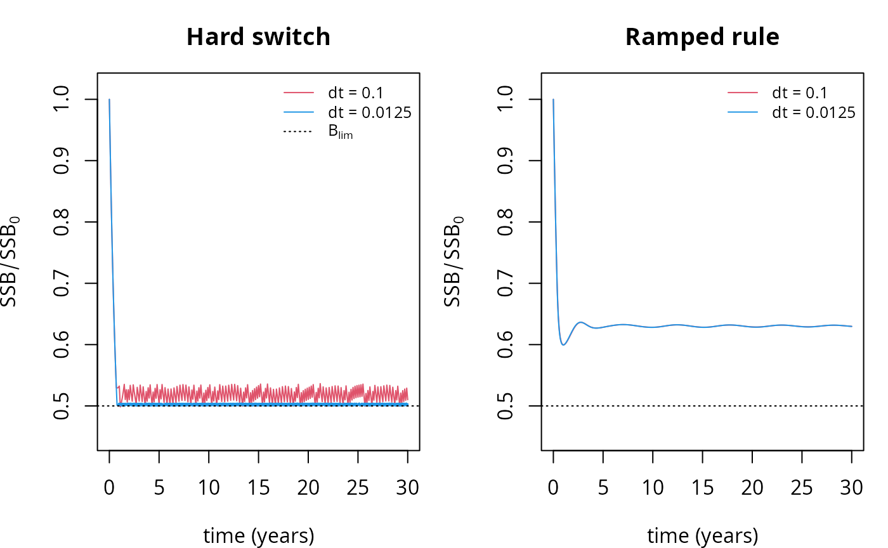
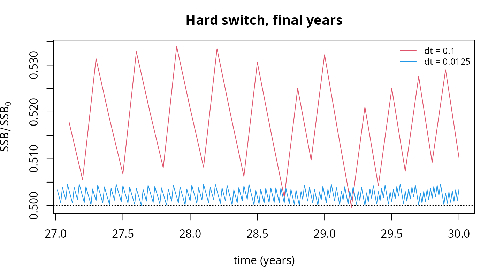

# Discontinuous rate functions

## Introduction

[`setRateFunction()`](https://sizespectrum.org/mizer/reference/setRateFunction.md)
lets you replace any of mizer’s built-in rate functions with one of your
own. Sooner or later this tempts you into writing a rate that switches
abruptly on the state of the model — a fishery that closes when a stock
falls below a limit reference point, a predator that switches diet when
its preferred prey becomes scarce, a mortality that kicks in below a
critical condition, a species declared extinct below a threshold
abundance.

Such a rate is a **discontinuous function of the abundances** `n`. This
vignette shows what goes wrong when you do that, why none of mizer’s
time-stepping methods can rescue you, and how to fix it. The fix is
short — round the corner off the switch — so if you only read one
section, read [Regularise the switch](#regularise-the-switch).

The trouble is worth spelling out because it is quiet. Mizer will not
warn you,
[`project()`](https://sizespectrum.org/mizer/reference/project.md) will
not fail, and the output will look entirely plausible. What you get
instead is a trajectory that keeps changing as you refine `dt`, a
steady-state solver that stalls, and a stability diagnostic that reports
a confident answer to a question it has not actually asked.

## A harvest control rule

Take a familiar management measure. A harvest control rule closes the
fishery for a stock when its spawning stock biomass (SSB) drops below a
limit reference point \\B\_{lim}\\. We will apply it to North Sea cod,
closing the `Otter` gear that catches it.

First a helper for the SSB of one species, and the two versions of the
rule we will compare.
[`getSSB()`](https://sizespectrum.org/mizer/reference/getSSB.md)
computes the SSB from the *initial* state of a params object, or from
every saved step of a simulation; a rate function is instead handed the
current abundances `n` directly, so we install them as the initial state
and ask [`getSSB()`](https://sizespectrum.org/mizer/reference/getSSB.md)
for the species we want. Going through
[`getSSB()`](https://sizespectrum.org/mizer/reference/getSSB.md) this
way, rather than doing the integral by hand, keeps the helper correct
whatever
[`second_order_w()`](https://sizespectrum.org/mizer/reference/second_order_w.md)
setting the model uses.

``` r

ssb_of <- function(params, n, species) {
    initialN(params) <- n
    getSSB(params)[[species]]
}

# The hard rule: the fishery is either fully open or fully shut.
hardHCR <- function(params, n, n_pp, n_other, t, effort, ...) {
    op <- other_params(params)
    if (ssb_of(params, n, op$stock) < op$b_lim) {
        effort[op$gear] <- 0
    }
    mizerFMort(params, n, n_pp, n_other, t = t, effort = effort, ...)
}

# The ramped rule: effort increases linearly from zero at B_lim to full at
# B_trigger. This is the shape of an ICES "hockey stick" rule.
rampHCR <- function(params, n, n_pp, n_other, t, effort, ...) {
    op <- other_params(params)
    ssb <- ssb_of(params, n, op$stock)
    frac <- (ssb - op$b_lim) / (op$b_trigger - op$b_lim)
    effort[op$gear] <- effort[op$gear] * min(1, max(0, frac))
    mizerFMort(params, n, n_pp, n_other, t = t, effort = effort, ...)
}
```

Both are perfectly reasonable things to write. The first is
discontinuous in `n`; the second is continuous. That single difference
is what the rest of this vignette is about.

We set up the North Sea model with enough fishing pressure on cod that
the stock runs down into the region where the rule bites, and store the
rule’s parameters in
[`other_params()`](https://sizespectrum.org/mizer/reference/setRateFunction.md).

``` r

params <- NS_params
initial_effort(params)["Otter"] <- 1.5
ssb0 <- getSSB(params)[["Cod"]]

other_params(params)$stock     <- "Cod"
other_params(params)$gear      <- "Otter"
other_params(params)$b_lim     <- 0.5 * ssb0
other_params(params)$b_trigger <- 0.7 * ssb0

params_hard <- setRateFunction(params, "FMort", "hardHCR")
params_ramp <- setRateFunction(params, "FMort", "rampHCR")
```

Now run each rule at two time steps that differ by a factor of eight,
and track the cod SSB.

``` r

ssb_series <- function(p, dt, t_max = 30, method = "tr_bdf2") {
    sim <- project(p, dt = dt, t_max = t_max, t_save = dt, method = method,
                   progress_bar = FALSE)
    ssb <- getSSB(sim)[, "Cod"]
    data.frame(t = as.numeric(names(ssb)), ssb = ssb / ssb0)
}

hard_coarse <- ssb_series(params_hard, dt = 0.1)
hard_fine   <- ssb_series(params_hard, dt = 0.0125)
ramp_coarse <- ssb_series(params_ramp, dt = 0.1)
ramp_fine   <- ssb_series(params_ramp, dt = 0.0125)
```

``` r

par(mfrow = c(1, 2), mar = c(4, 4, 3, 1))

plot(ssb ~ t, data = hard_coarse, type = "l", col = 2, ylim = c(0.45, 1.02),
     xlab = "time (years)", ylab = expression(SSB / SSB[0]),
     main = "Hard switch")
lines(ssb ~ t, data = hard_fine, col = 4)
abline(h = 0.5, lty = 3)
legend("topright", c("dt = 0.1", "dt = 0.0125", expression(B[lim])),
       col = c(2, 4, 1), lty = c(1, 1, 3), bty = "n", cex = 0.8)

plot(ssb ~ t, data = ramp_coarse, type = "l", col = 2, ylim = c(0.45, 1.02),
     xlab = "time (years)", ylab = expression(SSB / SSB[0]),
     main = "Ramped rule")
lines(ssb ~ t, data = ramp_fine, col = 4)
abline(h = 0.5, lty = 3)
legend("topright", c("dt = 0.1", "dt = 0.0125"),
       col = c(2, 4), lty = 1, bty = "n", cex = 0.8)
```



The two panels tell the whole story. Under the ramped rule the two time
steps give the same curve, settling to a well-defined state. Under the
hard rule the SSB collapses onto \\B\_{lim}\\ and then saws up and down
against it, and the size of that sawtooth depends on the time step
rather than on anything in the model.

Zooming in on the last few years makes the sawtooth explicit.

``` r

par(mar = c(4, 4, 3, 1))
late <- function(d) d[d$t > 27, ]
plot(ssb ~ t, data = late(hard_coarse), type = "l", col = 2,
     xlab = "time (years)", ylab = expression(SSB / SSB[0]),
     main = "Hard switch, final years")
lines(ssb ~ t, data = late(hard_fine), col = 4)
abline(h = 0.5, lty = 3)
legend("topright", c("dt = 0.1", "dt = 0.0125"),
       col = c(2, 4), lty = 1, bty = "n", cex = 0.8)
```



This is **chattering**. To see it directly, instrument the rule so that
it records every decision it takes, and count them.

``` r

tally <- new.env()

tallyHCR <- function(params, n, n_pp, n_other, t, effort, ...) {
    op <- other_params(params)
    closed <- ssb_of(params, n, op$stock) < op$b_lim
    tally$decisions <- c(tally$decisions, closed)
    if (closed) effort[op$gear] <- 0
    mizerFMort(params, n, n_pp, n_other, t = t, effort = effort, ...)
}
params_tally <- setRateFunction(params, "FMort", "tallyHCR")

switching <- function(dt, t_max = 30) {
    tally$decisions <- logical(0)
    project(params_tally, dt = dt, t_max = t_max, t_save = t_max,
            method = "tr_bdf2", progress_bar = FALSE)
    # Discard the first half of the decisions as transient
    d <- tail(tally$decisions, length(tally$decisions) %/% 2)
    c(closed_fraction   = mean(d),
      switches_per_year = sum(diff(d) != 0) / (t_max / 2))
}

dts_sw <- c(0.1, 0.05, 0.0125)
cbind(dt = dts_sw, as.data.frame(t(sapply(dts_sw, switching))))
```

    #>       dt closed_fraction switches_per_year
    #> 1 0.1000       0.1966667          7.866667
    #> 2 0.0500       0.1883333         15.066667
    #> 3 0.0125       0.1816667         58.066667

Two things are happening at once, and it is worth separating them.

The **fraction** of the time the fishery is closed converges, to about
18%. That number is meaningful: it is the mixture of the two branches
that holds the stock on the threshold, the *sliding solution* in the
sense of Filippov. In a limited sense, then, the model does have a
well-defined answer.

The **rate of switching** does not converge. It is proportional to
\\1/\Delta t\\ — about eight times a year at `dt = 0.1`, and nearly
sixty at `dt = 0.0125` — and diverges as \\\Delta t \to 0\\. The fishery
you have actually simulated is one that opens and closes as fast as your
numerical time step allows, which is not a management strategy anyone
proposed.

This also explains why the SSB curve above sits just *above*
\\B\_{lim}\\ rather than crossing it. Because the second-order methods
average the start-of-step and predicted end-of-step rates (see the next
section), a step on which the two disagree about the threshold is run
with a half-open fishery. The scheme is quietly inventing intermediate
effort levels that the rule never specified, and how much of that it
invents depends on \\\Delta t\\. That is the whole of the \\\Delta
t\\-dependence in the first figure.

## Why the time steppers cannot fix this

It is natural to reach for a better time stepper, and mizer offers two
beyond the default: `method = "predictor_corrector"` and the L-stable
`method = "tr_bdf2"`. Neither helps, and it is worth understanding why,
because the reason says something about how all three methods treat
nonlinearity.

Mizer’s density update is *semi-implicit*: the densities are solved for
implicitly, but the rates that make up the transport operator are frozen
at values computed from earlier states. The first-order method evaluates
the rates once per step, at the start. The two second-order methods
evaluate them twice — once at the start of the step and once from a
provisional Euler prediction of the end of the step — and then average
the two, as described in the [numerical scheme
vignette](https://sizespectrum.org/mizer/articles/numerical_details.md).
That average is a second-order approximation of the midpoint rate
*provided the rates vary smoothly along the trajectory*.

A discontinuity breaks precisely that proviso. When the threshold is
crossed inside a step, the honest step-average of the rate weights the
two branches by the fraction of the step actually spent on each side of
the threshold. The scheme instead weights them one half and one half, or
picks a single branch outright if both of its samples happen to land on
the same side. The error it makes on such a step is proportional to the
size of the jump, and no amount of cleverness in the *linear* solve can
recover information the *rate* evaluations never gathered.

L-stability, the property that makes TR-BDF2 damp stiff modes instead of
ringing on them, applies to the frozen linear operator. The problematic
mode here does not live in that operator; it lives in the rates, which
are held constant across the solve. So TR-BDF2 damps nothing.

The numbers bear this out. Measuring the amplitude of the sawtooth over
the last third of each run:

``` r

amplitude <- function(p, dt, method) {
    s <- ssb_series(p, dt, method = method)
    tail_s <- s$ssb[s$t > max(s$t) * 2 / 3]
    max(tail_s) - min(tail_s)
}

dts <- c(0.1, 0.05, 0.025, 0.0125)
data.frame(
    dt          = dts,
    euler       = sapply(dts, amplitude, p = params_hard, method = "euler"),
    tr_bdf2     = sapply(dts, amplitude, p = params_hard, method = "tr_bdf2"),
    ramp_tr_bdf2 = sapply(dts, amplitude, p = params_ramp, method = "tr_bdf2")
)
```

    #>       dt       euler     tr_bdf2 ramp_tr_bdf2
    #> 1 0.1000 0.074939822 0.036850315  0.003076512
    #> 2 0.0500 0.038121457 0.018601905  0.003298995
    #> 3 0.0250 0.019278516 0.009209786  0.003370588
    #> 4 0.0125 0.009904104 0.004620576  0.003391692

Under the hard rule the sawtooth amplitude halves whenever `dt` halves,
for both methods alike. That is first-order convergence. TR-BDF2
achieves a smaller constant — roughly half the amplitude of the Euler
method at the same `dt` — but a better constant is not what a
second-order method is for, and the extra order it was supposed to
deliver has gone.

Under the ramped rule the amplitude behaves quite differently: it
*converges*, to about 0.0034, instead of shrinking towards zero. That
residual variation is a small genuine oscillation of the model, resolved
better and better as `dt` falls, rather than an artefact manufactured by
the discretisation. This is the signature to look for. An artefact
shrinks with `dt`; a feature settles down to a value.

So the sliding solution identified earlier is reachable in principle —
the SSB does approach \\B\_{lim}\\ as \\\Delta t \to 0\\ — but only at
first-order cost, and only for the biomass. The effort never converges
at all. You are paying for a very small time step to resolve a switching
surface that the model never told you it had.

## What it does to the steady-state and stability tools

The damage is not confined to
[`project()`](https://sizespectrum.org/mizer/reference/project.md).
Mizer’s steady-state and stability machinery assumes a smooth right-hand
side, and a discontinuity undermines it in three different ways.

### The Newton solver stalls

With `solver = "newton"` the steady-state finders solve \\F(N) = 0\\
with a Newton-type root finder. A discontinuous rate makes \\F\\
discontinuous, and where the equilibrium is a sliding one there is no
root at all: neither branch is in equilibrium there. The solver has
nothing to converge to.

``` r

settle <- function(p) {
    sim <- project(p, dt = 0.01, t_max = 40, t_save = 40, progress_bar = FALSE)
    initialN(p) <- finalN(sim)
    initialNResource(p) <- finalNResource(sim)
    p
}
hard_settled <- settle(params_hard)
ramp_settled <- settle(params_ramp)

ramp_ss <- findSteadyState(ramp_settled, solver = "newton")
```

The ramped model converges without complaint. The hard one does not:

``` r

hard_ss <- findSteadyState(hard_settled, solver = "newton")
```

    #> Warning: The Newton solver did not converge (nleqslv termination code 3: No
    #> better point found (algorithm has stalled)). Returning the best iterate found.

It returns its best iterate, which sits essentially exactly on the
threshold — the sliding surface, where neither branch is in equilibrium
and so no root exists:

``` r

c(ramp = getSSB(ramp_ss)[["Cod"]] / other_params(params)$b_lim,
  hard = getSSB(hard_ss)[["Cod"]] / other_params(params)$b_lim)
```

    #>      ramp      hard 
    #> 1.2611078 0.9999017

### `getStability()` becomes unreliable

[`getStability()`](https://sizespectrum.org/mizer/reference/getStability.md)
builds its Jacobian by relative finite differences, perturbing each
abundance by a fraction `h` (default \\10^{-4}\\) and differencing.
Across a discontinuity that difference quotient is meaningless, and it
fails in two distinct ways depending on how close the state sits to the
threshold.

When the state sits *on* the switching surface — which is exactly where
a hard rule drives it — some perturbations straddle the threshold and
pick up the jump, giving an entry of order (size of jump)/(size of
perturbation). The reported growth rate of the dominant mode then
depends on `h`:

``` r

sapply(c(1e-3, 1e-4, 1e-5),
       function(h) getStability(hard_ss, h = h)$max_real_part)
```

    #> [1] 0.6104857 0.3054843 0.3054844

The coarsest step is the only one whose perturbations reach across the
threshold, and the growth rate it reports comes out at 0.61 against the
0.305 that the finer steps agree on. Note what those two do: they agree
to seven figures, because at that size no perturbation crosses the
threshold at all. That agreement is the second failure mode below, not a
clean bill of health.

Contrast the ramped model, where the answer is the same to five figures
whatever `h` you choose:

``` r

sapply(c(1e-3, 1e-4, 1e-5),
       function(h) getStability(ramp_ss, h = h)$max_real_part)
```

    #> [1] -0.02481145 -0.02481120 -0.02481155

What matters here is the *reproducibility* of that number, not its
value. (It is negative, so the ramped model’s steady state is weakly
stable. That is not in conflict with the small residual oscillation
measured earlier: the linearisation is of the same system those runs
project, reproduction included, but a decay rate this slow — an
e-folding time of forty years — is barely distinguishable from a
sustained cycle over a thirty-year run.) The `h`-sensitivity is the
cheapest diagnostic available: **if halving `h` changes the answer, do
not trust the answer** — while remembering that an answer which does not
move is necessary, not sufficient.

The second failure mode is quieter and therefore worse. When the state
is near but not on the threshold, no perturbation is large enough to
cross it, so the Jacobian sees only the branch the state happens to be
sitting on. The result is the stability of a smooth system that your
model is not:

``` r

st <- getStability(hard_settled)
c(max_real_part = st$max_real_part, stable = st$stable)
```

    #> max_real_part        stable 
    #>    -0.0586569     1.0000000

Every eigenvalue in the left half-plane, and a confident verdict of
`stable` — for a simulation that we watched chatter for thirty years and
will chatter for ever. Nothing here is flagged. The number is the
correct linearisation of the open-fishery branch, evaluated at a state
that is not an equilibrium of that branch, and it answers a question
nobody asked.

## Regularise the switch

The fix is to make the rate a continuous function of `n` by giving the
switch a finite width. The ramped rule above already does this, and it
is worth noticing that it is also the *more realistic* model: no real
fishery flips between fully open and fully shut in response to an
infinitesimal change in an estimated biomass, and real harvest control
rules are written as ramps for exactly that reason. The regularisation
is not a numerical hack imposed on the biology; the discontinuity was
the unrealistic idealisation.

Two shapes cover almost every case. A linear ramp between two
thresholds, as in `rampHCR()` above:

``` r

frac <- (x - x_lo) / (x_hi - x_lo)
switch_value <- min(1, max(0, frac))
```

or a logistic transition of relative width `eps` around a single
threshold, when you would rather not invent a second reference point:

``` r

switch_value <- 1 / (1 + exp(-(x / x_0 - 1) / eps))
```

How wide should the transition be? Wide enough that the state takes
several time steps to cross it. If the quantity driving the switch moves
at rate \\v\\, a transition of width \\\delta\\ takes \\\delta / v\\
years to traverse, so aim for \\\delta \gtrsim 10\\ v \\\Delta t\\.
Choosing the width on those grounds makes it a modelling decision you
can defend rather than a fudge factor: it says how precisely the
switching quantity is really known, which for anything estimated from
survey data is never to machine precision.

Then check that the answer does not depend on the choice. Halve `dt` and
confirm the trajectory does not move; halve `h` and confirm
[`getStability()`](https://sizespectrum.org/mizer/reference/getStability.md)
does not move. Both checks are cheap, and both fail loudly on a
discontinuity.

### Kinks are much milder than jumps

A rate built with [`max()`](https://rdrr.io/r/base/Extremes.html),
[`min()`](https://rdrr.io/r/base/Extremes.html) or
[`pmax()`](https://rdrr.io/r/base/Extremes.html) — the clamp in
`rampHCR()`, or the starvation mortality \\\mu_s = \max(0,\\ -E_r/w)
\cdot c\\ used by the
[mizerStarvation](https://sizespectrum.org/mizerStarvation) extension —
is continuous but not differentiable. This is a far less serious problem
than a jump. Such a rate cannot chatter, because there is no gap for the
two branches to argue across, and positivity and the qualitative
dynamics are safe. What it costs is accuracy at the steps that cross the
kink, and machine-precision convergence with `solver = "newton"`, whose
residual becomes merely Lipschitz. Mizer already lives with exactly this
situation in its van Leer flux limiter, for the same reason and with the
same consequence.

So the rule of thumb is: a kink is a mild accuracy tax, worth paying
when the biology genuinely has a corner in it. A jump is a correctness
problem, and is almost never what the biology actually says.

## Checklist

If you have registered a custom rate function with
[`setRateFunction()`](https://sizespectrum.org/mizer/reference/setRateFunction.md)
and something looks odd, work through this list.

- Does the rate contain an `if`, a comparison, or an indexing operation
  that depends on `n`, `n_pp` or `n_other`? Those are where
  discontinuities hide.
- Does the trajectory change when you halve `dt`? It should not, once
  `dt` is small enough.
- Does
  [`getStability()`](https://sizespectrum.org/mizer/reference/getStability.md)
  report a different `max_real_part` when you halve `h`? It should not —
  though an answer that does not move is necessary rather than
  sufficient, since a state near a threshold may have no perturbation
  reaching across it.
- Does the Newton solver warn that it stalled? On a smooth model it
  usually will not.
- Is a state variable pinned suspiciously exactly to a threshold you
  wrote into the model? That is a sliding mode.

None of this applies to rates that depend discontinuously on **size** or
on **time**. A knife-edge selectivity is a discontinuous function of
\\w\\, and is handled by the spatial discretisation described in the
[numerical scheme
vignette](https://sizespectrum.org/mizer/articles/numerical_details.md);
a management measure that switches on in a given year is a discontinuous
function of \\t\\, and costs you accuracy only in the single step
containing the switch. It is discontinuity in the *state* that causes
the trouble described here, because only that feeds back on itself.

## See also

- [The numerical scheme used in
  mizer](https://sizespectrum.org/mizer/articles/numerical_details.md) —
  how the rates are frozen and the densities updated, and the CFL
  condition for the second-order spatial scheme.
- [Extending
  mizer](https://sizespectrum.org/mizer/articles/guide-extend-mizer.md)
  — the full set of extension mechanisms.
- [Dynamic stability and Hopf
  bifurcations](https://sizespectrum.org/mizer/articles/dynamic_stability.md)
  —
  [`getStability()`](https://sizespectrum.org/mizer/reference/getStability.md)
  and `solver = "newton"` applied to smooth models.
