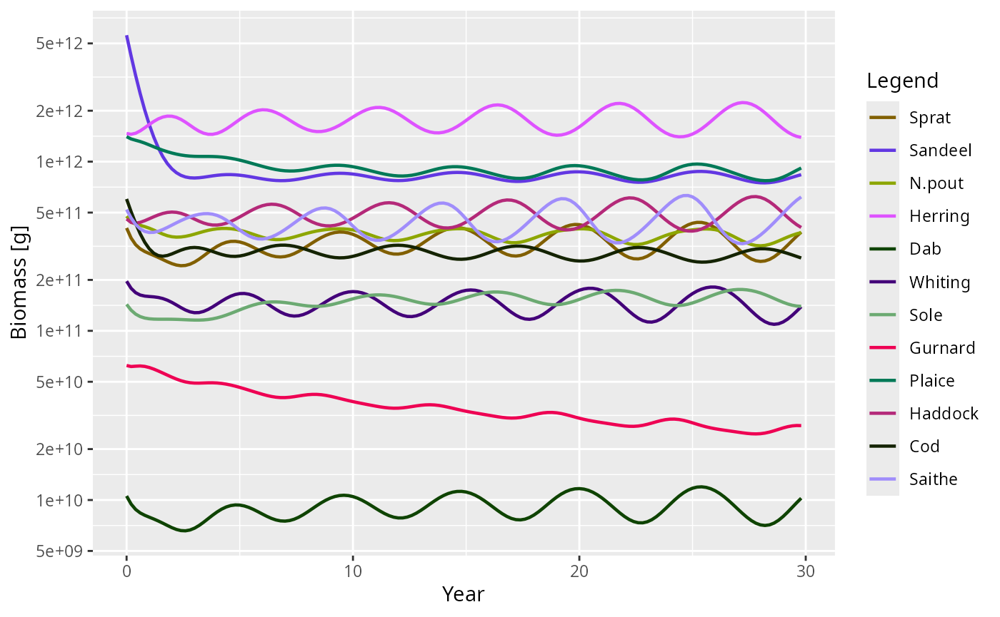
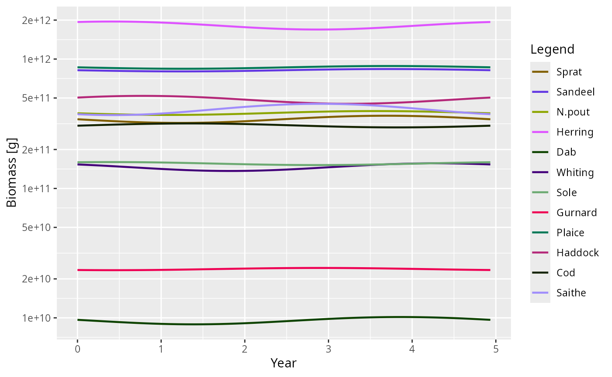
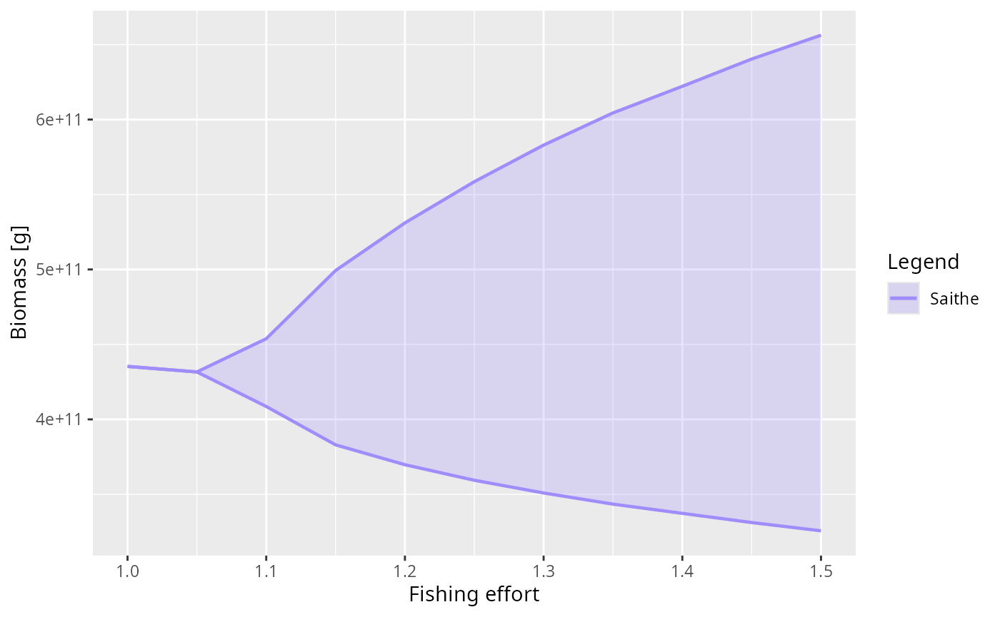
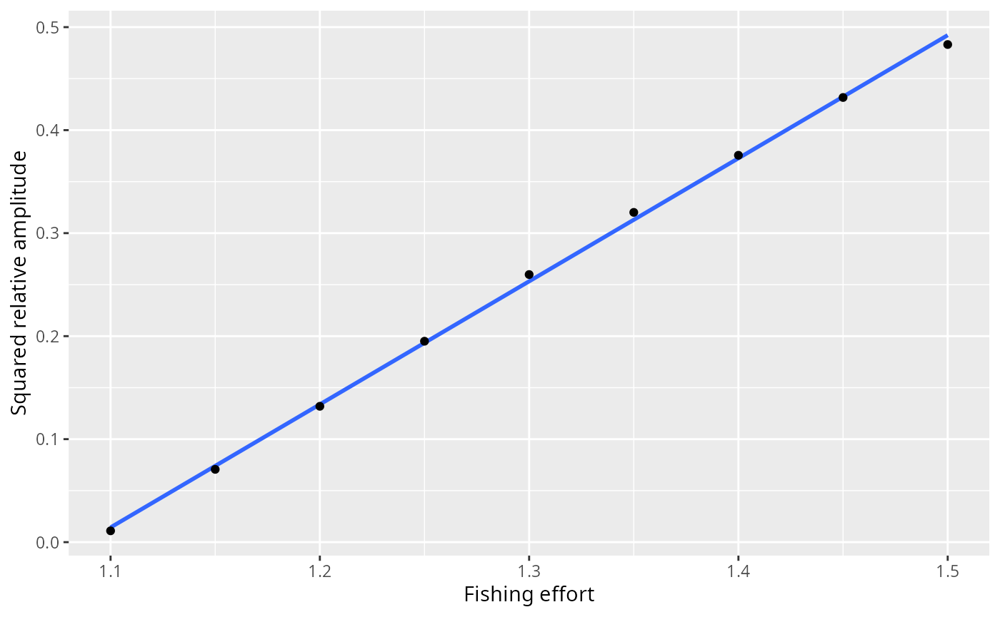

# Dynamic stability and Hopf bifurcations

## Introduction

In a mizer model, a steady state represents an equilibrium where the
abundance of every species at every size remains constant over time.
While
[`tuneSteadyState()`](https://sizespectrum.org/mizer/reference/tuneSteadyState.md)
attempts to find such a state by projecting the dynamics forward in time
until changes stop, this only works if the steady state is *dynamically
stable*.

If a steady state is unstable, small perturbations will grow rather than
decay, and the system will naturally move away from the steady state,
often settling into persistent oscillations (a limit cycle) or more
complex dynamics.

Mizer’s steady-state finders take a `solver` argument for exactly this
case. With `solver = "newton"` they find steady states irrespective of
their stability by solving the algebraic equilibrium equations directly.
Once a steady state is found, its stability can be analysed using
[`getStability()`](https://sizespectrum.org/mizer/reference/getStability.md).

This vignette explains how to perform this stability analysis, what the
results mean, how mizer’s steady-state finders detect and characterise
limit cycles, and how to use the linearised limit cycle approximation
provided by
[`getOscillationModeSim()`](https://sizespectrum.org/mizer/reference/getOscillationModeSim.md)
to understand emergent oscillations around a Hopf bifurcation.

## Linear stability analysis

Mizer discretises the size axis but leaves time continuous. On the size
grid the model is therefore a system of ordinary differential equations,

\\ \frac{dN}{dt} = F(N), \\

where \\N\\ is the full state vector (abundances of all species at all
sizes) and \\F\\ collects the divergence of the growth flux, the
mortality sink and the reproductive influx at the egg size. A steady
state \\N^\*\\ is a state at which \\F(N^\*) = 0\\.

Close to \\N^\*\\ a small perturbation \\\delta N(t) = N(t) - N^\*\\
obeys the linearised equation \\d\\\delta N/dt = J\\\delta N\\, where
\\J = \partial F / \partial N\\ evaluated at \\N^\*\\ is the Jacobian
matrix. Its eigenvalues \\\lambda_i\\ decide everything: each mode of
the perturbation evolves as \\e^{\lambda_i t}\\, so the steady state is
**stable** when every eigenvalue has negative real part and **unstable**
as soon as one has a positive real part.

Because abundances in a mizer model span dozens of orders of magnitude
across the size spectrum, evaluating stability in terms of absolute
perturbations can be numerically poorly-scaled. It is more natural to
consider **multiplicative (relative) perturbations**, where we perturb
the steady state by a small relative amount \\x(t)\\:

\\ N_i(t) = N_i^\* \left(1 + x_i(t)\right). \\

The relative Jacobian \\K\\ that governs these relative perturbations,

\\ K\_{ij} = \frac{N_j^\*}{N_i^\*} \frac{\partial F_i}{\partial
N_j}(N^\*), \\

is related to \\J\\ by a similarity transform \\K = D^{-1} J D\\, where
\\D\\ is a diagonal matrix of the steady-state abundances \\N^\*\\.
Because \\K\\ and \\J\\ are similar matrices, **they have exactly the
same eigenvalues**.

[`getStability()`](https://sizespectrum.org/mizer/reference/getStability.md)
computes \\J\\ by perturbing each state variable in turn and
differencing the rates of change that mizer’s own rate functions return,
so the eigenvalues it reports are those of the model as it is
configured, including any rate function registered with
[`setRateFunction()`](https://sizespectrum.org/mizer/reference/setRateFunction.md)
and whichever spatial scheme
[`second_order_w()`](https://sizespectrum.org/mizer/reference/second_order_w.md)
selects. **No time step enters this calculation.** The eigenvalues are a
property of the model, not of a solver, and they are what a simulation
with a small enough time step converges to.

*(Note on numerical implementation: while analysing the relative
Jacobian \\K\\ is conceptually natural, computing it requires dividing
by \\N_i^\*\\, which causes floating-point overflow for structurally
zero size classes (e.g., extinct species or truncated tails). Therefore,
[`getStability()`](https://sizespectrum.org/mizer/reference/getStability.md)
numerically computes the absolute Jacobian \\J\\ using finite-difference
steps scaled multiplicatively to the local density. This is
mathematically equivalent to the relative analysis but avoids dividing
by zero.)*

### The stability of the model and the stability of the solver

There is a second, quite different question one can ask: not whether the
*model* is stable, but whether *mizer’s numerical time step* is.
[`project()`](https://sizespectrum.org/mizer/reference/project.md)
advances the state by a discrete map

\\ N(t+\Delta t) = G(N(t)), \\

and the eigenvalues \\\mu_i\\ of the Jacobian of \\G\\ at the fixed
point decide whether that map amplifies a perturbation: it does not when
the **spectral radius** \\\max_i\|\mu_i\|\\ is below 1.
[`getDiscreteStability()`](https://sizespectrum.org/mizer/reference/getDiscreteStability.md)
reports those numbers for a chosen step size `dt`.

The two questions have different answers, and the difference matters.
Mizer’s step solves the transport implicitly, and implicit schemes
introduce a “temporal numerical diffusion” that artificially damps
oscillations. At a large `dt` a steady state that the model does not
hold can therefore have a spectral radius below 1 — the simulation
settles down onto a state that is an artefact of the step size. We will
see exactly that below.

It is tempting to try to recover \\J\\ from \\G\\ algebraically. If
mizer’s step were *fully* implicit, \\N^{t+\Delta t} = N^t + \Delta
t\\F(N^{t+\Delta t})\\, then the two Jacobians would be related exactly
by \\\mu = 1/(1 - \Delta t\\\lambda)\\ and one could simply invert. But
mizer’s step is not fully implicit: it evaluates all the rates —
encounter, feeding level, predation mortality, growth — at the state at
the *start* of the step, and only the transport solve that follows is
implicit. The inversion is then correct only to first order in \\\Delta
t\\, and at \\\Delta t = 1\\ it is wrong by more than an order of
magnitude. This is why
[`getStability()`](https://sizespectrum.org/mizer/reference/getStability.md)
differentiates \\F\\ directly instead.

## Driving the North Sea model unstable

Let’s load mizer and start with the standard North Sea model.

``` r

suppressMessages(devtools::load_all("..", quiet = TRUE))
params <- NS_params
```

The North Sea model at its default fishing effort is dynamically stable,
so it makes a rather uneventful example: perturb it and it simply
settles back down. To see something more interesting we increase the
fishing pressure, setting the effort of every gear to `1.5`. This pushes
the model across a **Hopf bifurcation** into a regime where the steady
state is unstable.

Because the steady state is now unstable, the default
`solver = "project"` cannot find it — projecting the dynamics forward
would diverge away from it. This is exactly the situation
`solver = "newton"` is designed for: it solves the equilibrium equations
directly and therefore finds the steady state regardless of its
stability. We use
[`findSteadyState()`](https://sizespectrum.org/mizer/reference/findSteadyState.md)
rather than
[`tuneSteadyState()`](https://sizespectrum.org/mizer/reference/tuneSteadyState.md)
because we want the steady state of the model as it stands, with the
reproduction parameters left alone.

``` r

params_f15 <- findSteadyState(params, effort = 1.5, solver = "newton")
```

## Diagnosing the instability

Is this steady state stable? We compute its stability metrics with
[`getStability()`](https://sizespectrum.org/mizer/reference/getStability.md).

``` r

stab <- getStability(params_f15, effort = 1.5)
stab$max_real_part
stab$stable
```

    #> [1] 0.07095636
    #> [1] FALSE

The largest real part among the eigenvalues, \\\text{Re}(\lambda) =
0.071 \> 0\\, so the steady state is unstable: a perturbation grows at
that exponential rate, roughly a factor \\e\\ every 14 years.

### What mizer’s time step makes of it

The instability is a property of the model. Whether you *see* it in a
simulation depends on the time step, and
[`getDiscreteStability()`](https://sizespectrum.org/mizer/reference/getDiscreteStability.md)
says by how much. It reports the spectral radius \\\max_i\|\mu_i\|\\ of
the one-step map; converting that into a growth rate per year,
\\\log(\max_i\|\mu_i\|)/\Delta t\\, puts it on the same footing as
`max_real_part`:

``` r

growth_rate <- function(dt) {
    rho <- getDiscreteStability(params_f15, effort = 1.5, dt = dt)$spectral_radius
    log(rho) / dt
}
sapply(c(0.1, 0.5, 1), growth_rate)
```

    #> [1] -0.005132024 -0.040072184  0.101244950

Against the model’s own 0.071 per year, mizer’s default `euler` step
gets none of these right, and not in a tidy direction either. At
\\\Delta t = 0.1\\ the implicit transport solve damps the growing
oscillation almost exactly as fast as the model grows it, so the scheme
sits at the edge of stability and a run started near the steady state
stays flat — a steady state that looks perfectly settled and is an
artefact of the step size. We watch that happen below. At \\\Delta t =
0.5\\ the map is firmly stable; at \\\Delta t = 1\\ it is unstable once
more, but oscillating with a period near 3.4 years that belongs to no
mode of the model.

This is the practical reason to keep an eye on `dt`, to prefer
`method = "tr_bdf2"` when the dynamics matter, and the reason
[`getStability()`](https://sizespectrum.org/mizer/reference/getStability.md)
does not go through the one-step map at all.

To see *how* it is unstable, we look at the dominant eigenvalue (the one
with the largest real part).

``` r

stab$eigenvalues[1]
#> [1] 0.07095636+1.273383i
```

It is **complex** with a positive real part (\\\lambda \approx 0.071 +
1.273i\\). A purely real, positive eigenvalue would signal monotone
growth, but a complex pair with a positive real part means the
perturbation grows *while oscillating* — a Hopf bifurcation. The period
of this oscillation is set by the imaginary part of the eigenvalue,

\\ \text{Period} = \frac{2\pi}{\|\text{Im}(\lambda)\|} \text{ years}, \\

which mizer reports as `dominant_period`:

``` r

stab$dominant_period
#> [1] 4.934245
```

So the linear analysis predicts a growing oscillation with a period of
roughly 4.93 years.

## Watching the limit cycle emerge with `projectUntilSettled()`

We can confirm these predictions by projecting the dynamics with
[`projectUntilSettled()`](https://sizespectrum.org/mizer/reference/projectUntilSettled.md).

Because the steady state is unstable, running the dynamics forward will
never “converge” to a fixed point in the usual sense.
[`projectUntilSettled()`](https://sizespectrum.org/mizer/reference/projectUntilSettled.md)
recognises this: it attaches a `"convergence"` attribute to its result
that reports whether the trajectory settled on a stable fixed point or a
limit cycle, along with its period and relative amplitude. It returns a
full `MizerSim` object covering the run, which is what we want here —
the approach to the cycle is the thing to look at.

``` r

sim_cycle <- projectUntilSettled(params, effort = 1.5, t_max = 200,
                                 t_per = 0.2, method = "tr_bdf2")
attr(sim_cycle, "convergence")
```

    #> $termination
    #> [1] "cycle_detected"
    #> 
    #> $converged
    #> [1] TRUE
    #> 
    #> $attractor
    #> [1] "limit_cycle"
    #> 
    #> $distance
    #> [1] 6.144612
    #> 
    #> $residual
    #> [1] 0.3030617
    #> 
    #> $years
    #> [1] 29.8
    #> 
    #> $period
    #> [1] 5.4
    #> 
    #> $amplitude
    #> [1] 0.6581569

[`projectUntilSettled()`](https://sizespectrum.org/mizer/reference/projectUntilSettled.md)
correctly identifies the attractor as a limit cycle with a period of
about 5.4 years and a peak-to-trough biomass amplitude of about 66% of
the mean. Applied to a model with a genuine stable steady state (such as
the default `params` at effort 0), the same call reports
`attractor = "fixed_point"`, which it does only when the biomasses have
actually stopped drifting and not merely because the distance function
went quiet:

``` r

attr(projectUntilSettled(params, t_max = 100), "convergence")$attractor
```

    #> [1] "fixed_point"

Because it is a standard `MizerSim` object, we can plot the emergence of
the limit cycle directly:

``` r

plotBiomass(sim_cycle)
```



Notice how well the detected nonlinear period (about 5.4 years) agrees
with the `dominant_period` of about 4.93 years from the linear analysis,
even though the cycle we are looking at is anything but small: its
relative amplitude is about 66% of the mean. The linear analysis is a
prediction about infinitesimal perturbations of the steady state, so the
remaining difference of under six percent is what the nonlinearity does
to the shape of the large-amplitude cycle. Close to the bifurcation
point the two agree even more closely.

## Visualising the oscillation shape

Finally,
[`getOscillationModeSim()`](https://sizespectrum.org/mizer/reference/getOscillationModeSim.md)
constructs a `MizerSim` object covering one period of the oscillation
*in the linear approximation*, using the eigenvector of the dominant
oscillatory mode. This isolates the pure **shape** of the cycle — which
species and sizes participate and with what phase — without the growth
or the nonlinear distortion of the full run. Fish and resource are
driven by the same eigenvector and the same scale factor, so the
resource carries the phase the mode gives it: on this model it leads the
total fish biomass by about 0.3 years of the 5.12-year period.

``` r

lcs <- getOscillationModeSim(params_f15, amplitude = 0.1)
```

Because `lcs` is an ordinary `MizerSim` object, any of the standard
mizer plotting functions can be used to explore it. For example, the
biomass over one period:

``` r

plotBiomass(lcs)
```



This linearised cycle gives a clear picture of the cohort-resonance
pattern driving the oscillation — the mode shape that the full nonlinear
limit cycle grows out of.

## Tracing the bifurcation with `scanModel()`

Everything so far has looked at a single fishing effort.
[`scanModel()`](https://sizespectrum.org/mizer/reference/scanModel.md)
varies one aspect of a model over a range of values and measures a
quantity on whatever attractor the model settles onto at each of them —
which is what a bifurcation diagram is. Here we scan the effort of every
gear from below the bifurcation to well above it, measuring the biomass
of Saithe, the species with the largest response.
[`scanEffort()`](https://sizespectrum.org/mizer/reference/scanEffort.md)
supplies the function that applies each effort to the model.

``` r

scan <- scanModel(params, scan_values = seq(1.0, 1.5, 0.05),
                  set_func = scanEffort(), value_func = getBiomass,
                  species = "Saithe", method = "tr_bdf2",
                  t_max = 2000, amp_rel_tol = 0.01)
```

The long `t_max` and the tight `amp_rel_tol` are deliberate. Close to a
Hopf bifurcation the leading eigenvalue is near zero, so the approach to
the attractor is correspondingly slow, and a shorter run reports a cycle
that is still growing rather than the one the model ends up on.

Plotting with `style = "envelope"` draws the smallest and the largest
value reached on the attractor, so a fixed point appears as a single
line and a limit cycle as the band between its extremes:

``` r

plot(scan, style = "envelope", log_y = FALSE)
```



The band has zero width up to an effort of 1.05 and opens continuously
above it. That is the signature of a **supercritical** Hopf bifurcation:
the limit cycle is born at the bifurcation with zero amplitude and grows
from there. In the subcritical case a cycle of finite size would appear
abruptly instead, and the model would show hysteresis — a different
attractor depending on whether the effort was being raised or lowered.

The attractor found at each effort is recorded in the scan, along with
the period of the cycle where there is one:

``` r

data.frame(effort = scan[[1]], attractor = scan$attractor,
           period = round(scan$period, 1))
#>    effort   attractor period
#> 1    1.00 fixed_point     NA
#> 2    1.05 fixed_point     NA
#> 3    1.10 limit_cycle    5.2
#> 4    1.15 limit_cycle    5.2
#> 5    1.20 limit_cycle    5.3
#> 6    1.25 limit_cycle    5.4
#> 7    1.30 limit_cycle    5.4
#> 8    1.35 limit_cycle    5.5
#> 9    1.40 limit_cycle    5.4
#> 10   1.45 limit_cycle    5.4
#> 11   1.50 limit_cycle    5.4
```

The period stays close to the `dominant_period` that the linear analysis
predicted, right across the range.

A supercritical Hopf bifurcation also predicts *how* the cycle grows:
its amplitude rises like the square root of the distance past the
bifurcation, so the squared amplitude should be a straight line in the
effort. The scan carries the minimum and maximum over the attractor in
its `ymin` and `ymax` columns, so the relative amplitude is one
subtraction away:

``` r

effort <- scan[[1]]
amplitude <- (scan$ymax - scan$ymin) / scan[[2]]
cycles <- scan$attractor == "limit_cycle"
fit <- lm(amplitude[cycles]^2 ~ effort[cycles])

ggplot2::ggplot(data.frame(effort = effort[cycles],
                           squared_amplitude = amplitude[cycles]^2),
                ggplot2::aes(effort, squared_amplitude)) +
    ggplot2::geom_smooth(method = "lm", formula = y ~ x, se = FALSE) +
    ggplot2::geom_point() +
    ggplot2::labs(x = "Fishing effort", y = "Squared relative amplitude")
```



It is: the fit has an \\R^2\\ of 0.999, and holds not only close to the
bifurcation but over the whole range scanned.

Extrapolating that line back to zero amplitude puts the bifurcation at
an effort of about 1.088. The eigenvalues give an independent estimate:
we find the steady state at a few efforts with `solver = "newton"` —
which works on either side of the bifurcation, since it does not care
about stability — and ask where the leading real part changes sign.

``` r

efforts <- c(1.00, 1.05, 1.10, 1.15)
max_real <- numeric(length(efforts))
p_e <- params
for (i in seq_along(efforts)) {
    p_e <- findSteadyState(p_e, effort = efforts[i], solver = "newton")
    max_real[i] <- getStability(p_e, effort = efforts[i])$max_real_part
}
data.frame(effort = efforts, max_real_part = signif(max_real, 3))
```

    #>   effort max_real_part
    #> 1   1.00      -0.01740
    #> 2   1.05      -0.00354
    #> 3   1.10       0.00862
    #> 4   1.15       0.01940

The leading real part crosses zero at an effort of about 1.065, a little
below the 1.088 that the amplitude line extrapolates to. The two are
calculated in completely different ways — one from the Jacobian at a
steady state, the other from the size of the cycles the dynamics settle
onto — and the small gap between them is the price of the projections: a
finite time step leaves a little numerical damping behind, which pushes
the apparent onset to slightly higher effort. The next section shows how
much damping that can be.

## What the default time step makes of the same model

Every projection above chose `method = "tr_bdf2"` deliberately. It is
worth seeing what mizer’s default `euler` step does with the same model,
because the answer depends on where the run starts and neither case
reports the model.

Repeat the run of the previous section with the default step. The
trajectory still settles on a limit cycle — but not on the model’s one:

``` r

sim_euler <- projectUntilSettled(params, effort = 1.5, t_max = 200,
                                 t_per = 0.2, method = "euler")
attr(sim_euler, "convergence")[c("attractor", "period", "amplitude")]
```

    #> $attractor
    #> [1] "limit_cycle"
    #> 
    #> $period
    #> [1] 5.1
    #> 
    #> $amplitude
    #> [1] 0.1663231

The period is close to the one `tr_bdf2` found, but the amplitude is
only about 17% of the mean against the 66% of the true cycle, smaller by
a factor of about 4. The numerical damping does not remove the
oscillation here; it shrinks it.

Start near the steady state instead and the same damping removes it
altogether. We nudge the fixed point by 5% and project twice, changing
nothing but the method:

``` r

params_nudged <- params_f15
initialN(params_nudged) <- initialN(params_f15) * 1.05
run <- function(method) {
    projectUntilSettled(params_nudged, effort = 1.5, t_max = 200,
                        t_per = 0.2, method = method)
}
sim_nudged_euler <- run("euler")
sim_nudged_trbdf2 <- run("tr_bdf2")
attr(sim_nudged_euler, "convergence")[c("attractor", "residual")]
attr(sim_nudged_trbdf2, "convergence")[c("attractor", "period", "amplitude")]
```

    #> $attractor
    #> [1] "fixed_point"
    #> 
    #> $residual
    #> [1] 0.02056507
    #> $attractor
    #> [1] "limit_cycle"
    #> 
    #> $period
    #> [1] 5.2
    #> 
    #> $amplitude
    #> [1] 0.6349932

Stepped with `euler` the nudge decays back to the fixed point and the
run reports `attractor = "fixed_point"`, with a residual drift small
enough that mizer’s own test calls the state settled:

``` r

isSteady(finalParams(sim_nudged_euler))
```

    #> [1] TRUE

Stepped with `tr_bdf2` the same nudge grows, at the rate the eigenvalue
predicts, into a cycle of period 5.2 years and relative amplitude 0.63.

So the two failure modes are different, and both are decided by the step
rather than by the model: near the steady state the default step turns
an unstable fixed point into a stable-looking one, and far from it, it
leaves the oscillation in place but understates how big it is. This is
why
[`getStability()`](https://sizespectrum.org/mizer/reference/getStability.md)
works from the model’s own rates of change, and why it is worth checking
a suspicious steady state with a smaller `dt` or with
`method = "tr_bdf2"` before believing it.

## A caveat: the analysis assumes a smooth model

Everything in this vignette rests on the one-step map being
differentiable at the steady state, so that the finite-difference
Jacobian means something. That holds for models built from mizer’s own
rate functions, but not necessarily for a model carrying a custom rate
registered with
[`setRateFunction()`](https://sizespectrum.org/mizer/reference/setRateFunction.md).
If such a rate jumps as a function of the abundances,
`solver = "newton"` may stall and
[`getStability()`](https://sizespectrum.org/mizer/reference/getStability.md)
can return a plausible-looking number that describes neither branch of
the dynamics.

The cheapest check is to re-run
[`getStability()`](https://sizespectrum.org/mizer/reference/getStability.md)
with a different `h`: on a smooth model `max_real_part` is unchanged to
several figures. See [Discontinuous rate
functions](https://sizespectrum.org/mizer/articles/discontinuous_rates.md).
