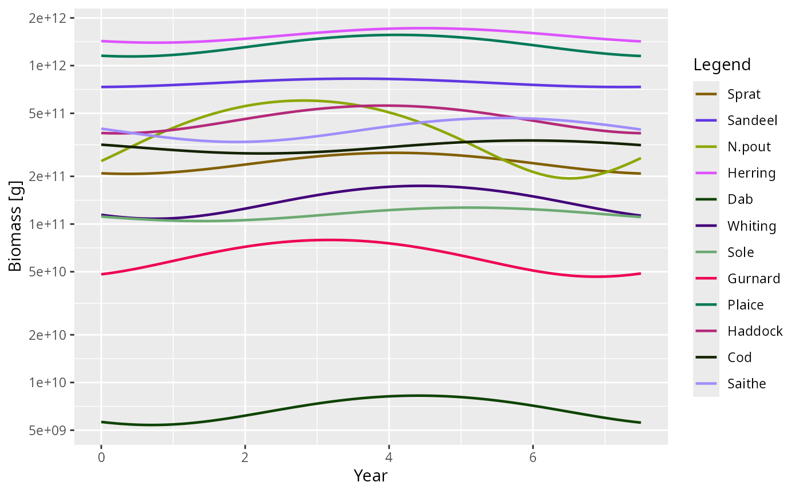

# Dynamic stability and Hopf bifurcations

## Introduction

In a mizer model, a steady state represents an equilibrium where the
abundance of every species at every size remains constant over time.
While [`steady()`](https://sizespectrum.org/mizer/reference/steady.md)
attempts to find such a state by projecting the dynamics forward in time
until changes stop, this only works if the steady state is *dynamically
stable*.

If a steady state is unstable, small perturbations will grow rather than
decay, and the system will naturally move away from the steady state,
often settling into persistent oscillations (a limit cycle) or more
complex dynamics.

Mizer provides the
[`steadyNewton()`](https://sizespectrum.org/mizer/reference/steadyNewton.md)
function to find steady states irrespective of their stability by
solving the algebraic equilibrium equations directly. Once a steady
state is found, its stability can be analysed using
[`getStability()`](https://sizespectrum.org/mizer/reference/getStability.md).

This vignette explains how to perform this stability analysis, what the
results mean, how mizer’s steady-state finders detect and characterise
limit cycles, and how to use the linearised limit cycle approximation
provided by
[`getLimitCycleSim()`](https://sizespectrum.org/mizer/reference/getLimitCycleSim.md)
to understand emergent oscillations around a Hopf bifurcation.

## Linear stability analysis

Mizer projects the state of the ecosystem forward in discrete time
steps. We can write this discrete-time map abstractly as:

\\ N(t+\Delta t) = G(N(t)) \\

where \\N(t)\\ represents the full state vector (abundances of all
species at all sizes) at time \\t\\. At a steady state \\N^\*\\, we have
\\N^\* = G(N^\*)\\.

Because abundances in a mizer model span dozens of orders of magnitude
across the size spectrum, evaluating stability in terms of absolute
perturbations (e.g., \\N(t) = N^\* + \delta N(t)\\) can be numerically
poorly-scaled. Instead, it is more natural to consider **multiplicative
(relative) perturbations**, where we perturb the steady state by a small
relative amount \\x(t)\\:

\\ N_i(t) = N_i^\* \left(1 + x_i(t)\right) \\

Linearising the dynamics for these small relative perturbations \\x(t)\\
gives:

\\ x(t+\Delta t) \approx K \\ x(t) \\

where \\K\\ is the relative Jacobian matrix. The elements of \\K\\
describe the proportional change in species \\i\\ resulting from a
proportional change in species \\j\\:

\\ K\_{ij} = \frac{\partial \log G_i}{\partial \log N_j}(N^\*) =
\frac{N_j^\*}{N_i^\*} \frac{\partial G_i}{\partial N_j}(N^\*) \\

Notice that \\K\\ is related to the standard absolute Jacobian \\L\\
(with elements \\L\_{ij} = \frac{\partial G_i}{\partial N_j}\\) by a
similarity transform \\K = D^{-1} L D\\, where \\D\\ is a diagonal
matrix of the steady-state abundances \\N^\*\\. Because \\K\\ and \\L\\
are similar matrices, **they have exactly the same eigenvalues**
\\\mu_i\\.

While a pure discrete-time stability analysis would check if the
spectral radius \\\max_i \|\mu_i\| \< 1\\, doing so evaluates the
stability of the numerical scheme rather than the underlying
mathematical model. Implicit numerical schemes like the one mizer uses
introduce severe “temporal numerical diffusion” that artificially damps
oscillations. To evaluate the true continuous-time stability,
[`getStability()`](https://sizespectrum.org/mizer/reference/getStability.md)
maps these discrete eigenvalues back to the exact continuous-time
eigenvalues \\\lambda_i\\ using the algebraic relation \\\lambda_i =
(1 - 1/\mu_i) / \Delta t\\.

**Why does this exact mapping work?** Mizer solves the continuous PDEs
of the size spectrum using a fully implicit backward Euler step: \\
N(t+\Delta t) = N(t) + \Delta t \\ \frac{dN}{dt}(t+\Delta t) \\ If we
define the continuous Jacobian as \\J = \partial(dN/dt)/\partial N\\ and
the discrete Jacobian of the one-step map as \\L = \partial N(t+\Delta
t)/\partial N(t)\\, differentiating the implicit step yields: \\ L = I +
\Delta t \\ J \\ L \quad \implies \quad (I - \Delta t \\ J) L = I \quad
\implies \quad J = \frac{1}{\Delta t}(I - L^{-1}) \\ This relates their
eigenvalues exactly by \\\lambda_i = (1 - 1/\mu_i) / \Delta t\\. By
applying this mapping, we analytically strip away the temporal numerical
diffusion of the implicit solver and recover the exact continuous-time
stability.

The stability of the continuous-time mathematical steady state is
determined by the real parts of these continuous eigenvalues. If the
maximum real part is negative (\\\max_i \text{Re}(\lambda_i) \< 0\\),
every perturbation decays and the steady state is stable; if any real
part is positive, some perturbation grows and it is unstable.

If you specifically want to study the numerical stability of mizer’s
Euler method for a particular time step,
[`getStability()`](https://sizespectrum.org/mizer/reference/getStability.md)
optionally accepts a `dt` argument. The discrete eigenvalues \\\mu_i\\
will then reflect the one-step map under that time step size, and the
returned **spectral radius** \\\max_i \|\mu_i\|\\ determines numerical
stability (stable if \\\<1\\).

*(Note on numerical implementation: While analysing the relative
Jacobian \\K\\ is conceptually natural, computing it requires dividing
by \\N_i^\*\\, which causes floating-point overflow for structurally
zero size classes (e.g., extinct species or truncated tails). Therefore,
[`getStability()`](https://sizespectrum.org/mizer/reference/getStability.md)
numerically computes the absolute Jacobian \\L\\ using finite-difference
steps scaled multiplicatively to the local density. This is
mathematically equivalent to the relative analysis but avoids dividing
by zero, ensuring robust eigenvalue computation. Fast decaying modes map
to \\\mu \approx 0\\, which can amplify numerical noise during the
\\1/\mu\\ inversion, so mizer safely filters these out to isolate the
dominant continuous eigenvalues.)*

## Driving the North Sea model unstable

Let’s load mizer and start with the standard North Sea model.

``` r

suppressMessages(devtools::load_all("..", quiet = TRUE))
params <- NS_params
```

The North Sea model at its default fishing effort is dynamically stable,
so it makes a rather uneventful example: perturb it and it simply
settles back down. To see something more interesting we increase the
fishing pressure, setting the effort of every gear to `1.5`. This pushes
the model across a **Hopf bifurcation** into a regime where the steady
state is unstable.

Because the steady state is now unstable,
[`steady()`](https://sizespectrum.org/mizer/reference/steady.md) cannot
find it — projecting the dynamics forward would diverge away from it.
This is exactly the situation
[`steadyNewton()`](https://sizespectrum.org/mizer/reference/steadyNewton.md)
is designed for: it solves the equilibrium equations directly and
therefore finds the steady state regardless of its stability.

``` r

params_f15 <- steadyNewton(params, effort = 1.5)
```

## Diagnosing the instability

Is this steady state stable? We compute its stability metrics with
[`getStability()`](https://sizespectrum.org/mizer/reference/getStability.md).

``` r

stab_default <- getStability(params_f15, effort = 1.5)
stab_default$spectral_radius
#> [1] 0.9598178
stab_default$max_real_part
#> [1] 1.698354
```

Notice the distinction between discrete numerical stability and
continuous physical stability: - The **spectral radius** \\\max \|\mu\|
= 0.96 \< 1\\, which means the numerical one-step map of the default
backward Euler solver at \\\Delta t = 1\\ is discretely stable. The
temporal numerical diffusion of backward Euler artificially damps the
oscillation. - Mapping back to continuous time reveals the true physical
PDE stability with **`max_real_part`** \\\text{Re}(\lambda) = 1.7 \>
0\\, showing that the continuous system is physically unstable.

To convert discrete eigenvalues \\\mu\\ of the one-step map to
continuous eigenvalues \\\lambda\\,
[`getStability()`](https://sizespectrum.org/mizer/reference/getStability.md)
uses the Backward Euler transformation: \\ \lambda = \frac{1 -
1/\mu}{\Delta t} \\ To ensure mathematical consistency across all state
variables and prevent fast-decaying modes from producing spurious
eigenvalue artifacts due to near-zero matrix inversion noise,
[`getStability()`](https://sizespectrum.org/mizer/reference/getStability.md)
evaluates the resource step using the same implicit Backward Euler
scheme: \\ N_R(t+\Delta t) = \frac{N_R(t) + \Delta t \\ r_R(w)
c_R(w)}{1 + \Delta t \\ (r_R(w) + \mu_R(w))} \\

Although
[`project()`](https://sizespectrum.org/mizer/reference/project.md) uses
the exact analytical resource solution (\\N_R(t+\Delta t) = N_R^\* +
(N_R(t) - N_R^\*) e^{-(r_R + \mu_R)\Delta t}\\) at each step, the
discrete eigenvalues \\\mu\\ from
[`getStability()`](https://sizespectrum.org/mizer/reference/getStability.md)
accurately reflect the numerical step in `project(method = "euler")`.
For fast resource modes (\\r_R + \mu_R \gg 1\\), both exact decay
(\\\mu\_{exact} = e^{-(r_R + \mu_R)\Delta t} \approx 0\\) and Backward
Euler (\\\mu\_{BE} = \frac{1}{1 + (r_R + \mu_R)\Delta t} \approx 0\\)
damp out perturbations within a single timestep. For slow, coupled modes
(\\\|\mu\| \approx 1\\) governing system stability, Taylor expanding
around \\\Delta t = 0\\ shows that \\\mu\_{BE} = 1 - k\Delta t +
\mathcal{O}(\Delta t^2)\\ matches \\\mu\_{exact} = 1 - k\Delta t +
\mathcal{O}(\Delta t^2)\\ to first order.

Furthermore, by default
[`getStability()`](https://sizespectrum.org/mizer/reference/getStability.md)
treats the resource spectrum as a *quasi-static* fast variable that
instantly equilibrates to the fish. Analysing the full coupled
fish–resource system with `include_resource = TRUE` includes the
resource dynamics:

``` r

stab <- getStability(params_f15, effort = 1.5, include_resource = TRUE)
stab$spectral_radius
#> [1] 1.136188
stab$max_real_part
#> [1] 1.235902
stab$stable
#> [1] FALSE
```

With the full coupled fish–resource dynamics included, both the discrete
numerical solver (\\\max \|\mu\| = 1.14 \> 1\\) and the continuous PDE
(\\\text{Re}(\lambda) = 1.24 \> 0\\) are unstable.

To see *how* it is unstable, we look at the dominant eigenvalue (the one
with the largest real part).

``` r

stab$eigenvalues[1]
#> [1] 1.235902+0.8479324i
```

It is **complex** with a positive real part (\\\lambda \approx 1.24 +
0.85i\\). A purely real, positive eigenvalue would signal monotone
growth, but a complex pair with a positive real part means the
perturbation grows *while oscillating* — a Hopf (or Neimark–Sacker)
bifurcation. The period of this oscillation is set by the imaginary part
of the eigenvalue,

\\ \text{Period} = \frac{2\pi}{\|\text{Im}(\lambda)\|} \text{ years}, \\

which mizer reports as `dominant_period`:

``` r

stab$dominant_period
#> [1] 7.410008
```

So the linear analysis predicts a growing oscillation with a period of
roughly 7.4 years.

## Watching the limit cycle emerge with `projectToSteady()`

We can confirm these predictions by projecting the dynamics with
[`projectToSteady()`](https://sizespectrum.org/mizer/reference/projectToSteady.md).

Because the steady state is unstable, running the dynamics forward will
never “converge” to a fixed point in the usual sense.
[`projectToSteady()`](https://sizespectrum.org/mizer/reference/projectToSteady.md)
recognises this: it attaches a `"convergence"` attribute to its result
that reports whether the trajectory settled on a stable fixed point or a
limit cycle, along with its period and relative amplitude. By passing
`return_sim = TRUE`, it returns a full `MizerSim` object covering the
run.

``` r

sim_cycle <- projectToSteady(params, effort = 1.5, t_max = 200, t_per = 0.2,
                             return_sim = TRUE, method = "tr_bdf2")
attr(sim_cycle, "convergence")
#> $type
#> [1] "cycle"
#> 
#> $converged
#> [1] TRUE
#> 
#> $distance
#> [1] 6.144612
#> 
#> $residual
#> [1] 0.3030617
#> 
#> $years
#> [1] 29.8
#> 
#> $period
#> [1] 5.4
#> 
#> $amplitude
#> [1] 0.6581569
```

[`projectToSteady()`](https://sizespectrum.org/mizer/reference/projectToSteady.md)
correctly identifies the attractor as a limit cycle with a period of
about 5.4 years and a peak-to-trough biomass amplitude of about 66% of
the mean. Applied to a model with a genuine stable steady state (such as
the default `params` at effort 0), the function reports
`type = "steady"` instead:

``` r

attr(projectToSteady(params, t_max = 100), "convergence")$type
#> [1] "steady"
```

Because `return_sim = TRUE` returns a standard `MizerSim` object, we can
plot the emergence of the limit cycle directly:

``` r

plotBiomass(sim_cycle)
```


Notice that the detected nonlinear period (about 5.4 years) is slightly
shorter than the `dominant_period` of about 7.4 years from the linear
PDE analysis. This is expected: at effort 1.5 we are beyond the
bifurcation where nonlinearities reshape the large-amplitude cycle.
Close to the bifurcation point the two agree closely; further from it
the linear analysis remains an excellent qualitative guide, correctly
predicting an oscillatory instability.

## Visualising the oscillation shape

Finally,
[`getLimitCycleSim()`](https://sizespectrum.org/mizer/reference/getLimitCycleSim.md)
constructs a `MizerSim` object covering one period of the oscillation
*in the linear approximation*, using the leading complex eigenvector.
This isolates the pure **shape** of the cycle — which species and sizes
participate and with what phase — without the growth or the nonlinear
distortion of the full run.

``` r

lcs <- getLimitCycleSim(params_f15, include_resource = TRUE, amplitude = 1)
```

Because `lcs` is an ordinary `MizerSim` object, any of the standard
mizer plotting functions can be used to explore it. For example, the
biomass over one period:

``` r

plotBiomass(lcs)
```



This linearised cycle gives a clear picture of the cohort-resonance
pattern driving the oscillation — the mode shape that the full nonlinear
limit cycle grows out of.

## A caveat: the analysis assumes a smooth model

Everything in this vignette rests on the one-step map being
differentiable at the steady state, so that the finite-difference
Jacobian means something. That holds for models built from mizer’s own
rate functions, but not necessarily for a model carrying a custom rate
registered with
[`setRateFunction()`](https://sizespectrum.org/mizer/reference/setRateFunction.md).
If such a rate jumps as a function of the abundances,
[`steadyNewton()`](https://sizespectrum.org/mizer/reference/steadyNewton.md)
may stall and
[`getStability()`](https://sizespectrum.org/mizer/reference/getStability.md)
can return a plausible-looking number that describes neither branch of
the dynamics.

The cheapest check is to re-run
[`getStability()`](https://sizespectrum.org/mizer/reference/getStability.md)
with a different `h`: on a smooth model the spectral radius is unchanged
to several figures. See [Discontinuous rate
functions](https://sizespectrum.org/mizer/articles/discontinuous_rates.md).
