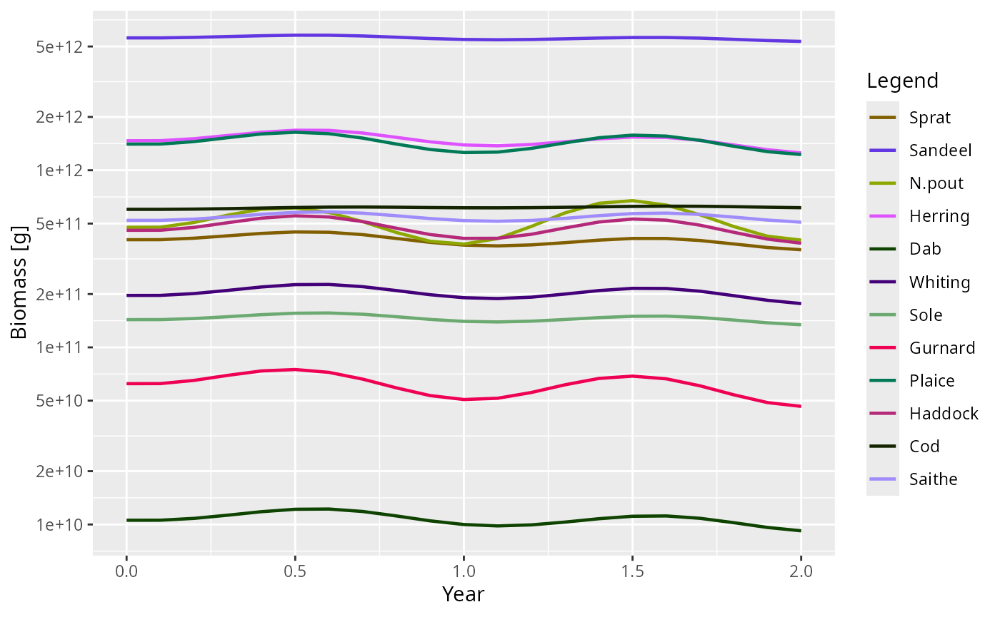
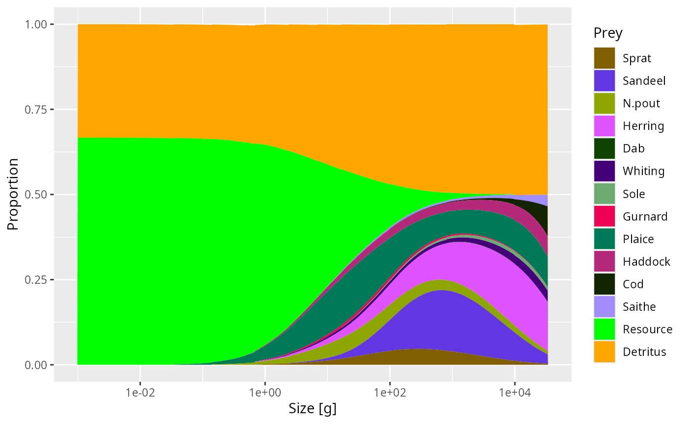

# Extending mizer

## Overview

This vignette is for users who want to change how mizer works without
editing the package source code. There are five main extension routes:

1.  Use
    [`setExtEncounter()`](https://sizespectrum.org/mizer/reference/setExtEncounter.md)
    or
    [`setExtMort()`](https://sizespectrum.org/mizer/reference/setExtMort.md)
    when you want to add simple external food or mortality sources that
    do not need their own dynamics.
2.  Use
    [`setRateFunction()`](https://sizespectrum.org/mizer/reference/setRateFunction.md)
    when you want to replace one of the standard rate calculations such
    as encounter, growth, mortality, or recruitment.
3.  Use
    [`setComponent()`](https://sizespectrum.org/mizer/reference/setComponent.md)
    when you want to add a new ecosystem component such as detritus,
    carrion, or an extra resource pool.
4.  Use S3 subclassing of `MizerParams` and `MizerSim` when you want to
    extend generic mizer methods such as plotting or summaries for a
    custom model type.
5.  Use
    [`customFunction()`](https://sizespectrum.org/mizer/reference/customFunction.md)
    only as a last resort when neither of the first four mechanisms is
    sufficient.

The safest workflow is to start with the smallest change that can
express your idea. In particular, if you only need to change one rate,
prefer
[`setRateFunction()`](https://sizespectrum.org/mizer/reference/setRateFunction.md)
over replacing
[`mizerRates()`](https://sizespectrum.org/mizer/reference/mizerRates.md)
or patching internal mizer functions.

## Choosing an extension mechanism

The following table is a quick guide.

| Goal | Use | Notes |
|:---|:---|:---|
| Add a non-dynamical external food or mortality source | [`setExtEncounter()`](https://sizespectrum.org/mizer/reference/setExtEncounter.md) or [`setExtMort()`](https://sizespectrum.org/mizer/reference/setExtMort.md) | Simplest route when the extra process does not need its own state variable. |
| Change one built-in rate calculation | [`setRateFunction()`](https://sizespectrum.org/mizer/reference/setRateFunction.md) | Best option for time-dependent or alternative rate formulations. |
| Add a new state variable or ecosystem pool | [`setComponent()`](https://sizespectrum.org/mizer/reference/setComponent.md) | Lets you add component dynamics and optional encounter or mortality contributions. |
| Extend plots or summaries for a custom model type | S3 subclass + new methods | Advanced route for custom behaviour layered on top of mizer generics. |
| Store parameters needed by your custom code | [`other_params()`](https://sizespectrum.org/mizer/reference/setRateFunction.md) or `component_params` | Use [`other_params()`](https://sizespectrum.org/mizer/reference/setRateFunction.md) for model-wide parameters and `component_params` for one component. |
| Replace arbitrary internal mizer code | [`customFunction()`](https://sizespectrum.org/mizer/reference/customFunction.md) | Experimental and fragile. Use only if the standard mechanisms cannot express your change. |

### `setExtEncounter()` and `setExtMort()`

These are the lightest-weight extension mechanisms. They are useful when
you want to represent ecosystem processes that affect fish but do not
need a separate state variable or their own dynamics.

Typical uses are:

- extra food sources that are not modelled explicitly, via
  [`setExtEncounter()`](https://sizespectrum.org/mizer/reference/setExtEncounter.md),
- mortality from predators that are outside the model, via
  [`setExtMort()`](https://sizespectrum.org/mizer/reference/setExtMort.md).

Both quantities are species x size arrays:

- `ext_encounter` has units of mass per year and is added directly to
  [`getEncounter()`](https://sizespectrum.org/mizer/reference/getEncounter.md),
- `ext_mort` has units of `1/year` and contributes directly to
  mortality.

If you only need a fixed background contribution, this is usually a
better choice than
[`setComponent()`](https://sizespectrum.org/mizer/reference/setComponent.md).
See [Worked example: non-dynamical external encounter and
mortality](#worked-example-non-dynamical-external-encounter-and-mortality).

### `setRateFunction()`

Use
[`setRateFunction()`](https://sizespectrum.org/mizer/reference/setRateFunction.md)
when your model still fits mizer’s standard flow of rate calculations,
but one step should be done differently. Examples include:

- making encounter or mortality explicitly time-dependent,
- using an alternative growth or reproduction formulation,
- swapping in a different recruitment density-dependence,
- replacing the whole
  [`mizerRates()`](https://sizespectrum.org/mizer/reference/mizerRates.md)
  pipeline with a custom version.

Your function is registered by name:

``` r

params <- setRateFunction(params, "Mort", "myMort")
```

The function must be available by name in the global environment or in
an installed package. mizer stores the function name, not the function
object. See [Worked example: a custom encounter
function](#worked-example-a-custom-encounter-function).

### `setComponent()`

Use
[`setComponent()`](https://sizespectrum.org/mizer/reference/setComponent.md)
when your model needs an additional dynamical quantity that is not
already represented in `MizerParams`, for example detritus, carrion, an
oxygen pool, or a second resource spectrum.

A component can contribute to the model in up to three ways:

- `dynamics_fun` updates the component itself during projection,
- `encounter_fun` adds to
  [`getEncounter()`](https://sizespectrum.org/mizer/reference/getEncounter.md),
- `mort_fun` adds to
  [`getMort()`](https://sizespectrum.org/mizer/reference/getMort.md).

The component state can be any R object. For example it can be a scalar,
a vector on the resource size grid, or a list with several fields. See
[Worked example: adding a detritus-like
component](#worked-example-adding-a-detritus-like-component).

### S4 subclassing with S3 methods for `MizerParams` and `MizerSim`

This is the most flexible extension route that still works with mizer’s
public generic functions. Although `MizerParams` and `MizerSim` are S4
classes, mizer registers many user-facing methods as S3 methods. That
means extension package authors can define a formal S4 subclass of these
objects and then provide S3 methods for that subclass such as:

- `plotBiomass.MyMizerSim()`,
- `summary.MyMizerParams()`,
- `getBiomass.MyMizerSim()`.

This is especially useful if you have added extra components or metadata
and want mizer’s summaries or plots to include them. Because multiple
extension packages may all want to modify the same function, each method
should call [`NextMethod()`](https://rdrr.io/r/base/UseMethod.html) so
that the contributions compose correctly.

See
[`vignette("creating-extension-packages", package = "mizer")`](https://sizespectrum.org/mizer/articles/creating-extension-packages.md)
for a step-by-step guide.

### `customFunction()`

Use
[`customFunction()`](https://sizespectrum.org/mizer/reference/customFunction.md)
only if you have confirmed that your goal cannot be expressed with
[`setRateFunction()`](https://sizespectrum.org/mizer/reference/setRateFunction.md),
[`setComponent()`](https://sizespectrum.org/mizer/reference/setComponent.md),
`resource_dynamics()<-`, or
[`setReproduction()`](https://sizespectrum.org/mizer/reference/setReproduction.md).
It replaces an internal mizer function in the package namespace and can
easily break the package if your replacement is not fully compatible.

## Worked example: non-dynamical external encounter and mortality

If the extra ecological process does not need its own state variable,
you can often model it with external encounter or external mortality.

For example, suppose each species has a fixed extra food source that
scales allometrically with body size:

``` r

params_ext <- NS_params
extra_food <- outer(rep(0.1, nrow(species_params(params_ext))),
                    w(params_ext)^(3/4))
ext_encounter(params_ext) <- ext_encounter(params_ext) + extra_food
```

This adds `extra_food` directly to the total encounter rate:

``` r

enc_base <- getEncounter(NS_params)
enc_ext <- getEncounter(params_ext)
range(enc_ext - enc_base, na.rm = TRUE)
#> [1] 5.623413e-04 2.820537e+02
```

Similarly, you can add a fixed external mortality term:

``` r

params_mort <- NS_params
extra_mort <- outer(rep(0.05, nrow(species_params(params_mort))),
                    w(params_mort)^(-1/4))
ext_mort(params_mort) <- ext_mort(params_mort) + extra_mort
```

This route is appropriate when:

- the extra process is not depleted or replenished dynamically,
- fish are affected by it but do not feed back on it,
- you want a transparent species x size term rather than a new
  component.

## Worked example: a custom encounter function

The next step up in complexity is to modify one rate while delegating
most of the work back to the built-in mizer function. The example below
adds a sinusoidal seasonal multiplier to the standard encounter rate.

``` r

params <- NS_params
other_params(params) <- list(
    season_amplitude = 0.2,
    season_period = 1
)
```

``` r

seasonalEncounter <- function(params, n, n_pp, n_other, t, ...) {
    p <- other_params(params)
    multiplier <- 1 + p$season_amplitude * sin(2 * pi * t / p$season_period)
    multiplier * mizerEncounter(params, n = n, n_pp = n_pp, n_other = n_other,
                                t = t, ...)
}
```

Register the function and inspect the result:

``` r

params2 <- setRateFunction(params, "Encounter", "seasonalEncounter")
```

``` r

enc0 <- getEncounter(params2, t = 0)
enc_quarter <- getEncounter(params2, t = 0.25)
range(enc_quarter / enc0, na.rm = TRUE)
#> [1] 1.2 1.2
```

``` r

sim <- project(params2, t_max = 2, t_save = 0.1)
plotBiomass(sim)
```



This pattern is often the easiest way to extend mizer safely:

- fetch custom parameters from `other_params(params)`,
- compute a modifier,
- call the standard mizer rate function,
- return a plain numeric matrix of the same shape.

See [How custom rate functions are
called](#how-custom-rate-functions-are-called) for more info.

### Testing a custom rate function

When you develop an extension package, add tests that compare your
custom rate function to the built-in behaviour in a simple case. For the
seasonal example a good first test would check:

- at `t = 0`, the result equals
  [`mizerEncounter()`](https://sizespectrum.org/mizer/reference/mizerEncounter.md),
- at `t = 0.25`, the result is scaled by `1 + season_amplitude`,
- the returned object has the same dimensions and dimnames as
  `initialN(params)`.

## Worked example: adding a detritus-like component

Now suppose you want to add a component that is consumed by fish and
slowly relaxes back to a carrying capacity. We will store the component
on the full resource size grid so that it can be used like an extra prey
spectrum.

``` r

detritusEncounter <- function(params, n, n_pp, n_other, component, ...) {
    params2 <- params
    params2@other_encounter[[component]] <- NULL
    mizerEncounter(params2, n = n, n_pp = n_other[[component]],
                   n_other = n_other, ...)
}

detritusDynamics <- function(params, n_other, rates, dt, component, ...) {
    detritus <- n_other[[component]]
    p <- params@other_params[[component]]
    interaction <- params@species_params$interaction_resource
    mort <- as.vector(interaction %*% rates$pred_rate)
    target <- p$rate * p$capacity / (p$rate + mort)
    target - (target - detritus) * exp(-(p$rate + mort) * dt)
}
```

``` r

detritus_params <- list(
    capacity = initialNResource(params),
    rate = params@rr_pp
)

params3 <- setComponent(
    params,
    component = "Detritus",
    initial_value = initialNResource(params) / 2,
    dynamics_fun = "detritusDynamics",
    encounter_fun = "detritusEncounter",
    component_params = detritus_params,
    colour = "orange"
)
```

Once the component has been added:

- its initial state is available via `initialNOther(params3)$detritus`,
- its settings can be inspected with
  `getComponent(params3, "detritus")`,
- its contribution is included automatically in
  [`getEncounter()`](https://sizespectrum.org/mizer/reference/getEncounter.md)
  and
  [`getDiet()`](https://sizespectrum.org/mizer/reference/getDiet.md).

For example:

``` r

plotDiet(params3, species = "Cod")
```



If you also want the component to contribute to mortality, add a
`mort_fun` when calling
[`setComponent()`](https://sizespectrum.org/mizer/reference/setComponent.md).

## S4 subclassing with S3 method dispatch

When an extension needs to change how generic mizer functions behave —
for example making
[`getBiomass()`](https://sizespectrum.org/mizer/reference/getBiomass.md)
include extra components, or making
[`plotBiomass()`](https://sizespectrum.org/mizer/reference/plotBiomass.md)
show additional panels — the right approach is to define a marker S4
subclass and register S3 methods for that class. This makes multiple
extension packages composable: each package adds its own step and passes
control to the next via
[`NextMethod()`](https://rdrr.io/r/base/UseMethod.html).

For a step-by-step guide to writing this kind of extension package,
including worked examples from
[mizerStarvation](https://github.com/sizespectrum/mizerStarvation) and
[mizerShelf](https://github.com/sizespectrum/mizerShelf), see
[`vignette("creating-extension-packages", package = "mizer")`](https://sizespectrum.org/mizer/articles/creating-extension-packages.md).

## How custom rate functions are called

Each overridable rate has its own expected function signature and return
shape. The most important point is that custom rate functions should
return plain numeric objects, not `ArraySpeciesBySize` or
`ArrayTimeBySpecies` objects. The `get*()` wrappers add those classes
afterwards where appropriate.

The table below summarises the required inputs and outputs.

| Rate | Signature | Return value |
|:---|:---|:---|
| Encounter | function(params, n, n_pp, n_other, t, …) | numeric matrix, species x size |
| FeedingLevel | function(params, n, n_pp, n_other, t, encounter, …) | numeric matrix, species x size |
| EReproAndGrowth | function(params, n, n_pp, n_other, t, encounter, feeding_level, …) | numeric matrix, species x size |
| ERepro | function(params, n, n_pp, n_other, t, e, …) | numeric matrix, species x size |
| EGrowth | function(params, n, n_pp, n_other, t, e, e_repro, …) | numeric matrix, species x size |
| PredRate | function(params, n, n_pp, n_other, t, feeding_level, …) | numeric matrix, species x full size grid |
| PredMort | function(params, n, n_pp, n_other, t, pred_rate, …) | numeric matrix, species x size |
| FMort | function(params, n, n_pp, n_other, t, effort, e_growth, pred_mort, …) | numeric matrix, species x size |
| Mort | function(params, n, n_pp, n_other, t, f_mort, pred_mort, …) | numeric matrix, species x size |
| RDI | function(params, n, n_pp, n_other, t, e_growth, mort, e_repro, …) | numeric vector, one value per species |
| RDD | function(rdi, species_params, params, t, …) | numeric vector, one value per species |
| ResourceMort | function(params, n, n_pp, n_other, t, pred_rate, …) | numeric vector, one value per full size bin |
| Rates | function(params, n, n_pp, n_other, t, effort, rates_fns, …) | named list with all standard rate components |

### Common arguments

Most custom rate functions use the same core arguments:

- `params`: the `MizerParams` object,
- `n`: species abundance by species and size,
- `n_pp`: the resource abundance on the full size grid,
- `n_other`: a named list of additional component states,
- `t`: the current simulation time.

Some rates also receive prerequisite rates that were already calculated
earlier in the pipeline, for example `encounter`, `feeding_level`, or
`pred_mort`.

### Dimensions and dimnames

Most size-resolved rates should return a matrix with the same dimensions
as `initialN(params)`, so a species x size matrix with the same
dimnames. The two important exceptions are:

- `PredRate`, which uses the full prey size grid and therefore returns
  species x `w_full`,
- `ResourceMort`, which returns one value per `w_full` bin rather than
  one value per species.

At registration time
[`setRateFunction()`](https://sizespectrum.org/mizer/reference/setRateFunction.md)
calls your function with test inputs and checks that the returned object
has the expected dimensions. This catches many mistakes immediately.

Before moving to dynamical components, it is worth seeing the even
simpler case of a non-dynamical extension.

## Practical advice for extension authors

### Start from a built-in function

If possible, copy the relevant built-in mizer function, make one change,
and register the modified version. This makes it much easier to stay
compatible with the rest of the rate pipeline.

### Keep model-wide and component-specific parameters separate

Use:

- `other_params(params)` for parameters used by custom rate functions
  across the whole model,
- `component_params` in
  [`setComponent()`](https://sizespectrum.org/mizer/reference/setComponent.md)
  for parameters belonging to one component only.

This keeps the structure of `params@other_params` readable and makes
debugging much easier.

### Return plain numeric objects

If you replace a built-in rate function, return a plain matrix, vector,
or list with the expected dimensions. Do not return `ArraySpeciesBySize`
objects from custom rate functions that are called through
[`setRateFunction()`](https://sizespectrum.org/mizer/reference/setRateFunction.md).

### Preserve dimnames where possible

Many bugs in extension code come from returning the right numeric values
with the wrong shape. A good habit is to build outputs from existing
mizer arrays so that dimensions and dimnames are inherited
automatically.

### Test registration and use

Test both of these:

1.  that
    [`setRateFunction()`](https://sizespectrum.org/mizer/reference/setRateFunction.md)
    or
    [`setComponent()`](https://sizespectrum.org/mizer/reference/setComponent.md)
    succeeds,
2.  that the downstream function you care about, such as
    [`getEncounter()`](https://sizespectrum.org/mizer/reference/getEncounter.md),
    [`getDiet()`](https://sizespectrum.org/mizer/reference/getDiet.md),
    or
    [`project()`](https://sizespectrum.org/mizer/reference/project.md),
    uses your extension as intended.

## When to move beyond a local script

If your extension becomes useful across several projects, consider
turning it into a small package. That gives you:

- a stable namespace so mizer can find your functions by name,
- a natural place for unit tests and documentation,
- versioning that can be recorded in `params@extensions`.

For larger changes you may also want to discuss your design on the
[mizer issue tracker](https://github.com/sizespectrum/mizer/issues)
before committing to an interface.

## See also

- [Using mizer extension
  packages](https://sizespectrum.org/mizer/articles/using-extension-packages.md)
- [Creating a mizer extension
  package](https://sizespectrum.org/mizer/articles/creating-extension-packages.md)
