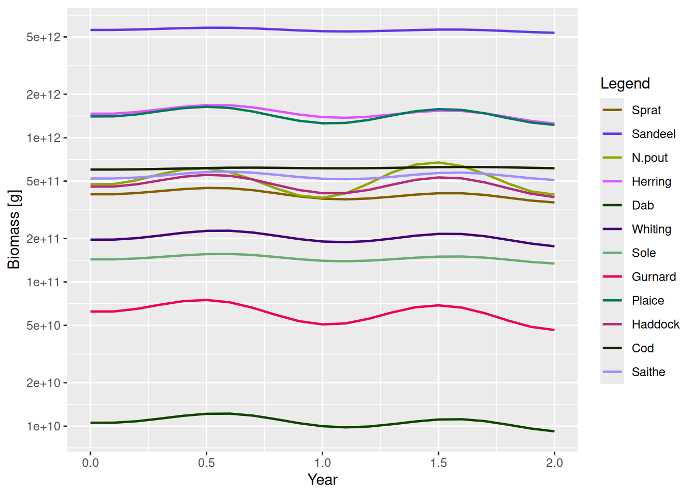
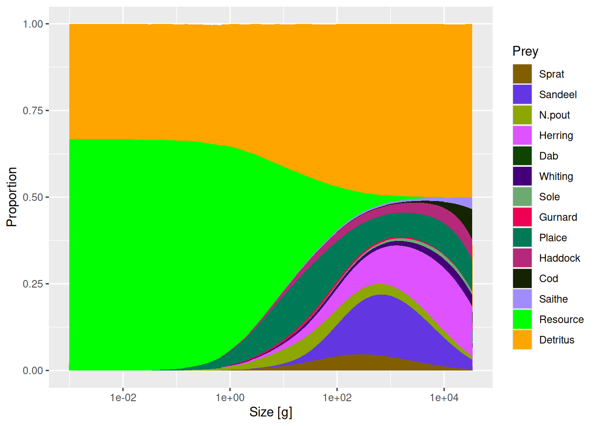

# Guide: Extending mizer

This guide covers the mechanisms for customising mizer’s dynamics
without editing the package source, from external encounter and
mortality through to whole new ecosystem components, with worked
examples of each. To package an extension up for others to use, see the
[guide to creating a mizer extension
package](https://sizespectrum.org/mizer/articles/guide-create-extension-package.md).

This is for changing how mizer works **without editing the package
source**. Pick the **lightest** mechanism that expresses your change,
and reach for a heavier one only when the lighter one cannot do the job.
All setters return a new
[`MizerParams`](https://sizespectrum.org/mizer/reference/MizerParams.md)
— reassign the result.

| Goal | Use |
|----|----|
| Add a fixed external food or mortality source (no new state variable) | [`ext_encounter()`](https://sizespectrum.org/mizer/reference/setExtEncounter.md) / [`ext_mort()`](https://sizespectrum.org/mizer/reference/setExtMort.md) |
| Add an extra encounter or mortality that depends on the model state but has no state of its own | [`other_encounter()`](https://sizespectrum.org/mizer/reference/other_mort.md) / [`other_mort()`](https://sizespectrum.org/mizer/reference/other_mort.md) |
| Change how one built-in rate is calculated | [`setRateFunction()`](https://sizespectrum.org/mizer/reference/setRateFunction.md) |
| Add a new dynamical pool (detritus, carrion, oxygen, second resource…) | [`setComponent()`](https://sizespectrum.org/mizer/reference/setComponent.md) |
| Store parameters for your custom code | [`other_params()`](https://sizespectrum.org/mizer/reference/setRateFunction.md) (model-wide) or `component_params` (one component) |
| Extend plots/summaries for a custom model type | S3 methods on an S4 subclass |
| Replace arbitrary internal mizer code (last resort) | [`customFunction()`](https://sizespectrum.org/mizer/reference/customFunction.md) |

If you only need to change one rate, prefer
[`setRateFunction()`](https://sizespectrum.org/mizer/reference/setRateFunction.md)
over replacing
[`mizerRates()`](https://sizespectrum.org/mizer/reference/mizerRates.md)
or patching internal functions. If you only need to change a *number*
the rates are computed from, you do not need this skill at all — see the
[guide to changing model
parameters](https://sizespectrum.org/mizer/articles/guide-change-parameters.md).

------------------------------------------------------------------------

## External encounter and mortality (lightest)

For a background process that affects fish but needs no state of its
own. Both are **species × size** arrays: `ext_encounter` (mass/year,
added to
[`getEncounter()`](https://sizespectrum.org/mizer/reference/getEncounter.md))
and `ext_mort` (1/year, added to mortality).

``` r

ext_mort(params) <- my_mort_array        # e.g. outside predators
ext_encounter(params) <- my_food_array   # extra unmodelled food
```

Build the array from the model’s own grid rather than from literal
dimensions, so its shape and dimnames come out right, and **add to**
what is already there rather than overwriting it. An extra food source
scaling allometrically with body size:

``` r

params_ext <- NS_params
extra_food <- outer(rep(0.1, nrow(species_params(params_ext))),
                    w(params_ext)^(3/4))
ext_encounter(params_ext) <- ext_encounter(params_ext) + extra_food
```

This is the right choice when the extra process is not itself depleted
or replenished, and the fish do not feed back on it. If it needs to
respond to the fish, you need a component instead.

External encounter changes the realised encounter and feeding level, but
it does not enter the power-law reference state used by
[`get_gamma_default()`](https://sizespectrum.org/mizer/reference/get_gamma_default.md)
and
[`get_f0_default()`](https://sizespectrum.org/mizer/reference/get_f0_default.md).
Those defaults likewise exclude functions registered with
[`other_encounter()`](https://sizespectrum.org/mizer/reference/other_mort.md),
including a component’s `encounter_fun`: they describe feeding on the
reference resource alone, before extra food sources are added.

------------------------------------------------------------------------

## Replacing a rate function

Use when the model still follows mizer’s standard flow but one step
should be computed differently — a time-dependent encounter, an
alternative growth or recruitment formulation, and so on. Mizer stores
the **function name**, so the function must be findable by name in the
global environment or an installed package; a function defined inside
another function cannot be found.

``` r

params <- setRateFunction(params, "Mort", "myMort")
getRateFunction(params)      # list the current rate functions
```

Replaceable rates include `Rates`, `Encounter`, `FeedingLevel`,
`PredRate`, `PredMort`, `Mort`, `ResourceMort`, `EReproAndGrowth`,
`ERepro`, `EGrowth`, `Diffusion`, `FMort`, `RDI` (density-independent
recruitment), and `RDD` (density-dependent recruitment). Resource
dynamics is set separately via
[`resource_dynamics()`](https://sizespectrum.org/mizer/reference/setResource.md).

**Write your function by starting from the built-in**
([`mizerMort()`](https://sizespectrum.org/mizer/reference/mizerMort.md),
[`mizerEncounter()`](https://sizespectrum.org/mizer/reference/mizerEncounter.md),
…): copy it, change what you need, and keep the same signature and
return dimensions/dimnames. Custom rate functions receive `params`, the
current state (`n`, `n_pp`, `n_other`), `t`, and previously computed
rates via `...` — accept `...` and pull what you need from it.

``` r

# Add a size-independent extra mortality, its size stored in other_params
myMort <- function(params, n, n_pp, n_other, t, f_mort, pred_mort, ...) {
    base <- mizerMort(params, n, n_pp, n_other, t, f_mort, pred_mort, ...)
    base + other_params(params)$extra_mort  # a scalar or species × size array
}
other_params(params)$extra_mort <- 0.1     # store the parameter
params <- setRateFunction(params, "Mort", "myMort")
```

**Time-dependent rates are the key reason to reach for
[`setRateFunction()`](https://sizespectrum.org/mizer/reference/setRateFunction.md).**
Species parameters and rate arrays are fixed for the whole simulation,
but a rate *function* receives the current time `t` and can therefore
change as the run proceeds — seasonal forcing, a warming trend, a
management measure that switches on in a given year. Wrap the built-in
and scale its result by `t`:

``` r

seasonalMort <- function(params, t, ...) {
    mizerMort(params, t = t, ...) * (1 + 0.3 * sin(2 * pi * t))   # t in years
}
params <- setRateFunction(params, "Mort", "seasonalMort")
```

**Never let a rate jump as a function of abundance.** Depending on `t`
or `w` discontinuously is fine; depending on `n`, `n_pp` or `n_other`
discontinuously is not. Mizer’s time steppers freeze the rates during
each density update, so they cannot see a threshold being crossed within
a step. A rule like `if (biomass < threshold) effort <- 0` gives a
trajectory that keeps changing as `dt` is refined, makes
`solver = "newton"` stall, and makes
[`getStability()`](https://sizespectrum.org/mizer/reference/getStability.md)
return a confident but meaningless answer — with no warning from mizer.
Choosing `method = "tr_bdf2"` does not help. Give the switch a finite
width instead:

``` r

# Bad: jumps. Good: ramps linearly between two thresholds.
frac <- (biomass - b_lim) / (b_trigger - b_lim)
effort <- effort * min(1, max(0, frac))
```

[`max()`](https://rdrr.io/r/base/Extremes.html)/[`min()`](https://rdrr.io/r/base/Extremes.html)
kinks are continuous and much less troublesome — they cost some
accuracy, not correctness. See the [Discontinuous rate
functions](https://sizespectrum.org/mizer/articles/discontinuous_rates.md)
article.

### Signatures and return shapes

Each replaceable rate has its own signature and its own expected return
shape.
[`setRateFunction()`](https://sizespectrum.org/mizer/reference/setRateFunction.md)
calls your function with test inputs at registration and checks the
dimensions, so a mistake here surfaces immediately rather than
mid-projection.

| Rate | Signature | Return value |
|----|----|----|
| `Encounter` | `function(params, n, n_pp, n_other, t, ...)` | numeric matrix, species × size |
| `FeedingLevel` | `function(params, n, n_pp, n_other, t, encounter, ...)` | numeric matrix, species × size |
| `EReproAndGrowth` | `function(params, n, n_pp, n_other, t, encounter, feeding_level, ...)` | numeric matrix, species × size |
| `ERepro` | `function(params, n, n_pp, n_other, t, e, ...)` | numeric matrix, species × size |
| `EGrowth` | `function(params, n, n_pp, n_other, t, e_repro, e, ...)` | numeric matrix, species × size |
| `PredRate` | `function(params, n, n_pp, n_other, t, feeding_level, ...)` | numeric matrix, species × **full** size grid |
| `PredMort` | `function(params, n, n_pp, n_other, t, pred_rate, ...)` | numeric matrix, species × size |
| `FMort` | `function(params, n, n_pp, n_other, t, effort, e_growth, pred_mort, ...)` | numeric matrix, species × size |
| `Mort` | `function(params, n, n_pp, n_other, t, f_mort, pred_mort, ...)` | numeric matrix, species × size |
| `RDI` | `function(params, n, n_pp, n_other, t, e_growth, mort, e_repro, diffusion, ...)` | numeric vector, one value per species |
| `RDD` | `function(rdi, species_params, params, t, ...)` | numeric vector, one value per species |
| `ResourceMort` | `function(params, n, n_pp, n_other, t, pred_rate, ...)` | numeric vector, one value per full size bin |
| `Diffusion` | `function(params, n, n_pp, n_other, t, feeding_level, ...)` | numeric matrix, species × size |
| `Rates` | `function(params, n, n_pp, n_other, t, effort, rates_fns, ...)` | named list with all standard rate components |

Three rules that follow from the table:

- **Return plain numeric objects.** Never return an
  [`ArraySpeciesBySize`](https://sizespectrum.org/mizer/reference/ArraySpeciesBySize.md)
  or
  [`ArrayTimeBySpecies`](https://sizespectrum.org/mizer/reference/ArrayTimeBySpecies.md)
  from a function registered with
  [`setRateFunction()`](https://sizespectrum.org/mizer/reference/setRateFunction.md);
  the `get…()` wrappers add those classes afterwards where they belong.
- **Most size-resolved rates match
  [`initialN(params)`](https://sizespectrum.org/mizer/reference/initialN-set.md)**
  in both dimensions and dimnames. The exceptions are `PredRate`, which
  is on the full prey grid
  ([`w_full`](https://sizespectrum.org/mizer/reference/w.md)), and
  `ResourceMort`, which is one value per `w_full` bin rather than one
  per species.
- **Build outputs from existing mizer arrays** so dimensions and
  dimnames are inherited. Most bugs in extension code are the right
  numbers in the wrong shape.

------------------------------------------------------------------------

## Respecting the model’s quadrature scheme

A model may be on either of two quadrature schemes, selected by the
`bin_average` entry of
[`second_order_w()`](https://sizespectrum.org/mizer/reference/second_order_w.md)
(see the [guide to running a mizer
simulation](https://sizespectrum.org/mizer/articles/guide-run-simulation.md)).
Code that ignores this looks correct and passes its tests, because the
default is the first-order scheme — and is then silently wrong by around
10% for anyone who has switched the second-order scheme on. Three rules:

- **Build derived quantities from the rate functions, don’t re-derive
  them.**
  [`getEncounter()`](https://sizespectrum.org/mizer/reference/getEncounter.md),
  [`getFeedingLevel()`](https://sizespectrum.org/mizer/reference/getFeedingLevel.md),
  [`getPredRate()`](https://sizespectrum.org/mizer/reference/getPredRate.md),
  [`getEGrowth()`](https://sizespectrum.org/mizer/reference/getEGrowth.md)
  already carry the right quadrature for whichever scheme the model is
  on. Re-deriving a rate from the species parameters is how this goes
  wrong.
- **To go inside the encounter convolution, use
  [`encounter_kernel()`](https://sizespectrum.org/mizer/reference/encounter_kernel.md),
  not
  [`pred_kernel()`](https://sizespectrum.org/mizer/reference/setPredKernel.md).**
  [`pred_kernel()`](https://sizespectrum.org/mizer/reference/setPredKernel.md)
  returns the kernel point-sampled on the grid — right for plotting, and
  the form in which you *supply* a custom kernel, but not the
  bin-integrated coefficients the convolution consumes. Pair
  [`encounter_kernel()`](https://sizespectrum.org/mizer/reference/encounter_kernel.md)
  with the plain point prey weight `params@w_full * params@dw_full`,
  which is a normalisation the kernel is built to cancel, so it must not
  itself be bin-averaged.
- **If your setter precomputes an array from a size-dependent
  parameter,** gate it on `params@second_order_w[["bin_average"]]` the
  way
  [`setExtMort()`](https://sizespectrum.org/mizer/reference/setExtMort.md)
  and
  [`setResource()`](https://sizespectrum.org/mizer/reference/setResource.md)
  do, and do the integral once at setup so projection cost is unchanged.

For a summary-style integral \\\int N_i(w) K_i(w) dw\\, do not write the
sum at all:
[`sizeIntegral(params, weighting = K, min_w = ..., max_w = ...)`](https://sizespectrum.org/mizer/reference/sizeIntegral.md)
does the integral under whichever scheme the model is on and wraps the
result — see “Writing your own indicator” in the [guide to analysing and
plotting mizer
results](https://sizespectrum.org/mizer/articles/guide-analyse-and-plot.md).
If you need the gating on its own, for a weight you are not integrating,
that is
[`bin_average_weight(K, params)`](https://sizespectrum.org/mizer/reference/bin_average_weight.md).
Test any new integral with the flag **on** as well as off; a test on the
default path alone proves nothing.

------------------------------------------------------------------------

## Adding a component

Use
[`setComponent()`](https://sizespectrum.org/mizer/reference/setComponent.md)
for a new dynamical quantity — any R object: a scalar, a vector on the
size grid, or a list. A component may contribute in up to three ways:

- `dynamics_fun` — updates the component’s own state during projection,
- `encounter_fun` — adds to
  [`getEncounter()`](https://sizespectrum.org/mizer/reference/getEncounter.md),
- `mort_fun` — adds to
  [`getMort()`](https://sizespectrum.org/mizer/reference/getMort.md).

``` r

params <- setComponent(
    params, "detritus",
    initial_value    = 1e5,
    dynamics_fun     = "detritus_dynamics",
    encounter_fun    = "detritus_encounter",  # optional
    component_params = list(rho = 0.1)
)
```

Access components with
[`getComponent()`](https://sizespectrum.org/mizer/reference/setComponent.md),
remove them with
[`removeComponent()`](https://sizespectrum.org/mizer/reference/setComponent.md).
Component state is available to all custom functions as
`n_other[["detritus"]]`, and its parameters via `component_params`.

If there is nothing for `dynamics_fun` to update — a starvation or
senescence mortality reads the state but keeps none of its own — do not
invent a component for it. Register the function on its own instead:

``` r

other_mort(params)[["starvation"]] <- "starvMort"
other_encounter(params)[["scavenging"]] <- "scavengingEncounter"
```

[`getMort()`](https://sizespectrum.org/mizer/reference/getMort.md) and
[`getEncounter()`](https://sizespectrum.org/mizer/reference/getEncounter.md)
add the result of every function registered this way, exactly as they do
for a component’s `mort_fun` and `encounter_fun`. The two registries do
not overlap: an entry that belongs to a component is owned by
[`setComponent()`](https://sizespectrum.org/mizer/reference/setComponent.md),
reported by
[`getComponent()`](https://sizespectrum.org/mizer/reference/setComponent.md)
and removed by
[`removeComponent()`](https://sizespectrum.org/mizer/reference/setComponent.md),
and
[`other_mort()`](https://sizespectrum.org/mizer/reference/other_mort.md)
deliberately does not list it — the same split
[`other_params()`](https://sizespectrum.org/mizer/reference/setRateFunction.md)
makes for component parameters. Assigning `NULL` removes a free-standing
entry.

The functions named in that call take the component’s name as a
`component` argument, so one implementation can serve several
components, and reach their own state as `n_other[[component]]` and
their own parameters as `params@other_params[[component]]`. A dynamics
function additionally receives the current `rates` and the step length
`dt`, and returns the component’s **new state** — not a rate of change,
so integrate the step yourself. This pair makes a detritus pool that
fish eat and that relaxes back towards a capacity:

``` r

detritusEncounter <- function(params, n, n_pp, n_other, component, ...) {
    params2 <- params
    # Drop this component before delegating, or mizerEncounter() calls back
    # into this function and recurses.
    params2@other_encounter[[component]] <- NULL
    mizerEncounter(params2, n = n, n_pp = n_other[[component]],
                   n_other = n_other, ...)
}

detritusDynamics <- function(params, n_other, rates, dt, component, ...) {
    detritus <- n_other[[component]]
    p <- params@other_params[[component]]
    interaction <- params@species_params$interaction_resource
    mort <- as.vector(interaction %*% rates$pred_rate)
    target <- p$rate * p$capacity / (p$rate + mort)
    # Exact over the step, so the result does not depend on dt
    target - (target - detritus) * exp(-(p$rate + mort) * dt)
}
```

Passing the component’s own abundance to
[`mizerEncounter()`](https://sizespectrum.org/mizer/reference/mizerEncounter.md)
as `n_pp`, as `detritusEncounter()` does, is the trick for making a
component act as an extra prey spectrum: it is then eaten through the
ordinary predation kernel and shows up in
[`getDiet()`](https://sizespectrum.org/mizer/reference/getDiet.md)
without further work.

### Components and the steady state

A component you give a `dynamics_fun` is outside mizer’s steady-state
machinery, in both directions, and a model with one needs checking
accordingly:

- [`tuneSteadyState()`](https://sizespectrum.org/mizer/reference/tuneSteadyState.md),
  [`findSteadyState(solver = "newton")`](https://sizespectrum.org/mizer/reference/findSteadyState.md)
  and
  [`getStability()`](https://sizespectrum.org/mizer/reference/getStability.md)
  hold the component at its stored value and solve the consumer-resource
  subsystem around it. Mizer warns when it meets a component with
  dynamics of its own.
- [`isSteady()`](https://sizespectrum.org/mizer/reference/isSteady.md),
  the [`summary()`](https://sizespectrum.org/mizer/reference/summary.md)
  drift line and
  [`project(check_steady = TRUE)`](https://sizespectrum.org/mizer/reference/project.md)
  judge that same subsystem. A component’s state can be any object at
  all, so mizer cannot form a biomass for it and does not fold its rate
  of change into the number. **A model can be
  [`isSteady()`](https://sizespectrum.org/mizer/reference/isSteady.md)
  while your component is moving.**

Mizer names any component that is moving whenever it reports on the
drift, and `attr(getSteadyResidual(params), "other")` holds the per-cell
relative rates of change it measured, reduced by `max(abs(...))` for
reporting — an overestimate whenever the component has fast cells
holding almost nothing, which is why that number is reported rather than
compared against a tolerance.

To settle a component along with everything else, use
[`projectUntilSettled()`](https://sizespectrum.org/mizer/reference/projectUntilSettled.md),
which advances it like every other state variable; its stopping rule
does wait for the component. Issue \#589 tracks giving components a way
to declare their own reduction and so re-enter the criterion.

------------------------------------------------------------------------

## Worked example: external encounter and mortality

The `extra_food` built above adds straight to the total encounter rate:

``` r

enc_base <- getEncounter(NS_params)
```

    ℹ No `a` column so using a = 0.01 in w = a l^b, with w in g and l in cm.
    ℹ No `b` column so using the isometric default b = 3 in w = a l^b.
    ℹ No `a` column so using a = 0.01 in w = a l^b, with w in g and l in cm.
    ℹ No `b` column so using the isometric default b = 3 in w = a l^b.
    ℹ No `a` column so using a = 0.01 in w = a l^b, with w in g and l in cm.
    ℹ No `b` column so using the isometric default b = 3 in w = a l^b.
    ℹ No `a` column so using a = 0.01 in w = a l^b, with w in g and l in cm.
    ℹ No `b` column so using the isometric default b = 3 in w = a l^b.

``` r

enc_ext <- getEncounter(params_ext)
```

    ℹ No `a` column so using a = 0.01 in w = a l^b, with w in g and l in cm.
    ℹ No `b` column so using the isometric default b = 3 in w = a l^b.
    ℹ No `a` column so using a = 0.01 in w = a l^b, with w in g and l in cm.
    ℹ No `b` column so using the isometric default b = 3 in w = a l^b.
    ℹ No `a` column so using a = 0.01 in w = a l^b, with w in g and l in cm.
    ℹ No `b` column so using the isometric default b = 3 in w = a l^b.
    ℹ No `a` column so using a = 0.01 in w = a l^b, with w in g and l in cm.
    ℹ No `b` column so using the isometric default b = 3 in w = a l^b.

``` r

range(enc_ext - enc_base, na.rm = TRUE)
```

    [1] 5.623413e-04 2.820537e+02

External mortality works the same way — note the negative exponent,
since mortality falls with size where the extra food rose with it:

``` r

params_mort <- NS_params
extra_mort <- outer(rep(0.05, nrow(species_params(params_mort))),
                    w(params_mort)^(-1/4))
ext_mort(params_mort) <- ext_mort(params_mort) + extra_mort
```

------------------------------------------------------------------------

## Worked example: a seasonal encounter rate

Wrapping a built-in rate, in full. This one takes the amplitude and
period of a seasonal cycle from
[`other_params()`](https://sizespectrum.org/mizer/reference/setRateFunction.md):

``` r

params <- NS_params
other_params(params) <- list(season_amplitude = 0.2, season_period = 1)
```

``` r

seasonalEncounter <- function(params, n, n_pp, n_other, t, ...) {
    p <- other_params(params)
    multiplier <- 1 + p$season_amplitude * sin(2 * pi * t / p$season_period)
    multiplier * mizerEncounter(params, n = n, n_pp = n_pp, n_other = n_other,
                                t = t, ...)
}
```

Registered by name, the rate now moves with `t`:

``` r

params2 <- setRateFunction(params, "Encounter", "seasonalEncounter")
```

    ℹ No `a` column so using a = 0.01 in w = a l^b, with w in g and l in cm.
    ℹ No `b` column so using the isometric default b = 3 in w = a l^b.

``` r

enc0 <- getEncounter(params2, t = 0)
enc_quarter <- getEncounter(params2, t = 0.25)
range(enc_quarter / enc0, na.rm = TRUE)
```

    [1] 1.2 1.2

At `t = 0.25` the multiplier is at its maximum, `1 + season_amplitude`,
exactly as intended. The seasonality then carries through a projection:

``` r

sim <- project(params2, t_max = 2, t_save = 0.1)
plotBiomass(sim)
```



A good first test for such a function checks that at `t = 0` it agrees
with
[`mizerEncounter()`](https://sizespectrum.org/mizer/reference/mizerEncounter.md),
that at `t = 0.25` it is scaled by `1 + season_amplitude`, and that its
result has the same dimensions and dimnames as `initialN(params)`.

------------------------------------------------------------------------

## Worked example: a detritus-like component

Putting `detritusEncounter()` and `detritusDynamics()` from above to
work. The component is stored on the full resource size grid, and starts
at half the capacity it relaxes towards:

``` r

detritus_params <- list(capacity = initialNResource(params),
                        rate = params@rr_pp)
```

    ℹ No `a` column so using a = 0.01 in w = a l^b, with w in g and l in cm.
    ℹ No `b` column so using the isometric default b = 3 in w = a l^b.

``` r

params3 <- setComponent(
    params,
    component = "Detritus",
    initial_value = initialNResource(params) / 2,
    dynamics_fun = "detritusDynamics",
    encounter_fun = "detritusEncounter",
    component_params = detritus_params,
    colour = "orange"
)
```

    ℹ No `a` column so using a = 0.01 in w = a l^b, with w in g and l in cm.
    ℹ No `b` column so using the isometric default b = 3 in w = a l^b.

Its initial state is now in
[`initialNOther(params3)$Detritus`](https://sizespectrum.org/mizer/reference/initialNOther-set.md)
and its settings in `getComponent(params3, "Detritus")`. Because it is
eaten through the ordinary predation kernel, it appears in the diet with
no further work:

``` r

plotDiet(params3, species = "Cod")
```

    ℹ No `a` column so using a = 0.01 in w = a l^b, with w in g and l in cm.
    ℹ No `b` column so using the isometric default b = 3 in w = a l^b.



To let the component kill fish as well as feed them, give
[`setComponent()`](https://sizespectrum.org/mizer/reference/setComponent.md)
a `mort_fun` too.

------------------------------------------------------------------------

## Extending plots and summaries: S3 methods on an S4 subclass

This is the most flexible route that still works with mizer’s public
generics. Although `MizerParams` and
[`MizerSim`](https://sizespectrum.org/mizer/reference/MizerSim.md) are
S4 classes, mizer registers most of its user-facing methods as **S3**
methods. So an extension defines a formal S4 subclass of these objects
and provides S3 methods for it — `getBiomass.MyMizerSim()`,
`plotBiomass.MyMizerSim()`, `summary.MyMizerParams()` — which is what
makes a summary or plot account for components the extension added.
Every such method must call
[`NextMethod()`](https://rdrr.io/r/base/UseMethod.html), so that several
extensions loaded at once compose instead of overwriting each other.

This only really works inside a package, because the marker class is
created by mizer when the package loads. Writing that package — the
class, the `.onLoad` registration and the methods — is the subject of
the [guide to creating a mizer extension
package](https://sizespectrum.org/mizer/articles/guide-create-extension-package.md),
and the order the methods then run in is the subject of the [guide to
using mizer extension
packages](https://sizespectrum.org/mizer/articles/guide-use-extension-packages.md).

------------------------------------------------------------------------

## Storing parameters

- **`other_params(params)$foo <- value`** — model-wide parameters your
  custom functions can read.
- **`component_params`** (a
  [`setComponent()`](https://sizespectrum.org/mizer/reference/setComponent.md)
  argument) — parameters scoped to one component.

Keeping the two separate is what keeps `params@other_params` readable
when several custom functions are in play.

------------------------------------------------------------------------

## `customFunction()` (last resort)

[`customFunction()`](https://sizespectrum.org/mizer/reference/customFunction.md)
replaces an internal mizer function inside the package namespace. Reach
for it only after confirming that
[`setRateFunction()`](https://sizespectrum.org/mizer/reference/setRateFunction.md),
[`setComponent()`](https://sizespectrum.org/mizer/reference/setComponent.md),
`resource_dynamics()<-` and
[`setReproduction()`](https://sizespectrum.org/mizer/reference/setReproduction.md)
cannot express the change: a replacement that is not fully compatible
breaks the package, and nothing checks that it is.

------------------------------------------------------------------------

## Testing and packaging

- Test **both** halves: that
  [`setRateFunction()`](https://sizespectrum.org/mizer/reference/setRateFunction.md)
  or
  [`setComponent()`](https://sizespectrum.org/mizer/reference/setComponent.md)
  succeeds, and that the downstream function you actually care about —
  [`getEncounter()`](https://sizespectrum.org/mizer/reference/getEncounter.md),
  [`getDiet()`](https://sizespectrum.org/mizer/reference/getDiet.md),
  [`project()`](https://sizespectrum.org/mizer/reference/project.md) —
  uses your extension as intended.
- After registering a custom rate, run
  [`project()`](https://sizespectrum.org/mizer/reference/project.md) on
  a short horizon and check the affected `get…()` output looks right;
  write a `testthat` test that compares against a hand-computed value on
  a small model.
- If a custom rate depends on the abundances through a threshold, read
  [Discontinuous rate
  functions](https://sizespectrum.org/mizer/articles/discontinuous_rates.md)
  before trusting any results.
- Once an extension is useful in more than one project, or you want to
  give it to someone else, make it a package: a stable namespace mizer
  can resolve function names in, somewhere for tests and documentation
  to live, and a version that gets recorded in `params@extensions`.
  Everything that only matters once you share — `.onLoad` registration,
  marker classes, dispatch via
  [`NextMethod()`](https://rdrr.io/r/base/UseMethod.html), bundled data
  objects, reporting through `info_level`, and upgrading objects saved
  by an earlier version — is in the [guide to creating a mizer extension
  package](https://sizespectrum.org/mizer/articles/guide-create-extension-package.md).
  For the other side of it, loading and saving a model that needs an
  extension package, see the [guide to using mizer extension
  packages](https://sizespectrum.org/mizer/articles/guide-use-extension-packages.md).
- For a larger design, it is worth discussing the interface on the
  [mizer issue tracker](https://github.com/sizespectrum/mizer/issues)
  before committing to it.
