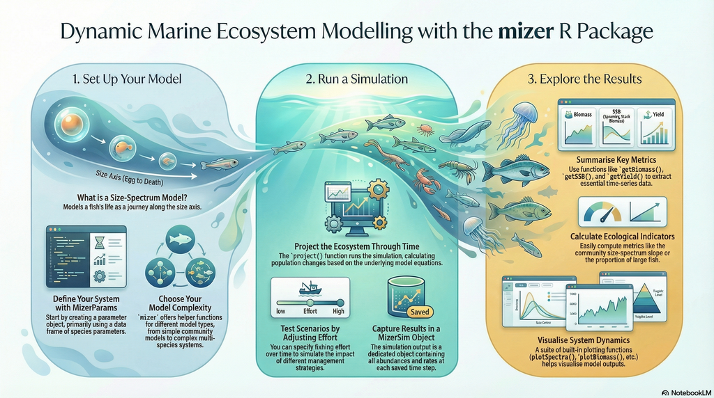
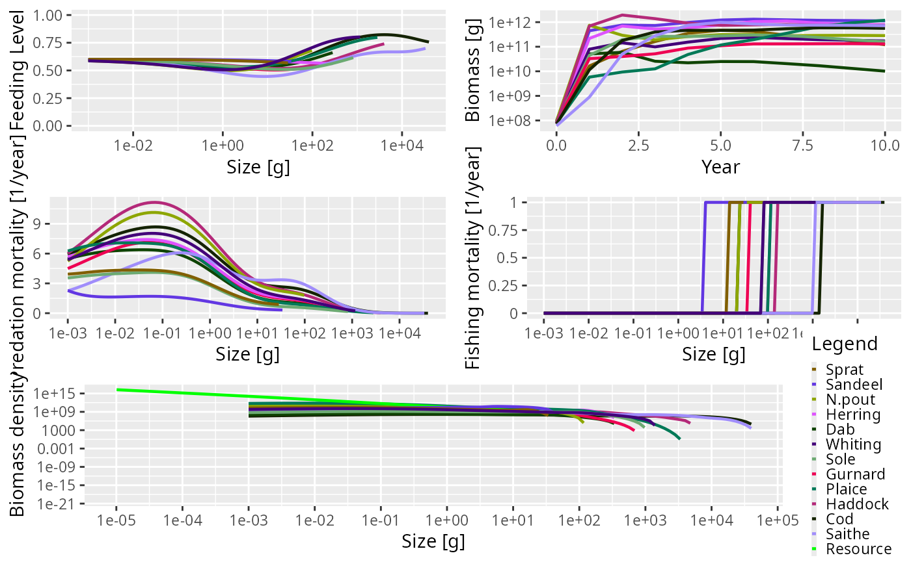
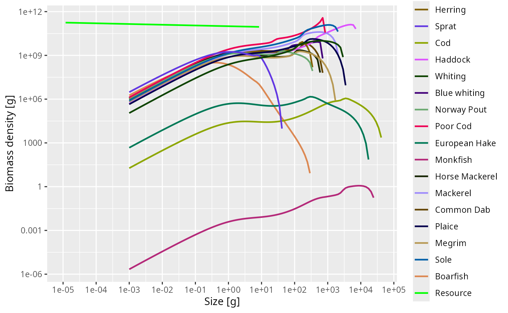
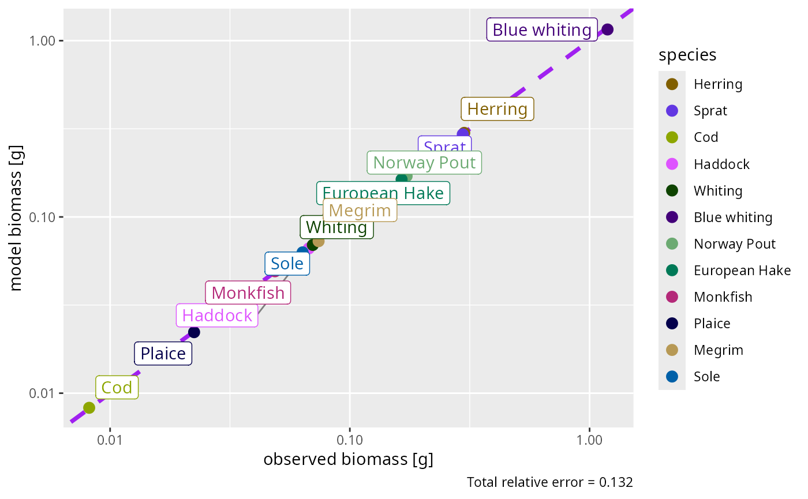
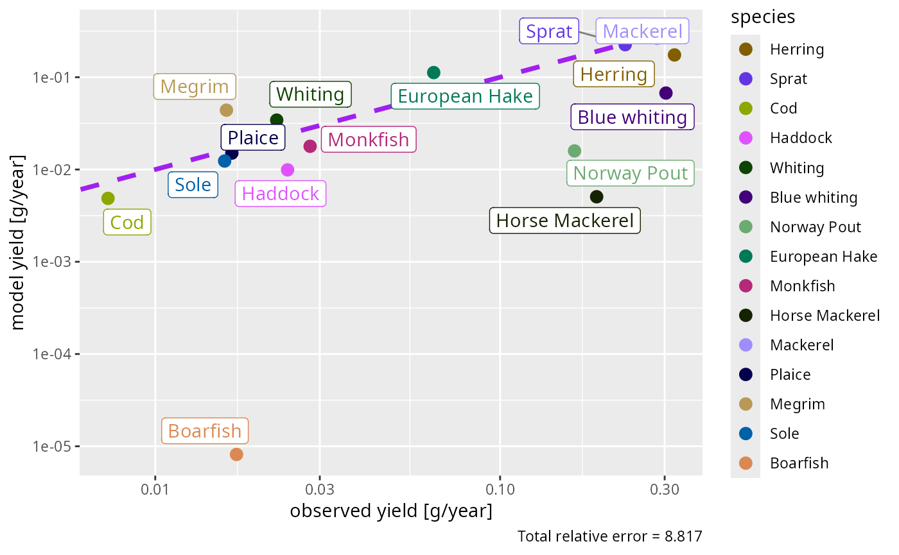

# Getting started with mizer

## Overview

The mizer package implements multi-species dynamic [Size-spectrum
models](#size-spectrum-models) in R. It has been designed for modelling
aquatic ecosystems.

Using mizer is relatively simple. There are four main stages, each
described in more detail in sections below.

1.  [Installing mizer](#installing-mizer).

2.  [Setting the model parameters](#setting-the-model-parameters).

3.  [Running a simulation](#running-a-simulation).

4.  [Exploring the results](#exploring-the-results).

Once you have seen these stages individually, the [worked
example](#a-worked-example-the-celtic-sea) near the end of this page
puts them together into a complete, self-contained study of a real
ecosystem — building, calibrating and projecting a Celtic Sea model.

If you run into any difficulties or have any questions or suggestions,
let us know about it by posting about it on our [issue
tracker](https://github.com/sizespectrum/mizer/issues/new). You can also
twitter to @[mizer_model](https://twitter.com/mizer_model). We love to
hear from you.



Mizer workflow diagram

A good way to get into mizer is to follow the online [mizer
course](https://mizer.course.sizespectrum.org). This course has three
parts, each consisting of several tutorials with example code and
exercises:

- **[Part 1:
  Understand](https://mizer.course.sizespectrum.org/understand/)**  
  You will gain an understanding of size spectra and their dynamics by
  exploring simple example systems hands-on with mizer.

- **[Part 2: Build](https://mizer.course.sizespectrum.org/build/)**  
  You will build your own multi-species mizer model for the Celtic sea,
  following our example. You can also create a model for your own area
  of interest.

- **[Part 3: Use](https://mizer.course.sizespectrum.org/use/)**  
  You will explore the effects of changes in fishing and changes in
  resource dynamics on the fish community and the fisheries yield. You
  will run your own model scenarios.

Click on this preview to open a mizer cheat sheet. [](https://sizespectrum.org/mizer/articles/images/cheat_sheet.pdf)

For quick reference while working we also provide four topic-based cheat
sheets:

- [Model setup and
  calibration](https://sizespectrum.org/mizer/articles/cheatsheet-model-setup-and-calibration.html)
- [Changing model
  parameters](https://sizespectrum.org/mizer/articles/cheatsheet-changing-parameters.html)
- [Fishing](https://sizespectrum.org/mizer/articles/cheatsheet-fishing.html)
- [Analysis and
  plotting](https://sizespectrum.org/mizer/articles/cheatsheet-analysis-and-plotting.html)

There is a [series of YouTube
videos](https://www.youtube.com/watch?v=zh0PDyTUssw&list=PLCTMeyjMKRkqR7uohI3p-61P7ZJj8sd5B)
by Richard Southwell about mizer which are however no longer entirely
up-to-date.

## Installing mizer

If you already have R installed on your computer, then installation of
the mizer package is very simple (assuming you have an active internet
connection). Just start an R session and then type:

``` r

install.packages("mizer")
```

After installing mizer, to actually use it, you need to load the package
using the [`library()`](https://rdrr.io/r/base/library.html) function.
Note that whilst you only need to install the package once, it will need
to be loaded every time you start a new R session.

``` r

library(mizer)
```

If you still need to install R or RStudio as well, or if you are
interested in installing a development version of mizer, click on the
triangle below to reveal further details:

Mizer is compatible with R versions 3.5 and later. You can install R on
your computer by following the instructions at
<https://cran.r-project.org/> for your particular platform.

Alternatively, if you can not or do not want to install R on your
computer, you can also work with R and RStudio in your internet browser
by creating yourself a free account at <https://rstudio.cloud>. There
you can then install mizer as described above. Running mizer in the
RStudio Cloud may be slightly slower than running it locally on your
machine, but the speed is usually quite acceptable.

This guide assumes that you will be using RStudio to work with R. There
is really no reason not to use RStudio and it makes a lot of things much
easier. RStudio develops rapidly and adds useful features all the time
and so it pays to upgrade to the [latest
version](https://posit.co/download/rstudio-desktop/) frequently. This
guide was written with version 2023.12.1.

The source code for mizer is hosted on
[GitHub](https://github.com/sizespectrum/mizer). If you are feeling
brave and wish to try out a development version of mizer you can install
the package from here using the R package devtools (which was used
extensively in putting together mizer). If you have not yet installed
devtools, do

``` r

install.packages("devtools")
```

Then you can install the latest version from GitHub using

``` r

devtools::install_github("sizespectrum/mizer")
```

Using the same
[`devtools::install_github()`](https://devtools.r-lib.org/reference/install-deprecated.html)
function you can also install code from forked mizer repositories or
from other branches on the official repository.

## Setting the model parameters

With mizer it is possible to implement many different types of
size-spectrum models using the same basic tools and methods.

Setting the model parameters is done by creating an object of
[`class ? MizerParams`](https://sizespectrum.org/mizer/reference/MizerParams-class.md).
This includes model parameters such as the life history parameters of
each species, and the fishing gears. For each type of sizespectrum model
there is a function for creating a new MizerParams object,
[`newSingleSpeciesParams()`](https://sizespectrum.org/mizer/reference/newSingleSpeciesParams.md),
[`newCommunityParams()`](https://sizespectrum.org/mizer/reference/newCommunityParams.md),
[`newTraitParams()`](https://sizespectrum.org/mizer/reference/newTraitParams.md)
and
[`newMultispeciesParams()`](https://sizespectrum.org/mizer/reference/newMultispeciesParams.md).

These functions make reasonable default choices for many of the model
parameters that you do not want to specify explicitly. For example to
set up a simple model (described more in the [Community
Model](https://sizespectrum.org/mizer/articles/community_model.html)
section) you can even let mizer choose all the parameters for you.

``` r

params <- newCommunityParams()
```

For a more complicated multi-species model you need to provide a data
frame with some species parameters. An example of a North Sea model is
included with the package. Here we also use a species interaction matrix
for the North Sea species.

``` r

params <- newMultispeciesParams(NS_species_params, NS_interaction)
```

When you run this yourself, the function prints some notes explaining
that, because only a few species parameters were supplied, mizer has
calculated default values for many others (for example the maximum
intake rate `h` and the search volume `gamma`) using size-based theory.
These notes are informational, not errors: they simply flag the
parameters you may want to refine later once you calibrate the model to
data. We have suppressed them here to keep the output short. Calibrating
such a model to observed biomasses and yields is demonstrated in the
[worked example](#a-worked-example-the-celtic-sea) below.

## Running a simulation

This is done by calling the
[`project()`](https://sizespectrum.org/mizer/reference/project.md)
function (as in “project forward in time”) with the model parameters.

``` r

sim <- project(params, t_max = 10, effort = 1)
```

This produces an object of class `MizerSim` which contains the results
of the simulation. In this example we chose to set some parameters of
the [`project()`](https://sizespectrum.org/mizer/reference/project.md)
function to specify that we want to project 10 years into the future,
under the assumption of unit fishing effort. You can see the help page
for [`project()`](https://sizespectrum.org/mizer/reference/project.md)
for more details and it is described fully in [the section on running a
simulation.](https://sizespectrum.org/mizer/articles/running_a_simulation.html)

## Exploring the results

After a simulation has been run, the results can be examined using a
range of
[`?plotting_functions`](https://sizespectrum.org/mizer/reference/plotting_functions.md),
[`?summary_functions`](https://sizespectrum.org/mizer/reference/summary_functions.md)
and
[`?indicator_functions`](https://sizespectrum.org/mizer/reference/indicator_functions.md).
The [`plot()`](https://sizespectrum.org/mizer/reference/plot.md)
function combines several of these plots into one:

``` r

plot(sim)
```



Just as an example: we might be interested in how the proportion of
large fish varies over time. We can get the proportion of Herrings in
terms of biomass that have a weight above 50g in each of the 10 years:

``` r

getProportionOfLargeFish(sim, 
                         species = "Herring", 
                         threshold_w = 50, 
                         biomass_proportion = TRUE)
```

    ##         0         1         2         3         4         5         6         7 
    ## 0.8241807 0.1858698 0.7586884 0.6780193 0.3325129 0.3036110 0.4717033 0.6379461 
    ##         8         9        10 
    ## 0.5976582 0.5539731 0.5763835

We can then use the full power of R to work with these results.

The functionality provided by mizer to explore the simulation results is
more fully described in [the section on exploring the simulation
results.](https://sizespectrum.org/mizer/articles/exploring_the_simulation_results.html)

## A worked example: the Celtic Sea

The four stages above introduced the mizer API one command at a time.
This section puts them together into a single, self-contained study of a
real ecosystem — the Celtic Sea — taking a model from raw species
parameters all the way to a fishing-scenario result:

1.  **Build** a multi-species model from species parameters, an
    interaction matrix and fishing-gear definitions.
2.  **Bring it to steady state** so the size spectra are
    self-consistent.
3.  **Calibrate** it so that its steady state reproduces the *observed*
    biomasses and growth rates.
4.  **Check** it against an independent quantity — the observed
    fisheries yields.
5.  **Set its resilience** to fishing.
6.  **Project a fishing scenario** and **interpret an indicator** —
    here, the total sustainable yield as a function of fishing effort.

The model is the one built step-by-step, with much more explanation of
every choice, in the [Build part of the mizer
course](https://mizer.course.sizespectrum.org/build/). It is based on
the Celtic Sea model of Spence et al.
([2021](#ref-spence_parameterizing_2021)), with species parameters and
observations drawn from FishBase and the ICES stock-assessment database.
Here we concentrate on seeing the whole workflow run in one place.

### Getting the data

The model needs three inputs: a species-parameter data frame, a species
interaction matrix, and a table of fishing-gear parameters. We also load
a set of observed commercial yields to check the model against later.
These small files live in the course repository; the code below
downloads them into your working directory the first time you run it.

``` r

base_url <- "https://github.com/gustavdelius/mizerCourse/raw/master/build/"
files <- c("celtic_species_params.rds", "celtic_gear_params.csv",
           "celtic_interaction.csv", "celtic_yields.rds")
for (f in files) {
    if (!file.exists(f)) download.file(paste0(base_url, f), destfile = f)
}

celtic_species_params <- readRDS("celtic_species_params.rds")
celtic_gear_params    <- read.csv("celtic_gear_params.csv")
celtic_interaction    <- as.matrix(read.csv("celtic_interaction.csv",
                                             row.names = 1))
```

The species-parameter data frame has one row per species. Besides the
required maximum size `w_max` it carries a few life-history parameters
and, crucially, the **observed** average biomass of each species
(`biomass_observed`, in grams per square metre) that we will calibrate
to. Some species have no observation and are left as `NA`.

``` r

celtic_species_params[, c("species", "w_max", "biomass_observed")]
```

    ##           species       w_max biomass_observed
    ## 1         Herring   307.31559      0.300000000
    ## 2           Sprat    35.84195      0.295749801
    ## 3             Cod 41561.32628      0.008179382
    ## 4         Haddock  6669.92227      0.067381049
    ## 5         Whiting  2611.42837      0.070079361
    ## 6    Blue whiting   599.82211      1.188248745
    ## 7     Norway Pout   319.77787      0.172520253
    ## 8        Poor Cod   711.87913               NA
    ## 9   European Hake 15506.13615      0.164362236
    ## 10       Monkfish 21478.67091      0.048720611
    ## 11 Horse Mackerel   518.58232               NA
    ## 12       Mackerel  1857.47965               NA
    ## 13     Common Dab   640.30873               NA
    ## 14         Plaice  3133.64249      0.022404698
    ## 15         Megrim  1556.92834      0.074079322
    ## 16           Sole  1979.31808      0.063519261
    ## 17       Boarfish   278.92128               NA

### Building the model

[`newMultispeciesParams()`](https://sizespectrum.org/mizer/reference/newMultispeciesParams.md)
turns these inputs into a `MizerParams` object, filling in with
size-based defaults every parameter we have not supplied. We set the
allometric exponents `n` and `p` both to 3/4 and switch the commercial
gear on at unit effort.

``` r

cel <- newMultispeciesParams(
    species_params = celtic_species_params,
    gear_params    = celtic_gear_params,
    interaction    = celtic_interaction,
    n = 3/4, p = 3/4,
    initial_effort = 1
)
```

As before, mizer prints notes about the defaults it has chosen; we have
suppressed them here to keep the output short.

### Finding the steady state

A freshly built model has only a rough spectrum.
[`steady()`](https://sizespectrum.org/mizer/reference/steady.md) runs
the size-spectrum dynamics, holding reproduction and the resource fixed,
until the community settles onto a steady state.

``` r

cel <- steady(cel)
plotSpectra(cel, power = 2)
```



Each curve is now a smooth species spectrum, and together they line up
along the background resource — the hallmark of a self-consistent
size-spectrum model.

### Calibrating to observed biomass

The steady state is self-consistent, but its species abundances are
still arbitrary. Calibration rescales them to match observation. We do
this in stages, **re-running
[`steady()`](https://sizespectrum.org/mizer/reference/steady.md) after
every adjustment** because each change pushes the community off its
steady state:

- [`calibrateBiomass()`](https://sizespectrum.org/mizer/reference/calibrateBiomass.md)
  sets the overall abundance scale (the resource level `kappa`) so that
  the *total* community biomass matches the sum of the observed
  biomasses.
- [`matchBiomasses()`](https://sizespectrum.org/mizer/reference/matchBiomasses.md)
  then rescales each species individually to its own `biomass_observed`.
- [`matchGrowth()`](https://sizespectrum.org/mizer/reference/matchGrowth.md)
  adjusts intake, search volume and metabolism so the fish reach
  maturity at the right age.

[`matchBiomasses()`](https://sizespectrum.org/mizer/reference/matchBiomasses.md)
and
[`matchGrowth()`](https://sizespectrum.org/mizer/reference/matchGrowth.md)
pull on different parameters, so we alternate them, re-converging each
time, until both are satisfied.

``` r

cel <- calibrateBiomass(cel)
for (i in 1:4) {
    cel <- matchBiomasses(cel)
    cel <- matchGrowth(cel)
    cel <- steady(cel)
}
```

[`plotBiomassObservedVsModel()`](https://sizespectrum.org/mizer/reference/plotBiomassObservedVsModel.md)
shows how well the calibrated steady state reproduces the observations:
points on the diagonal are a perfect match.

``` r

plotBiomassObservedVsModel(cel)
```



Most species sit close to the 1:1 line. A few remain off — the worst by
nearly an order of magnitude — and these would need more iteration, or a
look at their predation-kernel parameters, before you trusted the model
for them. Diagnosing and fixing such residuals is exactly what the
[refinement
tutorial](https://mizer.course.sizespectrum.org/build/refine.html) of
the course is about.

### Checking against observed yield

Biomass was our calibration target. The fisheries **yield** is an
independent quantity: we did not tune to it, so comparing modelled and
observed yields is a genuine test of the model. We attach the observed
yields and plot them against the model.

``` r

celtic_yields <- readRDS("celtic_yields.rds")
species_params(cel)$yield_observed <- as.numeric(celtic_yields)
plotYieldObservedVsModel(cel)
```



The modelled yields come out at the right overall level and mostly
within a factor of a few of the observations — reassuring, given that
yield was not a calibration target. Where a species’ yield is badly off,
the usual culprit is its gear selectivity or catchability, which you
would adjust next (see the [landings
tutorial](https://mizer.course.sizespectrum.org/build/landings.html)).

### Setting the resilience to fishing

Calibrating the steady state fixes *where* the community sits, but not
*how sensitively* it responds when we change fishing. That sensitivity
is governed by the strength of density dependence in reproduction.
[`setBevertonHolt()`](https://sizespectrum.org/mizer/reference/setBevertonHolt.md)
sets it through the `reproduction_level` — the fraction of the maximum
recruitment that is realised at the steady state. A value of 0.5 gives
moderate density dependence, a common default in the absence of
stock-specific information.

``` r

cel <- setBevertonHolt(cel, reproduction_level = 0.5)
```

This changes the reproduction parameters without moving the steady
state, so the biomass and yield fits above are preserved.

### Projecting a fishing scenario

We now have a calibrated, resilient model. Let us use it to ask a
management question: **is the fishery being fished at the effort that
maximises the total sustainable yield?**

We sweep fishing effort from zero to twice its current value. For each
level we project to the new steady state and record the total community
yield — the yield that could be taken indefinitely at that effort.

``` r

efforts <- c(0, 0.25, 0.5, 0.75, 1, 1.25, 1.5, 2)
sustainable_yield <- sapply(efforts, function(e) {
    p <- projectToSteady(cel, effort = e, t_max = 100,
                         return_sim = FALSE, progress_bar = FALSE)
    sum(getYield(p))
})

plot(efforts, sustainable_yield, type = "b", pch = 19,
     xlab = "Fishing effort (relative to current)",
     ylab = "Total sustainable yield (g/m²/year)")
abline(v = 1, lty = 2)
```


### Interpreting the result

The curve is the community-level analogue of a single-stock yield curve.
It rises, peaks, and then falls as heavier fishing starts to erode the
stocks faster than they can rebuild. The dashed line marks the
**current** effort.

The peak — the effort giving maximum sustainable yield for the community
as a whole — lies a little *below* the current effort. In other words,
this fishery is already working slightly harder than the level that
would maximise its total long-term catch: pushing effort higher buys no
extra yield and depletes the community, while easing off a little would
*increase* the sustainable catch. That is a textbook signature of a
lightly overfished community, recovered here purely from the model we
calibrated to biomass and growth.

This is only the beginning of what the calibrated model can tell you.
From here you could look at individual species’ yield curves to find
each stock’s own \\F\_\text{MSY}\\
([`plotYieldVsF()`](https://sizespectrum.org/mizerExperimental/reference/plotYieldVsF.html)),
change the gear selectivity to protect juveniles, or explore how the
community size spectrum flattens under fishing. The [Use part of the
course](https://mizer.course.sizespectrum.org/use/) develops several
such scenarios.

## Size-spectrum models

Size spectrum models have emerged as a conceptually simple way to model
a large community of individuals which grow and change trophic level
during life. There is now a growing literature describing different
types of size spectrum models (e.g. [Benoît and Rochet
2004](#ref-benoit_continuous_2004); [Andersen and Beyer
2006](#ref-andersen_asymptotic_2006); [Andersen et al.
2008](#ref-andersen_life-history_2008); [Law et al.
2009](#ref-law_size-spectra_2009); [Hartvig
2011](#ref-hartvig_food_2011); [Hartvig et al.
2011](#ref-hartvig_food_2011-1)). The models can be used to understand
how marine communities are organised ([Andersen and Beyer
2006](#ref-andersen_asymptotic_2006); [Andersen et al.
2009](#ref-andersen_trophic_2009); [Blanchard et al.
2009](#ref-blanchard_how_2009)) and how they respond to fishing
([Andersen and Rice 2010](#ref-andersen_direct_2010); [Andersen and
Pedersen 2010](#ref-andersen_damped_2010)). This section introduces the
central assumptions, concepts, processes, equations and parameters of
size spectrum models.

Roughly speaking there are four versions of the size spectrum modelling
framework of increasing complexity: The [single-species
model](https://sizespectrum.org/mizer/articles/single_species_size-spectrum_dynamics.html),
the [community model](#community-model) ([Benoît and Rochet
2004](#ref-benoit_continuous_2004); [Maury et al.
2007](#ref-maury_modeling_2007); [Blanchard et al.
2009](#ref-blanchard_how_2009); [Law et al.
2009](#ref-law_size-spectra_2009)), the [trait-based
model](#trait-based-model) ([Andersen and Beyer
2006](#ref-andersen_asymptotic_2006); [Andersen and Pedersen
2010](#ref-andersen_damped_2010)), and the [multispecies
model](#multispecies-model) ([Hartvig et al.
2011](#ref-hartvig_food_2011-1)). The single-species, community and
trait-based models can be considered as simplifications of the
multispecies model. This section focuses on the multispecies model but
is also applicable to the other types of models. Mizer is able to
implement all types of model using similar commands.

Size spectrum models are a subset of physiologically structured models
([Metz and Diekmann 1986](#ref-metz_dynamics_1986); [De Roos and Persson
2001](#ref-de_roos_physiologically_2001)) as growth (and thus
maturation) is food dependent, and processes are formulated in terms of
individual level processes. All parameters in the size spectrum models
are related to individual weight which makes it possible to formulate
the model with a small set of general parameters, which has prompted the
label \`\`charmingly simple’’ to the model framework \[Pope et al.
([2006](#ref-pope_modelling_2006))}.

The model framework builds on the central assumption that an individual
can be characterized by its weight \\w\\ and its species number \\i\\
only. The aim of the model is to calculate the size- and trait-spectrum
\\{\cal N}\_i(w)\\ which is the density of individuals such that \\{\cal
N}\_i(w)dw\\ is the number of individuals in the interval
\\\[w:w+dw\]\\. Scaling from individual-level processes of growth and
mortality to the size spectrum of each trait group is achieved by means
of the McKendrick-von Foerster equation, which is simply a continuity
equation that describes the flow of biomass up the size spectrum,
\\\begin{equation} \frac{\partial N_i(w)}{\partial t} + \frac{\partial
g_i(w) N_i(w)}{\partial w} = -\mu_i(w) N_i(w) \end{equation}\\ where
individual growth \\g_i(w)\\ and mortality \\\mu_i(w)\\ are coupled,
because growth of one individual is due to predation on another, who
consequently dies.

The continuity equation is supplemented by a boundary condition at the
egg weight \\w_0\\ where the flux of individuals (numbers per time)
\\g_i(w_0) N_i(w_0)\\ is determined by the reproduction of offspring by
mature individuals in the population \\R_i\\: \\\begin{equation}
g_i(w_0)N_i(w_0) = R_i. \end{equation}\\

The rest of the formulation of the model rests on a number of
\`\`standard’’ assumptions from ecology and fisheries science about how
encounters between predators and prey leads to growth \\g_i(w)\\ and
reproduction \\R_i\\ of the predators, and mortality of the prey
\\\mu_i(w)\\.

For a more detailed exposition of the model see the section [The mizer
size-spectrum
model](https://sizespectrum.org/mizer/articles/model_description.html).

It is easiest to learn the basics of mizer through examples. We do this
by looking at four set-ups of the framework, of increasing complexity.
For each one there is an article that describes how to set up the model,
run it in different scenarios, and explore the results. We recommend
that you explore these in the following order:

### Single-species model

The [single-species
model](https://sizespectrum.org/mizer/articles/single_species_size-spectrum_dynamics.html)
is a good starting point because it allows one to understand the main
features of size-spectrum modelling without the complexities of
multi-species interactions. The model describes a single species in a
fixed background community. It allows exploration of how the shape of
the species size spectrum is determined by the growth and death rates of
individuals of that species. The article gives you a first glimpse of
how to work with mizer, but in a simplified setting.

### Community model

In the [community
model](https://sizespectrum.org/mizer/articles/community_model.html),
individuals are only characterized by their size and are represented by
a single group representing an across-species average. Community size
spectrum models have been used to investigate how abundance size spectra
emerge solely from the individual-level process of size-based predation
and how fishing impacts metrics of community-level size spectra. Since
few parameters are required it has been used for investigating
large-scale community-level questions where detailed trait- and
species-level parameterisations are not tractable.

### Trait-based model

The [trait-based
model](https://sizespectrum.org/mizer/articles/trait_model.html)
resolves a continuum of species with varying maximum sizes. The maximum
size is considered to be the most important trait that characterizes a
species’ life history. The continuum is represented by a discrete number
of species spread evenly over the range of maximum sizes. The number of
species is not important and does not affect the general dynamics of the
model. Many of the parameters, such as the preferred predator-prey mass
ratio, are the same for all species. Other model parameters are
determined by the maximum size. For example, the weight at maturation of
each species is a set fraction of the maximum size. In the trait-based
model, species-level complexity is captured through different life
histories, and both intra- and inter-specific size spectra emerge. This
approach is powerful for examining the generic population and whole
community level responses to both size and species selective fishing
without the requirement for detailed species-specific parameters.

### Multispecies model

In the [multispecies
model](https://sizespectrum.org/mizer/articles/multispecies_model.html)
individual species are resolved in detail and each has distinct life
history, feeding and reproduction parameters. More detailed information
is required to parameterise the multispecies model but the approach can
be used to address management strategies for a realistic community in a
specific region or subset of interacting species.

### Which model to use

All models predict abundance, biomass and yield as well as predation and
mortality rates at size. They are useful for establishing baselines of
abundance of unexploited communities, for understanding how fishing
impacts aquatic communities and for testing indicators that are being
developed to support an ecosystem approach to fisheries management.

Which model to use in a specific case depends on needs and on the amount
of information available to calibrate the model. The multi-species model
could be set up for most systems where calibration parameters can be
estimated. This requires a lot of insight and data. If the parameters
are just guesstimates the results of the multi-species model will be no
more accurate than the results from the trait-based model. In such
situations we therefore recommend the use of the trait-based model, even
though it only provides general information about the maximum size
distribution and not about specific species.

The community model is useful for large-scale community-level questions
where only the average spectrum is needed. Care should be taken when the
community model is used to infer the dynamical properties of marine
ecosystems, since it is prone to unrealistically strong oscillations due
to the lack of dampening effects provided by the life-history diversity
in the trait-based and multi-species models.

The single-species model is mainly of pedagogical use and for comparison
to other single-species fisheries models. But an important aim of
size-spectrum modelling is to get away from single-species thinking.

## Using AI coding agents with mizer

The [mizerAgents](https://sizespectrum.org/mizerAgents/) package makes
it easy to set up AI coding agents — such as Claude Code, GitHub
Copilot, Codex, or Gemini — to work effectively with mizer. It bundles a
curated mizer reference card and complete API documentation optimised
for large language models, and deploys them into your mizer project with
a single function call.

First install the package from GitHub:

``` r

pak::pak("sizespectrum/mizerAgents")
```

Then, from the root of your mizer project, run:

``` r

mizerAgents::setup_mizer_agent()
```

See [Using AI Agents with
Mizer](https://sizespectrum.org/mizerAgents/articles/mizerAgents.html)
for more detail.

## References

Andersen, K. H., and J. E. Beyer. 2006. “Asymptotic Size Determines
Species Abundance in the Marine Size Spectrum.” *The American
Naturalist* 168 (1): 54–61. <https://doi.org/10.1086/504849>.

Andersen, K. H., J. E. Beyer, and P. Lundberg. 2009. “Trophic and
Individual Efficiencies of Size-Structured Communities.” *Proceedings of
the Royal Society B: Biological Sciences* 276 (1654): 109–14.
<https://doi.org/10.1098/rspb.2008.0951>.

Andersen, K. H., and M. Pedersen. 2010. “Damped Trophic Cascades Driven
by Fishing in Model Marine Ecosystems.” *Proceedings of the Royal
Society B-Biological Sciences* 277 (1682): 795–802.
<https://doi.org/10.1098/rspb.2009.1512>.

Andersen, K. H., and Jake C. Rice. 2010. “Direct and Indirect Community
Effects of Rebuilding Plans.” *ICES Journal of Marine Science: Journal
Du Conseil* 67 (9): 1980–88. <https://doi.org/10.1093/icesjms/fsq035>.

Andersen, K.H., J.E. Beyer, M. Pedersen, N.G. Andersen, and H. Gislason.
2008. “Life-History Constraints on the Success of the Many Small Eggs
Reproductive Strategy.” *Theoretical Population Biology* 73 (4): 490–97.
<https://doi.org/10.1016/j.tpb.2008.02.001>.

Benoît, Eric, and Marie-Joëlle Rochet. 2004. “A Continuous Model of
Biomass Size Spectra Governed by Predation and the Effects of Fishing on
Them.” *Journal of Theoretical Biology* 226 (1): 9–21.
<https://doi.org/10.1016/S0022-5193(03)00290-X>.

Blanchard, Julia L., Simon Jennings, Richard Law, et al. 2009. “How Does
Abundance Scale with Body Size in Coupled Size-Structured Food Webs?”
*Journal of Animal Ecology* 78 (1): 270–80.
<https://doi.org/10.1111/j.1365-2656.2008.01466.x>.

De Roos, André M., and Lennart Persson. 2001. “Physiologically
Structured Models – from Versatile Technique to Ecological Theory.”
*Oikos* 94 (1): 51–71.
<https://doi.org/10.1034/j.1600-0706.2001.11313.x>.

Hartvig, Martin. 2011. “Food Web Ecology.” {Ph.D.}, Lund University.

Hartvig, Martin, K. H. Andersen, and Jan E. Beyer. 2011. “Food Web
Framework for Size-Structured Populations RID c-4303-2011.” *Journal of
Theoretical Biology* 272 (1): 113–22.
<https://doi.org/10.1016/j.jtbi.2010.12.006>.

Law, Richard, Michael J. Plank, Alex James, and Julia L. Blanchard.
2009. “Size-Spectra Dynamics from Stochastic Predation and Growth of
Individuals.” *Ecology* 90 (3): 802–11.
<https://doi.org/10.1890/07-1900.1>.

Maury, Olivier, Blaise Faugeras, Yunne-Jai Shin, Jean-Christophe
Poggiale, Tamara Ben Ari, and Francis Marsac. 2007. “Modeling
Environmental Effects on the Size-Structured Energy Flow Through Marine
Ecosystems. Part 1: The Model.” *Progress in Oceanography* 74 (4):
479–99. <https://doi.org/10.1016/j.pocean.2007.05.002>.

Metz, Johan A. J., and O. Diekmann. 1986. *The Dynamics of
Physiologically Structured Populations*. Springer-Verlag.

Pope, John G., Jake C. Rice, Niels Daan, Simon Jennings, and Henrik
Gislason. 2006. “Modelling an Exploited Marine Fish Community with 15
Parameters - Results from a Simple Size-Based Model.” *Ices Journal of
Marine Science* 63 (6): 1029–44.
<https://doi.org/10.1016/j.icesjms.2006.04.015>.

Spence, Michael A., Robert B. Thorpe, Paul G. Blackwell, Finlay Scott,
Richard Southwell, and Julia L. Blanchard. 2021. “Quantifying
Uncertainty and Dynamical Changes in Multi-Species Fishing Mortality
Rates, Catches and Biomass by Combining State-Space and Size-Based
Multi-Species Models.” *Fish and Fisheries* 22 (4): 667–81.
<https://doi.org/10.1111/faf.12543>.
