# Using ggplot2 and plotly with mizer

## Introduction

In this tutorial we will use the [ggplot2
package](https://ggplot2.tidyverse.org/) and the  
[plotly package for R](https://plot.ly/r/) to visualise the results from
mizer simulations.

``` r

library(mizer)
library(ggplot2)
library(plotly)
```

Mizer provides several functions for calculating summaries of the mizer
simulation results, see
[`?summary_functions`](https://sizespectrum.org/mizer/reference/summary_functions.md).
Many of these functions have corresponding plotting functions, see
[`?plotting_functions`](https://sizespectrum.org/mizer/reference/plotting_functions.md).
However it is easy to produce customised plots directly using
[`ggplot()`](https://ggplot2.tidyverse.org/reference/ggplot.html) or
[`plot_ly()`](https://rdrr.io/pkg/plotly/man/plot_ly.html). This gives
more flexibility than the built-in plotting functions. Also, you will
occasionally want to look at different quantities for which perhaps
there is not built-in plotting function. In those cases the examples you
see below will provide a useful blueprint.

Both ggplot2 and plotly works with data frames, and the convenient way
to manipulate data frames is the [dplyr
package](https://dplyr.tidyverse.org/).

``` r

library(dplyr)
```

We create a simple simulation that we will use for our examples below.

``` r

params <- newMultispeciesParams(NS_species_params)
sim <- project(params, t_max = 10, t_save = 0.5, effort = 0)
```

## From arrays to data frames

Mizer likes to work with arrays indexed by species and time or size. For
example the built-in summary functions return such arrays. These arrays
need to be converted to data frames before they can be conveniently
plotted with either
[`ggplot()`](https://ggplot2.tidyverse.org/reference/ggplot.html) or
`plot_ly`. This conversion is achieved by the function
[`melt()`](https://rdrr.io/pkg/reshape2/man/melt.html).

For example, the function
[`getBiomass()`](https://sizespectrum.org/mizer/reference/getBiomass.md)
returns a two-dimensional array (matrix) with one dimension
corresponding to the time and the second dimension to the species.

``` r

biomass <- getBiomass(sim)
str(biomass)
```

    ##  'ArrayTimeBySpecies' num [1:21, 1:12] 8.77e+07 2.52e+09 3.21e+09 7.50e+08 2.09e+08 ...
    ##  - attr(*, "dimnames")=List of 2
    ##   ..$ time: chr [1:21] "0" "0.5" "1" "1.5" ...
    ##   ..$ sp  : chr [1:12] "Sprat" "Sandeel" "N.pout" "Herring" ...
    ##  - attr(*, "value_name")= chr "Biomass"
    ##  - attr(*, "units")= chr "g"
    ##  - attr(*, "params")=Formal class 'MizerParams' [package "mizer"] with 48 slots

This array can be converted with the
[`melt()`](https://rdrr.io/pkg/reshape2/man/melt.html) function to a
data frame that contains one row for each entry in the array.

``` r

biomass_frame <- melt(biomass)
str(biomass_frame)
```

    ## 'data.frame':    252 obs. of  3 variables:
    ##  $ time : num  0 0.5 1 1.5 2 2.5 3 3.5 4 4.5 ...
    ##  $ sp   : Factor w/ 12 levels "Sprat","Sandeel",..: 1 1 1 1 1 1 1 1 1 1 ...
    ##  $ value: num  8.77e+07 2.52e+09 3.21e+09 7.50e+08 2.09e+08 ...

## ggplot2 or plotly

In this form the information can be handed to
[`plot_ly()`](https://rdrr.io/pkg/plotly/man/plot_ly.html) and converted
to a line plot:

``` r

pp <- plot_ly(biomass_frame) %>% 
    add_lines(x = ~time, y = ~value, color = ~sp)
pp
```

We have specified that the time is plotted along the x axis, the value
along the y axis and that the different species are represented by the
colours of the lines. Note the American spelling “color” required by
plotly.

Alternatively we can do the same thing with
[`ggplot()`](https://ggplot2.tidyverse.org/reference/ggplot.html):

``` r

pg <- ggplot(biomass_frame) +
    geom_line(aes(x = time, y = value, colour = sp))
pg
```

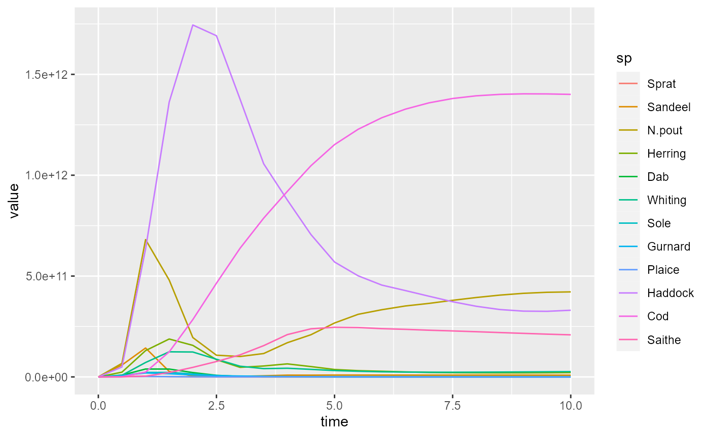

Notice the different syntax for the ggplot2 and for plotly packages. The
underlying ideas are similar: they are both implementations of the
grammar of graphics. I recommend learning ggplot2 first, and switching
to plotly only when it has clear advantages (in particular for
animations, see below).

The main advantage of plotly, namely the interactivity of the resulting
figures, can be obtained also with the ggplot syntax by running the
result of
[`ggplot()`](https://ggplot2.tidyverse.org/reference/ggplot.html)
through the function
[`ggplotly()`](https://rdrr.io/pkg/plotly/man/ggplotly.html):

``` r

ggplotly(pg)
```

Below we will always for each plot first give the ggplot code and then
the plotly code.

## Adding labels

We may want to add labels to the figure and to each of the axes. In
ggplot this is done with
[`labs()`](https://ggplot2.tidyverse.org/reference/labs.html).

``` r

pg + labs(title = "Biomass plot",
          x = "Time [years]",
          y = "Biomass [g]")
```

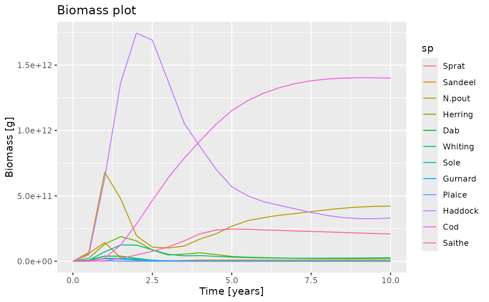

In plotly we use the `layout()` function.

``` r

pp %>% layout(
    title = "Biomass plot",
    xaxis = list(
        title = "Time [years]"
    ),
    yaxis = list(
        title = "Biomass [g]"
    )
)
```

## Filtering out data

We can use the filter function to filter out some of the data. For
example we could select only the data for specific species:

``` r

two_species_biomass <- filter(biomass_frame, sp %in% c("Gurnard", "Herring"))
```

Now if we plot this reduced data frame we get

``` r

ggplot(two_species_biomass) +
    geom_line(aes(x = time, y = value, color = sp))
```

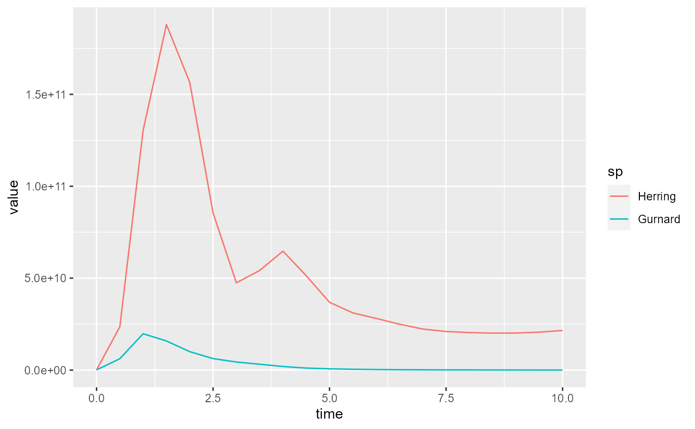

In the above we first converted the array to a data frame with
[`melt()`](https://rdrr.io/pkg/reshape2/man/melt.html) and then selected
the data of interest with
[`filter()`](https://dplyr.tidyverse.org/reference/filter.html). We
could alternatively have first selected only the desired entries in the
array and then created the data frame with
[`melt()`](https://rdrr.io/pkg/reshape2/man/melt.html) from the
resulting smaller array:

``` r

nfr <- melt(getBiomass(sim)[, c("Gurnard", "Herring")])
ggplot(nfr) +
    geom_line(aes(x = time, y = value, color = sp))
```

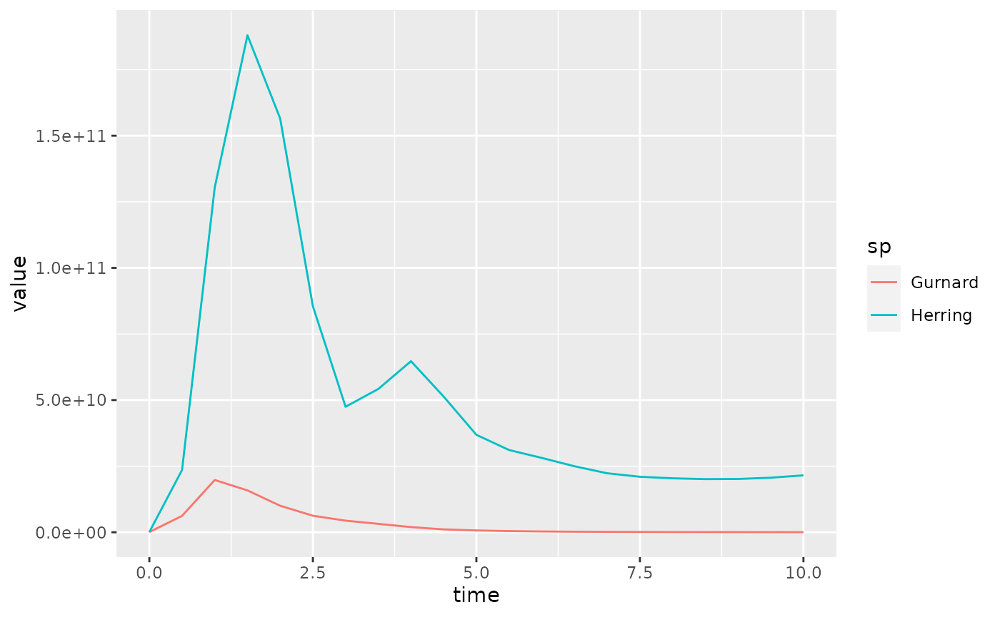

The result looks almost identical, except that the colours associated to
the species have changed.

## Specifying line colours

If we want to make sure the same species always has the same colour, we
can use the colours specified by the MizerParams object

``` r

getColours(params)
```

    ##      Sprat    Sandeel     N.pout    Herring        Dab    Whiting       Sole 
    ##  "#815f00"  "#6237e2"  "#8da600"  "#de53ff"  "#0e4300"  "#430079"  "#6caa72" 
    ##    Gurnard     Plaice    Haddock        Cod     Saithe   Resource      Total 
    ##  "#ee0053"  "#007957"  "#b42979"  "#142300"  "#a08dfb"    "green"    "black" 
    ## Background    Fishing   External 
    ##     "grey"      "red"     "grey"

To use these colours in ggplot we add
[`scale_colour_manual()`](https://ggplot2.tidyverse.org/reference/scale_manual.html):

``` r

ggplot(biomass_frame) +
    geom_line(aes(x = time, y = value, color = sp)) + 
    scale_colour_manual(values = getColours(params))
```

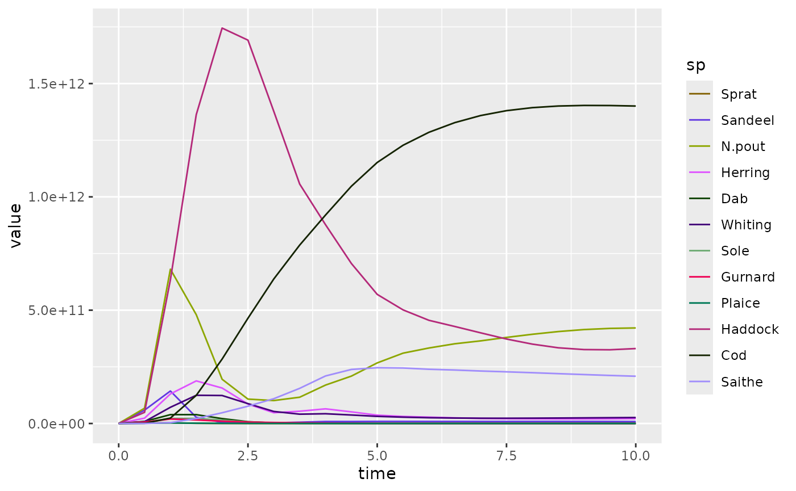

In plotly we add `colors = getColours(params)r` to the
[`add_lines()`](https://rdrr.io/pkg/plotly/man/add_trace.html) command:

``` r

plot_ly(biomass_frame) %>% 
    add_lines(x = ~time, y = ~value, color = ~sp,
              colors = getColours(params))
```

Again note the American spelling “colors” required by plotly.

## Plotting rate functions

Functions such as
[`getEncounter()`](https://sizespectrum.org/mizer/reference/getEncounter.md),
[`getFeedingLevel()`](https://sizespectrum.org/mizer/reference/getFeedingLevel.md),
[`getMort()`](https://sizespectrum.org/mizer/reference/getMort.md),
[`getEGrowth()`](https://sizespectrum.org/mizer/reference/getEGrowth.md)
and others return an `ArraySpeciesBySize` object — a species × size
matrix that carries a human-readable name and units. These objects have
their own [`plot()`](https://sizespectrum.org/mizer/reference/plot.md)
method that produces a ggplot directly, so no
[`melt()`](https://rdrr.io/pkg/reshape2/man/melt.html) step is needed:

``` r

fl <- getFeedingLevel(params)
plot(fl)
```

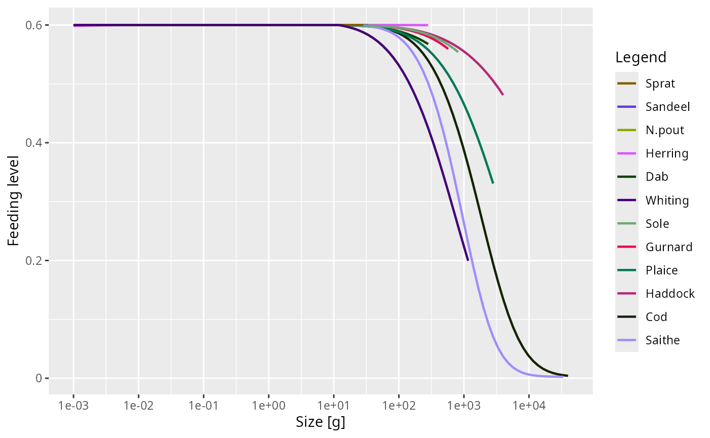

The `params` argument is optional but recommended: it supplies the
species colours, linetypes, and size ranges stored in the `MizerParams`
object, and it restricts each species’ curve to its natural size range
(`w_min` to `w_max`).

You can select a subset of species with the `species` argument:

``` r

plot(fl, species = c("Cod", "Herring", "Sprat"))
```

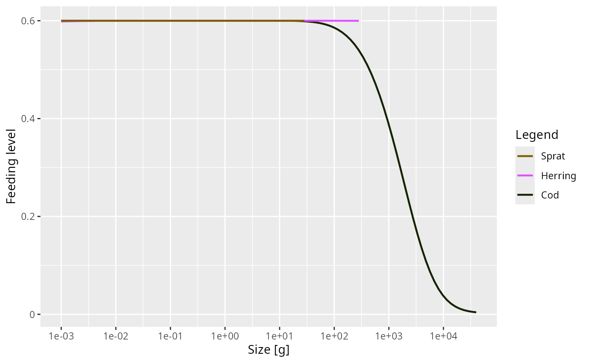

Because the result is an ordinary ggplot object you can add layers or
themes in the usual way:

``` r

plot(fl) +
    geom_hline(yintercept = 0.6, linetype = "dashed", colour = "grey50") +
    labs(title = "Feeding level at steady state")
```

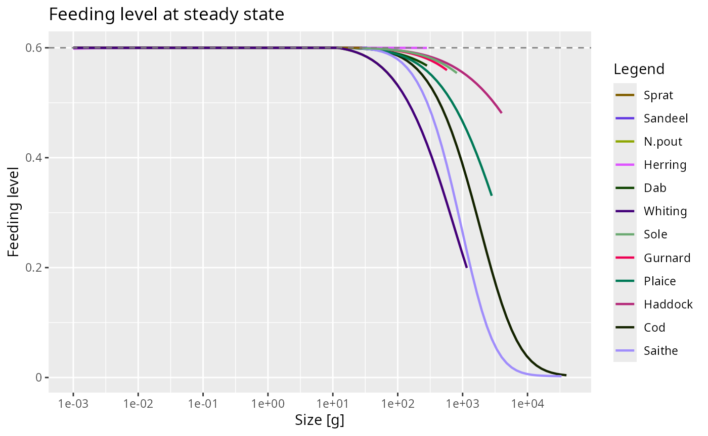

If you need a data frame instead — for example to pass to
[`plot_ly()`](https://rdrr.io/pkg/plotly/man/plot_ly.html) or to combine
with other data — use
[`as.data.frame()`](https://sizespectrum.org/mizer/reference/as.data.frame.md):

``` r

fl_df <- as.data.frame(fl)
str(fl_df)
```

    ## 'data.frame':    1200 obs. of  3 variables:
    ##  $ w      : num  0.001 0.001 0.001 0.001 0.001 0.001 0.001 0.001 0.001 0.001 ...
    ##  $ value  : num  0.6 0.6 0.6 0.598 0.6 ...
    ##  $ Species: chr  "Sprat" "Sandeel" "N.pout" "Herring" ...

This gives a long-format data frame with columns `w`, `value`, and
`Species`, which can be handed directly to
[`ggplot()`](https://ggplot2.tidyverse.org/reference/ggplot.html) or
[`plot_ly()`](https://rdrr.io/pkg/plotly/man/plot_ly.html):

``` r

ggplot(fl_df) +
    geom_line(aes(x = w, y = value, colour = Species)) +
    scale_colour_manual(values = getColours(params)) +
    scale_x_log10() +
    labs(y = "Feeding level")
```

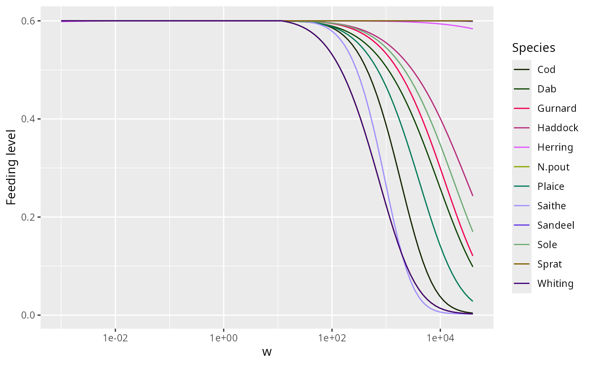

## Plotting spectra

Of course mizer has the
[`plotSpectra()`](https://sizespectrum.org/mizer/reference/plotSpectra.md)
function for plotting size spectra. Again it is instructional to create
such plots by hand.

We can access the abundance spectra of the species via `N(sim)`. This is
a three-dimensional array (time x species x size). Let us first look at
the abundance at the final time.

``` r

final_n <- N(sim)[idxFinalT(sim), , , drop = FALSE]
```

The `drop = FALSE` means that the result will again be a 3 dimensional
array.

``` r

str(final_n)
```

    ##  'ArrayTimeBySpeciesBySize' num [1, 1:12, 1:100] 1.92e+06 4.81e+12 1.15e+14 3.86e+12 1.12e+11 ...
    ##  - attr(*, "dimnames")=List of 3
    ##   ..$ time: chr "10"
    ##   ..$ sp  : chr [1:12] "Sprat" "Sandeel" "N.pout" "Herring" ...
    ##   ..$ w   : chr [1:100] "0.001" "0.00119" "0.00142" "0.0017" ...
    ##  - attr(*, "value_name")= chr "Number density"
    ##  - attr(*, "units")= chr "1/g"
    ##  - attr(*, "representation")= chr "point"
    ##  - attr(*, "params")=Formal class 'MizerParams' [package "mizer"] with 48 slots

We use the [`melt()`](https://rdrr.io/pkg/reshape2/man/melt.html)
function to convert this array into a data frame.

``` r

nf <- melt(final_n)
```

This has created a data frame with 4 variables and one observation for
each of the 1200 entries in the `1` x 12 x `rdim(final_n)[3]` matrix
`final_n`.

``` r

str(nf)
```

    ## 'data.frame':    1200 obs. of  4 variables:
    ##  $ time : int  10 10 10 10 10 10 10 10 10 10 ...
    ##  $ sp   : Factor w/ 12 levels "Sprat","Sandeel",..: 1 2 3 4 5 6 7 8 9 10 ...
    ##  $ w    : num  0.001 0.001 0.001 0.001 0.001 0.001 0.001 0.001 0.001 0.001 ...
    ##  $ value: num  1.92e+06 4.81e+12 1.15e+14 3.86e+12 1.12e+11 ...

The first three variables take their values from the dimension names of
the array. Of course the time variable is the same for all observations,
because we selected these before creating the data frame. The fourth
variable called `value` is the value of the entry of the array, so the
abundance density in our case.

There are a lot of entries with value 0, which we are not really
interested in, so it makes sense to remove them:

``` r

nf <- filter(nf, value > 0)
```

This leaves a data frame with only 945 observations.

We can send this data frame to ggplot and add a line for the spectrum
for each species, with a different colour for each, and specify that we
want both the x axis and the y axis to be on a logarithmic scale.

``` r

pg <- ggplot(nf) +
    geom_line(aes(x = w, y = value, color = sp)) +
    scale_x_log10() +
    scale_y_log10()
pg
```

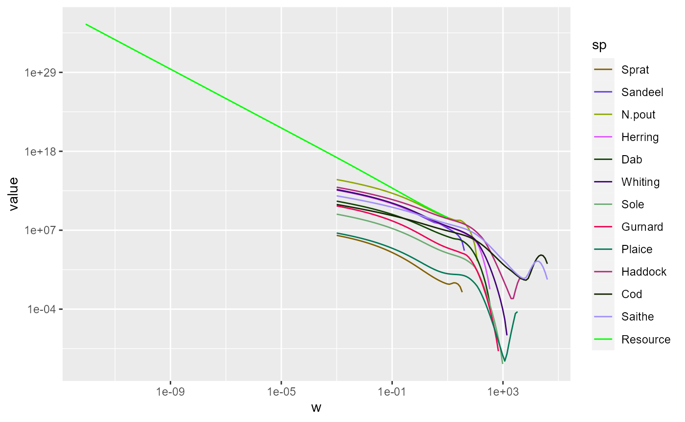

The corresponding syntax for plotly is

``` r

p <- plot_ly(nf) %>%
    add_lines(x = ~w, y = ~value, color = ~sp) %>% 
    layout(xaxis = list(type = "log", exponentformat = "power"),
           yaxis = list(type = "log", exponentformat = "power"))
p
```

In the above we used the pipe operator `%>%` which feeds the return
value of one function into the first argument of the next function.

## Including resource spectrum

We can include additional lines in the plot by merging several data
frames. For example, we can include another line for the resource
spectrum. We first convert also the resource abundance at the final time
into a data frame and filter out the zero values

``` r

nf_pp <- melt(NResource(sim)[idxFinalT(sim), , drop = FALSE]) %>% 
    filter(value > 0)
```

This data frame only contains three variables, because it does not have
the `sp` column specifying the species. We add this column with the
value “Resource”

``` r

nf_pp$sp <- "Resource"
```

Now this new data frame has the same columns as the data frame `nf` and
the two can be bound together

``` r

nf <- rbind(nf, nf_pp)
```

Using this extended data frame gives the following plot:

``` r

p <- ggplot(nf) +
    geom_line(aes(x = w, y = value, color = sp)) + 
    scale_colour_manual(values = getColours(params)) +
    scale_x_log10() +
    scale_y_log10()
p
```

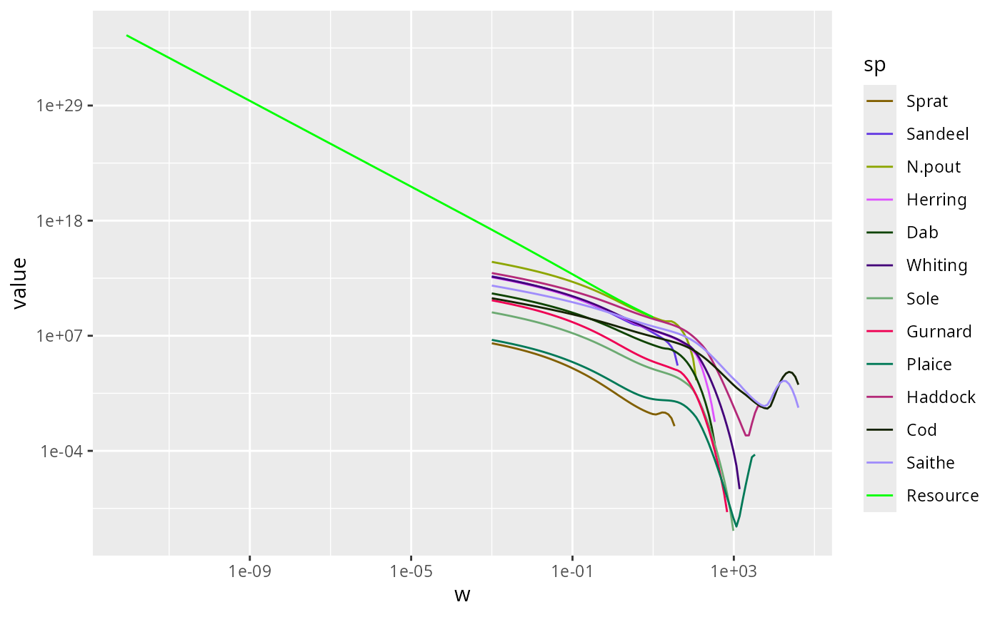

Of course we could use the same data frame also with plotly.

## Limiting the axes

We might want to zoom in on the part that includes the fish. There are
three ways to achieve this. The first is to use
[`filter()`](https://dplyr.tidyverse.org/reference/filter.html) to
filter out all the rows in the data frame that have small w and then
plot the resulting data frame as usual:

``` r

nf %>%
    filter(w > 10^-4) %>% 
    ggplot() +
    geom_line(aes(x = w, y = value, color = sp)) + 
    scale_colour_manual(values = getColours(params)) +
    scale_x_log10() +
    scale_y_log10()
```

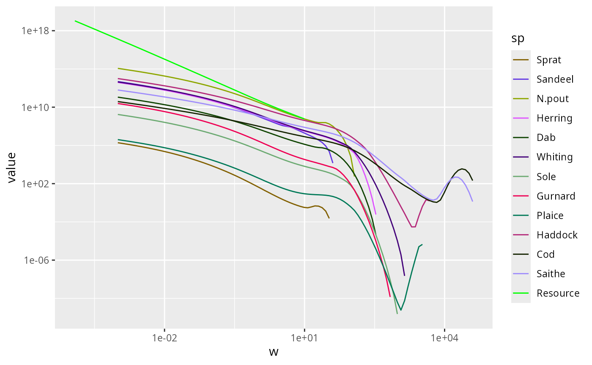

The second method is to specify limits for the axes. In ggplot this is
done by adding `limits` to the axis scales:

``` r

ggplot(nf) +
    geom_line(aes(x = w, y = value, color = sp)) + 
    scale_colour_manual(values = getColours(params)) +
    scale_x_log10(limits = c(10^-4, NA)) +
    scale_y_log10(limits = c(NA, 10^20))
```

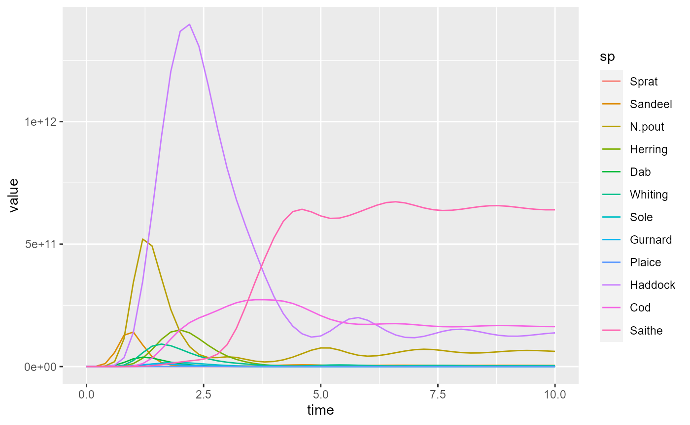

The `NA` means that the existing limits are kept.

In plotly we specify the `range` as follows:

``` r

plot_ly(nf) %>%
    add_lines(x = ~w, y = ~value, color = ~sp,
              colours = getColours(params)) %>% 
    layout(xaxis = list(type = "log", exponentformat = "power",
                        range = c(-4, 4)),
           yaxis = list(type = "log", exponentformat = "power",
                        range = c(-14, 20)))
```

Note how in plotly the range is specified by giving the logarithm to
base 10 of the limits.

## Animating spectra

Instead of picking out a specific time we can ask plotly to make an
animation showing the changing spectra over time. So we melt the entire
`N(sim)` array and use the time variable to specify the frames with the
`frame = ~time` argument to
[`add_lines()`](https://rdrr.io/pkg/plotly/man/add_trace.html):

``` r

melt(N(sim)) %>% 
    filter(value > 0) %>% 
    plot_ly() %>% 
    add_lines(x = ~w, y = ~value, 
              color = ~sp, colors = getColours(params),
              frame = ~time,
              line = list(simplify = FALSE)) %>% 
    layout(xaxis = list(type = "log", exponentformat = "power"),
           yaxis = list(type = "log", exponentformat = "power"))
```

Note how this produces a smooth animation in spite of the fact that we
saved the abundances only once a year. That interpolation is facilitated
by the `line = list(simplify = FALSE)` argument.

The ggplot package does not provide a similarly convenient way of
creating animations. There is the gganimate package, but it is not
nearly as convenient.

## Comparing simulations

We may also want to make plots contrasting the results of two different
simulations, for example with different fishing policies. To illustrate
this we create two simulations with different fishing effort:

``` r

sim1 <- project(params, t_max = 10, t_save = 0.2, effort = 2)
sim2 <- project(params, t_max = 10, t_save = 0.2, effort = 4)
```

Let us look at a plot of the fishing yield against time. This is
calculated by the
[`getYield()`](https://sizespectrum.org/mizer/reference/getYield.md)
function, which returns an array (time x species) that we can convert to
a data frame

``` r

yield1 <- melt(getYield(sim1))
yield2 <- melt(getYield(sim2))
```

Let’s look at the plot of the yield from the first simulation:

``` r

ggplot(yield1) +
    geom_line(aes(x = time, y = value, colour = sp))
```

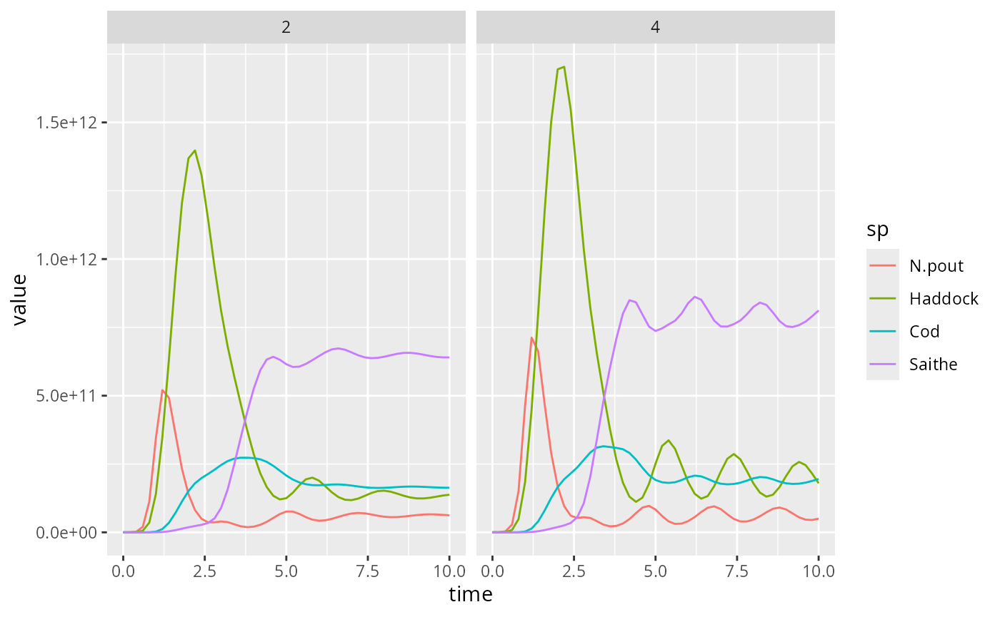

To make the plot less cluttered, we keep only the 4 most important
species

``` r

yield1 <- filter(yield1, sp %in% c("Saithe", "Cod", "Haddock", "N.pout"))
yield2 <- filter(yield2, sp %in% c("Saithe", "Cod", "Haddock", "N.pout"))
```

and plot again

``` r

p1 <- ggplot(yield1) +
    geom_line(aes(x = time, y = value, colour = sp))
p1
```

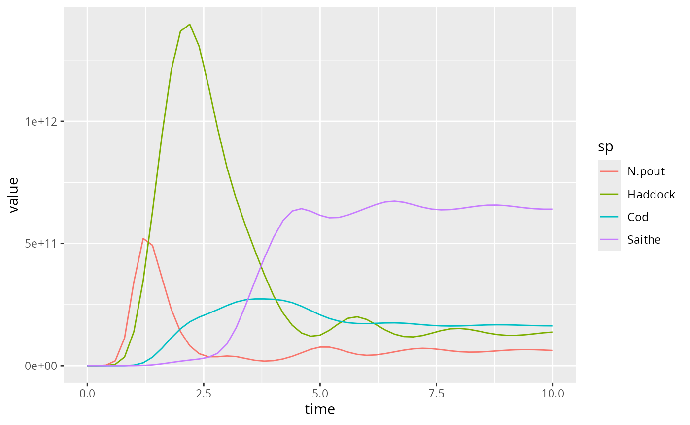

For simulation 2 the plot looks like this:

``` r

p2 <- ggplot(yield2) +
    geom_line(aes(x = time, y = value, colour = sp))
p2
```

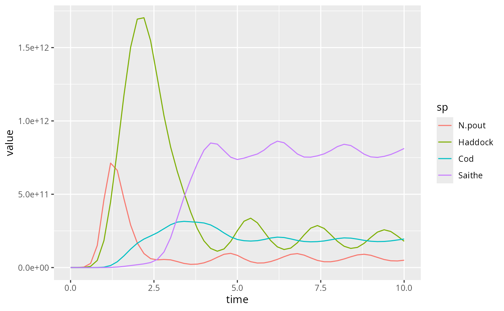

Comparison will be easier if we combine these two plots. For that we add
an extra variable to the data frames that allow us to distinguish them
and then we merge them together.

``` r

yield1$effort <- as.factor(2)
yield2$effort <- as.factor(4)
yield <- rbind(yield1, yield2)
```

In ggplot we can now use
[`facet_grid()`](https://ggplot2.tidyverse.org/reference/facet_grid.html)
to put the plot for each value of `effort` side-by-side:

``` r

ggplot(yield) +
    geom_line(aes(x = time, y = value, 
                  colour = sp)) +
    facet_grid(cols = vars(effort))
```


Or we can use the `linetype` aesthetic to represent the different
`effort` values by different line types:

``` r

ggplot(yield) +
    geom_line(aes(x = time, y = value, 
                  colour = sp,
                  linetype = effort))
```

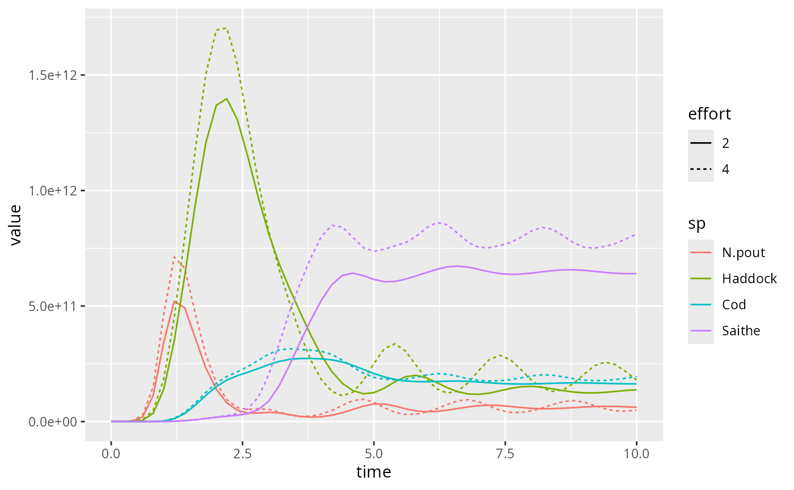

An alternative is to use the visual diff functionality from the
diffviewer package. For that purpose we need to create the two plots
with the same limits on the axes.

``` r

p1 <- ggplot(yield1) +
    geom_line(aes(x = time, y = value, colour = sp)) +
    ylim(0,1.75e12)
p2 <- ggplot(yield2) +
    geom_line(aes(x = time, y = value, colour = sp)) +
    ylim(0,1.75e12)
```

We can then create a visual comparison by saving the plots to temporary
files and using
[`diffviewer::visual_diff()`](https://diffviewer.r-lib.org/reference/visual_diff.html):

``` r

# Save plots to temporary files
tmp1 <- tempfile(fileext = ".png")
tmp2 <- tempfile(fileext = ".png")
ggsave(tmp1, p1, width = 6, height = 4)
ggsave(tmp2, p2, width = 6, height = 4)

# Create visual diff
diffviewer::visual_diff(tmp1, tmp2)
```

plotly is less good at faceting, but it can put arbitrary plots
side-by-side (or arrange them into a grid) with
[`subplot()`](https://rdrr.io/pkg/plotly/man/subplot.html)

``` r

subplot(p1, p2, shareX = TRUE, shareY = TRUE)
```

Note how the `shareY = TRUE` argument to `suplot()` makes sure the two
plots use the same scale on the y axis, and similarly for
`shareX = TRUE`.

Also in plotly we can now tie the `effort` variable to the line type.

``` r

plot_ly(yield) %>% 
    add_lines(x = ~time, y = ~value, 
              color = ~sp, linetype = ~effort)
```

Arguably, ggplot2 does a nicer job in this case.
