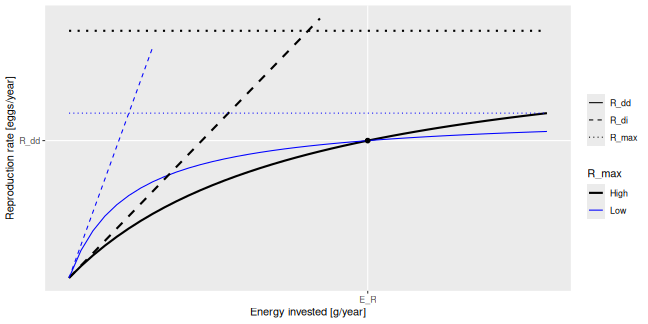

# Alias for `setBevertonHolt()`

**\[deprecated\]**

An alias provided for backward compatibility with mizer version \<=
2.0.4

## Usage

``` r
setRmax(params, erepro, R_max, reproduction_level, ...)
```

## Arguments

- params:

  A MizerParams object

- erepro:

  Reproductive efficiency for each species. See details.

- R_max:

  Maximum reproduction rate. See details.

- reproduction_level:

  Sets `R_max` so that the reproduction rate at the initial state is
  `R_max * reproduction_level`.

- ...:

  Unused

  - `R_factor`: Legacy alternative for specifying
    `reproduction_level = 1 / R_factor`.

## Value

A MizerParams object

## Details

With Beverton-Holt density dependence the relation between the energy
invested into reproduction and the number of eggs hatched is determined
by two parameters: the reproductive efficiency `erepro` and the maximum
reproduction rate `R_max`.

If no maximum is imposed on the reproduction rate (\\R\_{max} =
\infty\\) then the resulting density-independent reproduction rate
\\R\_{di}\\ is proportional to the total rate \\E_R\\ at which energy is
invested into reproduction, \$\$R\_{di} = \frac{\rm{erepro}}{2 w\_{min}}
E_R,\$\$ where the proportionality factor is given by the reproductive
efficiency `erepro` divided by the egg size `w_min` to convert energy to
egg number and divided by 2 to account for the two sexes.

Imposing a finite maximum reproduction rate \\R\_{max}\\ leads to a
non-linear relationship between energy invested and eggs hatched. This
density-dependent reproduction rate \\R\_{dd}\\ is given as \$\$R\_{dd}
= R\_{di} \frac{R\_{max}}{R\_{di} + R\_{max}}.\$\$

(All quantities in the above equations are species-specific but we
dropped the species index for simplicity.)

The following plot illustrates the Beverton-Holt density dependence in
the reproduction rate for two different choices of parameters.


This plot shows that a given energy \\E_R\\ invested into reproduction
can lead to the same reproduction rate \\R\_{dd}\\ with different
choices of the parameters `R_max` and `erepro`. `R_max` determines the
asymptote of the curve and `erepro` its initial slope. A higher `R_max`
coupled with a lower `erepro` (black curves) can give the same value as
a lower `R_max` coupled with a higher `erepro` (blue curves).

For the given initial state in the MizerParams object `params` one can
calculate the energy \\E_R\\ that is invested into reproduction by the
mature individuals and the reproduction rate \\R\_{dd}\\ that is
required to keep the egg abundance constant. These two values determine
the location of the black dot in the above graph. You then only need one
parameter to select one curve from the family of Beverton-Holt curves
going through that point. This parameter can be `erepro` or `R_max`.
Instead of `R_max` you can alternatively specify the
`reproduction_level` which is the ratio between the density-dependent
reproduction rate \\R\_{dd}\\ and the maximal reproduction rate
\\R\_{max}\\.

If you do not provide a value for any of the reproduction parameter
arguments, then `erepro` will be set to the value it has in the current
species parameter data frame. If you do provide one of the reproduction
parameters, this can be either a vector with one value for each species,
or a named vector where the names determine which species are affected,
or a single unnamed value that is then used for all species. Any species
for which the given value is `NA` will remain unaffected.

The values for `R_max` must be larger than \\R\_{dd}\\ and can range up
to `Inf`. If a smaller value is requested a warning is issued and the
value is increased to the value required for a reproduction level of
0.99.

The values for the `reproduction_level` must be non-negative and less
than 1. The values for `erepro` must be large enough to allow the
required reproduction rate. If a smaller value is requested a warning is
issued and the value is increased to the smallest possible value. The
values for `erepro` should also be smaller than 1 to be physiologically
sensible, but this is not enforced by the function.

As can be seen in the graph above, choosing a lower value for `R_max` or
a higher value for `erepro` means that near the steady state the
reproduction will be less sensitive to a change in the energy invested
into reproduction and hence less sensitive to changes in the spawning
stock biomass or its energy income. As a result the species will also be
less sensitive to fishing, leading to a higher F_MSY.

## Examples

``` r
params <- NS_params
species_params(params)$erepro
#>  [1] 1 1 1 1 1 1 1 1 1 1 1 1
# Attempting to set the same erepro for all species
params <- setBevertonHolt(params, erepro = 0.1)
#> Warning: For the following species `erepro` has been increased to the smallest possible value: erepro[Gurnard] = 0.558; erepro[Plaice] = 0.921
t(species_params(params)[, c("erepro", "R_max")])
#>               Sprat      Sandeel       N.pout      Herring          Dab
#> erepro 1.000000e-01 1.000000e-01 1.000000e-01 1.000000e-01 1.000000e-01
#> R_max  8.071481e+11 4.112049e+11 3.472063e+13 1.197577e+12 1.167176e+10
#>            Whiting         Sole   Gurnard    Plaice      Haddock          Cod
#> erepro 1.00000e-01 1.000000e-01 0.5582259 0.9212325 1.000000e-01          0.1
#> R_max  6.22081e+11 4.007876e+10       Inf       Inf 3.929056e+12 8280106764.0
#>              Saithe
#> erepro 1.000000e-01
#> R_max  1.145835e+11
# Setting erepro for some species
params <- setBevertonHolt(params, erepro = c("Gurnard" = 0.6, "Plaice" = 0.95))
t(species_params(params)[, c("erepro", "R_max")])
#>               Sprat      Sandeel       N.pout      Herring          Dab
#> erepro 1.000000e-01 1.000000e-01 1.000000e-01 1.000000e-01 1.000000e-01
#> R_max  8.071481e+11 4.112049e+11 3.472063e+13 1.197577e+12 1.167176e+10
#>            Whiting         Sole      Gurnard       Plaice      Haddock
#> erepro 1.00000e-01 1.000000e-01 6.000000e-01 9.500000e-01 1.000000e-01
#> R_max  6.22081e+11 4.007876e+10 1.047481e+13 1.082568e+15 3.929056e+12
#>                 Cod       Saithe
#> erepro          0.1 1.000000e-01
#> R_max  8280106764.0 1.145835e+11
# Setting R_max
R_max <- 1e17 * species_params(params)$w_max^-1
params <- setBevertonHolt(NS_params, R_max = R_max)
#> Warning: The following species require an unrealistic value greater than 1 for `erepro`: Plaice
t(species_params(params)[, c("erepro", "R_max")])
#>               Sprat      Sandeel       N.pout      Herring          Dab
#> erepro 9.274305e-03 1.297184e-04 7.257409e-02 8.045063e-03 4.224791e-03
#> R_max  3.030303e+15 2.777778e+15 1.000000e+15 2.994012e+14 3.086420e+14
#>             Whiting         Sole      Gurnard       Plaice      Haddock
#> erepro 1.292557e-02 3.571380e-03 5.609587e-01 3.773957e+01 6.020565e-02
#> R_max  8.389262e+13 1.154734e+14 1.497006e+14 3.360215e+13 2.316692e+13
#>                 Cod       Saithe
#> erepro 6.375069e-05 2.433424e-03
#> R_max  2.509328e+12 2.521521e+12
# Setting reproduction_level
params <- setBevertonHolt(params, reproduction_level = 0.3)
#> Warning: The following species require an unrealistic value greater than 1 for `erepro`: Plaice
t(species_params(params)[, c("erepro", "R_max")])
#>               Sprat      Sandeel       N.pout      Herring          Dab
#> erepro 1.324581e-02 1.852847e-04 1.026645e-01 1.145066e-02 6.035197e-03
#> R_max  2.441029e+12 1.368905e+12 3.256200e+13 3.671952e+12 3.726224e+10
#>             Whiting         Sole      Gurnard       Plaice      Haddock
#> erepro 1.834577e-02 5.100263e-03 7.974655e-01 1.316046e+00 7.954325e-02
#> R_max  1.807310e+12 1.288262e+11 2.430980e+12 1.092730e+14 5.804489e+12
#>                 Cod       Saithe
#> erepro 9.077210e-05 3.322021e-03
#> R_max  2.758282e+10 3.730633e+11
```
