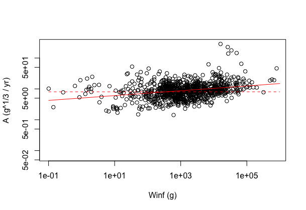
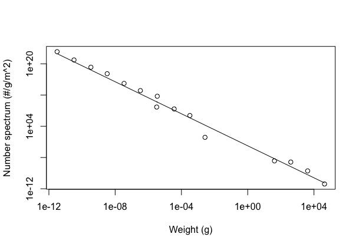

```{r setup, include=FALSE}
knitr::opts_chunk$set(echo = TRUE)
```

## [Predation kernel](https://sizespectrum.org/mizer/reference/setPredKernel.html#setting-predation-kernel)

log-normal kernel

-   `beta` = 30 for Multispecies and `beta` = 100 for Trait and Community.

-   `sigma` = 2.0 for Multispecies and Community and `sigma` = 1.3 for Trait

**NEW: still need to discuss, but ideally the same for all types of model**

Ken: I would say:

-   `beta` = 400. This follows the analysis in Andersen (2019, p. 26 and figure 2.6).
-   `sigma` = 1.0 for following Ursin et al (1973). For the trait-based and community models we can increase to `sigma` = 1.3 to represent that each size or trait-group represent a range of species with various values of `beta`. 


## [Search volume](https://sizespectrum.org/mizer/reference/setSearchVolume.html#setting-search-volume)

-   `q` = `lambda` - 2 + `n` **NEW: if no `lambda` is specified, then `q` = 0.8** See discussion in Andersen (2019; p.22-23 and Fig. 2.4),

-   `gamma` is determined from `f0 = 0.6`, `h`, `kappa`, `lambda` and the predation kernel so that if the prey abundance was described by the power law $\kappa w^{-\lambda}$ then the encounter rate would lead to the feeding level`f0`.

## [Maximum intake rate](https://sizespectrum.org/mizer/reference/setMaxIntakeRate.html#setting-maximum-intake-rate)

-   `n` = 2/3

-   `h` for `n`=2/3.  `h` represents the factor of the maximum consumption rate. It can be calculated from the growth rate coefficient $A$ as: $$h = \frac{A}{\alpha(f_0-f_c)}$$ (eq. 3.31), where `alpha`=0.6 is the assimulation efficiency and `f0`=0.6 and `fc`=0.2.  We can find the growth coefficient from von Bertalanffy growth parameters (eq.3.9): $A = 3c^{1/3} K L_\infty$ where c is the coefficient in the length-mass relation $c\approx 0.01$ g/cm. An analysis of von Bertlanffy growth from fish base (only used bony fish and estimates where $| t_0 | <1$) gives:



The fit is (red line): $A=\exp(1.62)W_\infty^{0.078}$. The geometric mean (dashed red) is $A \approx 8\ \mathrm{g^{1/3}/yr}$. Using the geometric mean gives: $$ h \approx 33\ \mathrm{g^{1/3}/yr}$$.


-   In multispecies model `h` is determined so that with feeding level `f0 = 0.6` and under the assumption `p` = `n` the species reaches maturity size `w_mat` at the age predicted by the von Bertalanffy growth curve parameters `k_vb` and `t0` = 0. The calculation uses `w_min`, `w_inf`, `n`, `b = 3`, `fc = 0.2`.
-   trait: `h` = 40 **NEW value from Ken**
-   community: `h` = 10

## Metabolic rate

-   `p`

    -   trait: `p` = `n`, `n` = 2/3

    -   multispecies `p` = 0.7 **NEW: `p` = 2/3**

        **NEW: issue warning about poor default when user chooses p different from n.**

-   `k` = 0

-   `ks` determined from `fc`, `alpha`, `h`, `n`, `p`

    -   trait: set so that `fc` = 0.25 **NEW: `fc` = 0.2**
    -   multispecies: set so that `fc` = 0.2 at `w_mat`.
    -   community: `ks` = 0

## [External mortality](https://sizespectrum.org/mizer/dev/reference/setExtMort.html#setting-external-mortality-rate)

-   Multispecies: scales with `w_inf`

    -   `z0pre` = 0.6
    -   `z0exp` = `n` - 1

-   Trait: proportional to predation mortality

    -   `ext_mort_prop` = 0

-   Community: `z0` = 0.1

## [Reproduction](https://sizespectrum.org/mizer/dev/reference/setReproduction.html#setting-reproduction)

-   `w_mat` = `w_inf` / `eta` with multispecies `eta` = 0.25, trait `eta` = 10\^(-0.6) \~ 0.25.

-   `w_mat25` = `w_mat * 3^(-0.1)` (corresponds to U = 10)

    **NEW: `w_mat25` = `w_mat * 3^(-0.2)` (corresponds to U = 5)**

-   `m` = 1

-   `w_min` = 0.001

-   `erepro` = 1 **NEW: `erepro` = 0.01 (thus slightly higher than 0.0066)? Increase for some species if needed but issue warning.**

-   `R_max` chosen to achieve desired biomass.

## [Fishing](https://sizespectrum.org/mizer/reference/setFishing.html#setting-fishing)

single knife_edge gear, catching all species,

-   `catchability` = 1

-   `knife_edge_size`

    -   Multispecies: `knife_edge_size` = `w_mat`
    -   Trait and community: `knife_edge_size` = 1000

## [Resource](https://sizespectrum.org/mizer/reference/setResource.html#setting-resource-dynamics)

-   `r_pp`

    -   Multispecies `r_pp` = 10 **NEW: `r_pp` = 4**
    -   Trait `r_pp` = 0.1 **NEW: determined by new parameter `resource_level` = 1/2**
    -   Community: r_pp = 10

-   `kappa`

    -   Multispecies `kappa` = 1e+11 **NEW: Use value per m\^2, same as Trait**
    -   Trait `kappa` = 0.005
    -   Community = 1000
    
    Ken: In the absence of other information we use a "per area" specification of the resource spectrum. Below is the abundance spectrum as observed on the Scotian shelf from Boudreau and Dickie (1992):
    

    
The fit is made with `kappa` = 0.1 g\^{1.05} (assuming that ´q´=0.8 and ´n´=3/4; for `n`=2/3 the value is simular but different units: `kappa` = 0.1 g\^{1.14})

-   `lambda` = 2.05 **NEW: `lambda` = `q` + 2 - `n` if the user specified a `q` (and this q is the same for all species), otherwise `lambda` = 2.05**


## Other

-   `alpha`

    -   Multispecies: `alpha` = 0.6
    -   Trait: `alpha` = 0.4
    -   Community: `alpha` = 0.2

**NEW: still need to discuss, but ideally the same for all types of model**

Ken: Suggest to use `alpha`=0.6 for trait-based and multi-species models (Andersen (2019, p.50)).

Ken: For the community model `alpha` does not represent the assimilation efficiency, but the it represents the average growth efficiency (see Andersen et al (2009), RPSLB (209) 109-114, section "average growth efficiency"). The average growth efficiency depends upon the physiological parameters and the predator-prey interaction parameters in a rather complex way. A value of 0.2 for beta=400 is reasonable (figure 4b).
