```{r setup, include = FALSE}
knitr::opts_chunk$set(
  collapse = TRUE,
  comment = "#>"
)
library(mizer)
```

# Introduction

This guide is for you if you need to extend mizer 
to meet the needs of your research project. 
You will already have read the mizer model description in
`vignette("model_description")`
and thus be familiar with what mizer can do out of the box.
You now want to implement the extension or modification of the
model required for your research, and for that you need to dive into 
the internal workings of mizer. This guide is meant to make
that as easy as possible.

The first thing you should do, even before reading this guide, is to
go to https://github.com/sizespectrum/mizer/issues and create a new "issue""
to share your ideas and plans with the mizer community. You may get back 
valuable feedback and advice. Another way to get in touch with the
mizer community is via the [size-spectrum modelling Google group](https://groups.google.com/forum/#!forum/size-spectrum-models).


# Setting up working environment
In this section we describe how to set up your working environment
to allow you to easily work with the mizer code. Much of it you
may already have in place, so feel free to skip ahead.

## Installing R, RStudio and Git

Mizer is compatible with __R__ versions 3.1 and later.
If you still need to [install R](https://cran.r-project.org/), simply install 
the latest version. This guide was prepared with
`r R.version.string`.

This guide assumes that you will be using __RStudio__ to work with R. There is
really no reason not to use RStudio and it makes a lot of things much easier.
RStudio develops rapidly and adds useful features all the time and so it pays 
to upgrade to the [latest version](https://www.rstudio.com/products/rstudio/download/preview/) 
frequently. This guide was written with version 1.2.1268.

Mizer is developed using the version control system __Git__ and the code is hosted
on GitHub. To contribute to the mizer code, you need to have the Git software
installed on your system. On most Linux machines it will be installed already,
but on other platforms you need to
[install it](http://happygitwithr.com/install-git.html). You do not need to install
any GUI for git because RStudio has 
[built-in support for git](https://support.rstudio.com/hc/en-us/articles/200532077-Version-Control-with-Git-and-SVN). 
A good place to learn about using Git and GitHub is 
[this chapter](http://r-pkgs.had.co.nz/git.html) 
in the guide by Hadley on R package development.

## Forking mizer from GitHub

To work with the code you will create your own git repository with a copy of the mizer code. Go to https://github.com/sizespectrum/mizer and fork it into your own repository by clicking the "Fork" button.

<center>
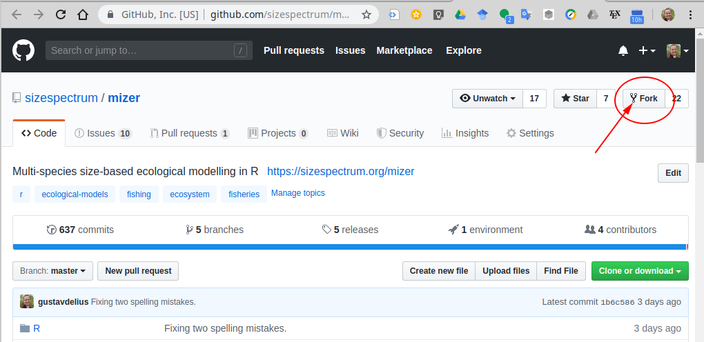{width=80%}
</center>

You will be prompted to log in to GitHub. If you do not yet have an account, 
you need to create one for yourself.

Once you have your own fork of the mizer repository, you create a local copy on
whichever machine you work on. You can do this from within RStudio. For this you
click on the "Project" drop-down and then select "New Project...".

<center>
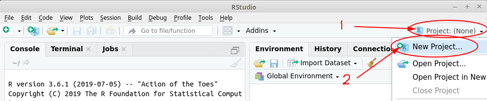{width=80%}
</center>

This will bring up a dialog box where you select "Version Control".
<center>
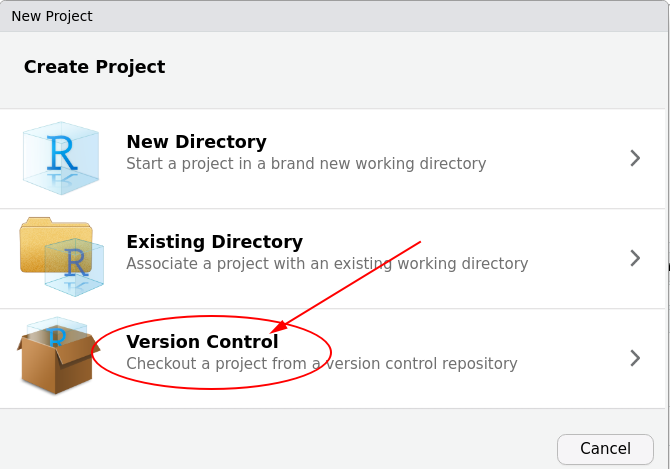{width=50%}
</center>

Provided you have Git installed and RStudio was able to find it you can then
choose "Git" on the next dialog box.

<center>
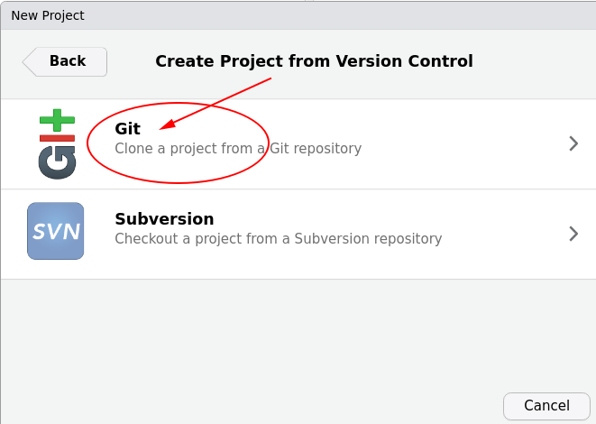{width=50%}
</center>

If the Git option is not showing, the you need to troubleshoot, and perhaps
https://happygitwithr.com/rstudio-see-git.html helps.

In the next dialog box you let RStudio know where to find your fork.
<center>
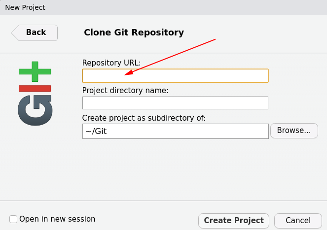{width=50%}
</center>

To find the correct repository URL you go back to GitHub to the front page of 
the repository that was created when you forked the official mizer repository.
There you will find a "Clone or download" button which when clicked will
reveal the repository URL. Make sure that you are on the page of your fork of
the repository. The URL should contain your GitHub username.
<center>
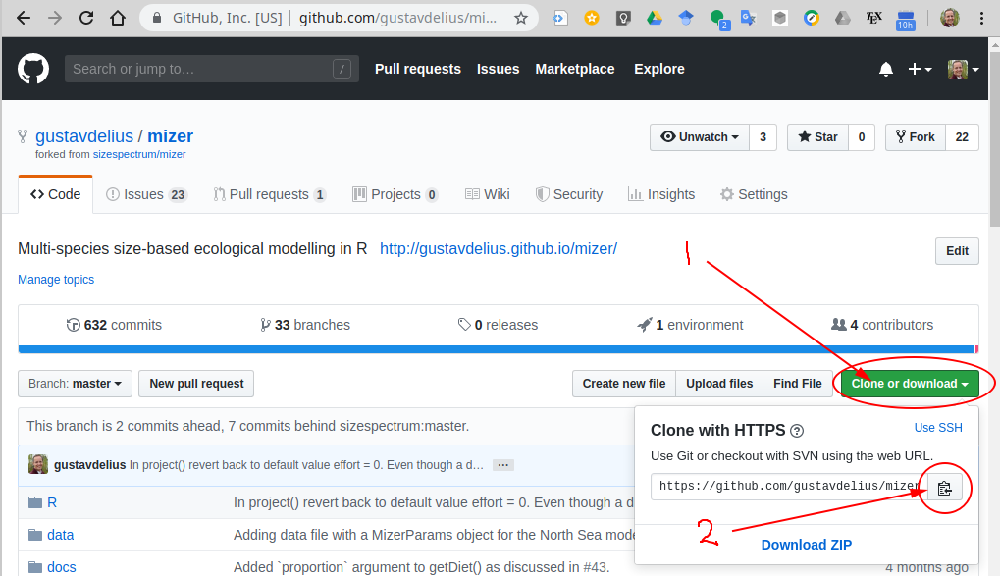{width=80%}
</center>

You can copy that to the clipboard by pressing the
button next to the URL and then paste it back into the RStudio dialog box.
In that dialog box you can also change where RStudio stores the repository on
your machine. Choose anywhere convenient. Then click "Create Project".


## Setting up RStudio developer tools

To work with R packages as a developer, you will need to
[install additional tools](https://support.rstudio.com/hc/en-us/articles/200486498-Package-Development-Prerequisites). 

Once you have these tools in place, you should install the devtools and roxygen2 packages with
```{r eval=FALSE}
install.packages(c("devtools", "roxygen2"))
```

You are now all set to develop R packages, and 
[RStudio makes this extra easy](https://support.rstudio.com/hc/en-us/articles/200486488-Developing-Packages-with-RStudio). There is even a cheat sheet "Package Development with devtools" accessible from the Help menu in RStudio.

To set things up, click on Build -> More -> Configure Build Tools.

<center>
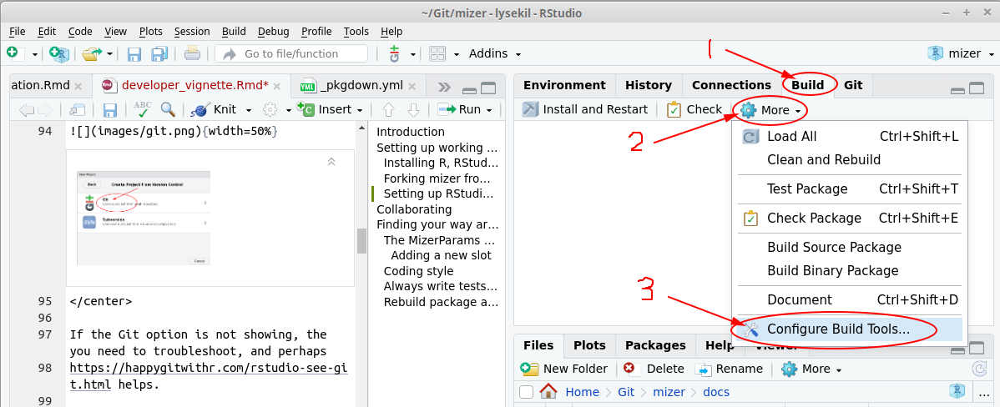
</center>

In the resulting dialog box, tick the checkboxes "Use devtools package functions if available" and "Generate documentation with roxygen" and then click on "Configure".

<center>
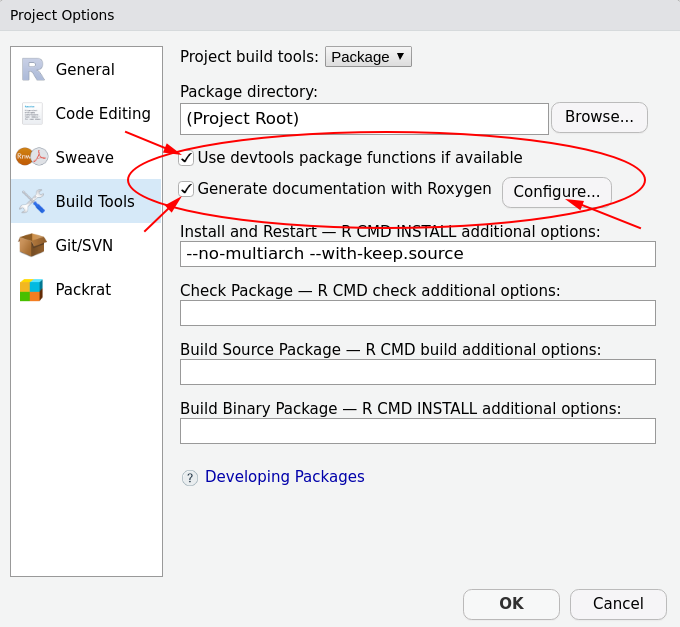{width=50%}
</center>

This will open another dialog box where you tick "Install and Restart".

<center>
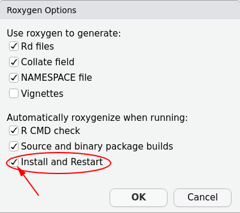{width=40%}
</center>

Hit "OK". While you are on the Project Options dialog box, click on
"Code Editing" and then check "Insert spaces for tabs" and set "Tab width"
to 4, because that is the convention the mizer code follows.

<center>
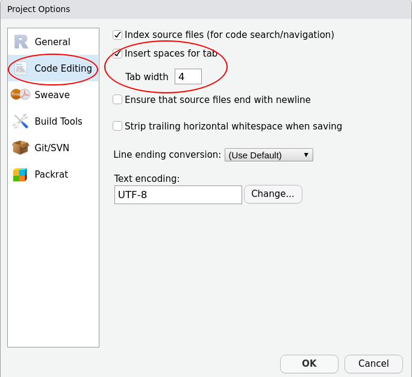{width=50%}
</center>

## usethis package

Many useful commands for working with packages and with GitHub are provided
by the
[usethis](https://usethis.r-lib.org/) 
package, which is automatically installed along with
devtools. The package comes with a useful vignette with suggestions for 
[how to set things up](https://usethis.r-lib.org/articles/articles/usethis-setup.html)
most conveniently.


## Installing mizer
You are now ready to install the mizer package using the development code from
GitHub. First you should do this with the command
```{r eval=FALSE}
devtools::install_github("sizespectrum/mizer")
```
This will automatically also install all the other packages that mizer depends
on. However this uses the version of the code in the official mizer repository
on GitHub, not your local copy of the code. Once you have made changes to your
local code, you will want to install mizer using that code. To do this 
go to the "Build" tab in RStudio and click on "Install and Restart" or
alternatively use the keyboard shortcut Ctrl+Shift+B.
<center>
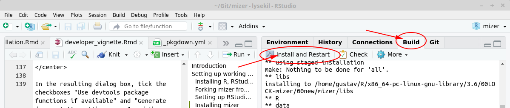
</center>

You can watch the progress in the "Build" tab. Once the build has completed, you will see that in the console RStudio automatically runs
```{r eval=FALSE}
library(mizer)
```
to load you freshly built mizer package. 
You will want to click "Install and Restart" whenever you have changed your
local code.

# Working with git

You will be making your code changes in your fork of the mizer code (we are
using the so-called Fork & Pull model). From time to time you will want to
interact with the main mizer repository in two ways:

1. You will want to contribute some of your code back to the mizer project, so
that it benefits others and also so that it gets automatically included in
future releases.

2. You will want to be able to merge new developments made in mizer by others
into your code base.

This interaction is made possible with git and GitHub. 

It initially takes a bit of effort to get the hang of how this works. Therefore
we have created a little tutorial 
"[Working with git and GitHub](working_with_git.html)"
with an exercise that will take you through all
the necessary steps. Unless you are already very familiar with git and GitHub,
it will be worthwhile for you to work through that tutorial now.


# Contributor guidelines

## Coding style
[Google's R Style Guide](https://google.github.io/styleguide/Rguide.xml)

[The tidyverse style guide](http://style.tidyverse.org/)

## Always write tests for your code
We use [testthat](http://testthat.r-lib.org/) and
[shinytest](https://rstudio.github.io/shinytest/articles/shinytest.html).
The test are in the directory `tests/testthat`. 

Some tests compare the results of calculations to the results the code gave in
the past, using the `testthat::expect_known_value()` test. The past values are stored in
tests/testthat/values. If one of the tests gives a value that is different from
the stored value, then the test throws an error *and* overwrites the stored
value with the new result. The second time the test is run, it then no longer
fails. Luckily the original values will still be in the git repository. So after
you think you have fixed the error that led to the wrong result, you should
revert to the old stored values before re-running the test. Reverting to the old
stored values is easy: Just go to the Git tab in RStudio, select the changed
files in `tests/testthat/values` (select, not tick), then right-click and choose
Revert.

It may be that the change in the result of a calculation is intended, perhaps
because your new code is more accurate than the old code. If you are 100%
certain of this, but only then, should you commit the changed files in
tests/testthat/values, so that these new values form the basis of future
comparison tests.

Plots are tested with the [vdiffr](http://vdiffr.r-lib.org/) package. When a
plot has changed, you should run vdiffr::manage_cases(), which will start a
shiny gadget where you can view the changes in the plot.


# Finding your way around the mizer code

This section is still in an early stage of development.

Mizer is organised in a modular fashion. It is separated into setup functions,
simulation functions, and analysis and plotting functions. 

There are several different functions for setting up a `MizerParams` object for
specifying various concrete models. These setup functions make various 
simplifying assumptions about the model parameters to reduce the amount of
information that needs to be specified. This usually takes the form of
assuming allometric scaling laws. 

The core of mizer is the `project()` function
that runs a simulation of the size-spectrum model. It takes a specification
of the model contained in an object of type `MizerParams` and returns the
results of the simulation in an object of type `MizerSim`.

There are many functions for analysing and plotting the results of a mizer
simulation contained in a `MizerSim` object.

The `MizerParams` and `MizerSim` objects are S4 objects,
meaning that their slots are rigorously defined and are accessed with the '@'
notation. You do not need to learn about S4 classes in order to understand the
mizer code, because the code avoids using S4 methods. In the presentation
below we assume that the `MizerParams` object is called `params` and the
`MizerSim` object is called `sim`.

Although `MizerParams` and `MizerSim` are S4 classes, mizer registers all
their methods as S3 methods rather than S4 methods. For example, the summary
plot for a `MizerParams` object is defined as `plot.MizerParams()` and
registered with `S3method(plot, MizerParams)` in the NAMESPACE, not via
`setMethod("plot", "MizerParams", ...)`. This works because S3 dispatch reads
the `class()` attribute of an object, which S4 objects have, so
`plot(params)` correctly finds `plot.MizerParams()`.

The reason for preferring S3 is that calling `setMethod()` on a function that
is not already an S4 generic silently promotes it to one, changing dispatch
semantics package-wide. For instance, if mizer used `setMethod("plot", ...)`,
then `plot` would become an S4 generic for all code running in the same R
session. This can cause hard-to-diagnose failures when `plot()` is called with
objects of mixed S3/S4 types, because S4 dispatch requires an exact method
match on all arguments rather than falling back gracefully to S3 methods.

In short: use S3 methods (named `generic.ClassName`) for `MizerParams` and
`MizerSim`, and avoid `setMethod()` unless you are extending a generic that is
already S4 in a dependency.


## The MizerParams class
An object of class 'MizerParams' holds all the information needed for the
'project()' function to simulate a model. 

### Adding a new slot
If you need to add a new slot to the MizerParams class, you need to make the following additions in the file `MizerParams-class.R`:

1. Go to the section "Class definition" and add a
  description of you new slot with @slot.
2. Add an entry in the `slots` list inside `setClass`.
3. In the function `emptyParams()` go to the section "Make object" and inside
  the call to `new()` provide a default value for your slot. If your slot holds
  an array, then it is conventional in mizer to already give it the correct
  dimensions and dimnames here, if possible.

What exactly to put into these places is usually clear in analogy to what is
already there for other similar slots.

<!--

## The project methods

## The MizerSim object

## Shiny apps


-->

## The ArraySpeciesBySize class

Many functions in mizer — `getEncounter()`, `getFeedingLevel()`,
`getPredMort()`, `getMort()`, `getEReproAndGrowth()`, `getERepro()`,
`getEGrowth()`, `getFMort()`, `getFlux()`, and `getCriticalFeedingLevel()` —
return a `ArraySpeciesBySize` object. This is a lightweight S3 class that wraps a
species × size matrix and attaches two extra attributes:

- `value_name`: a human-readable label (e.g. `"Encounter rate"`).
- `units`: the physical units of the rate (e.g. `"g/year"` or `"1/year"`).

### Behaviour

A `ArraySpeciesBySize` object behaves exactly like a regular matrix for subsetting and
arithmetic. Subsetting with `[` preserves the class as long as the result is
still a 2-D matrix; arithmetic operators (via `Ops.ArraySpeciesBySize`) strip the class
and return a plain matrix. This means you can use `ArraySpeciesBySize` objects
transparently in calculations without worrying about attribute contamination.

```{r eval=FALSE}
enc <- getEncounter(NS_params)
is.ArraySpeciesBySize(enc)       # TRUE
enc["Cod", "100"]       # still a ArraySpeciesBySize
enc * 2                 # plain matrix — class is stripped by Ops.ArraySpeciesBySize
```

### Enhanced output methods

`ArraySpeciesBySize` provides `print()`, `summary()`, `plot()`, and `as.data.frame()`
methods designed for quick inspection of rate arrays:

```{r eval=FALSE}
enc <- getEncounter(NS_params)
print(enc)              # one-line min/mean/max per species
summary(enc)            # tabular summary per species
plot(enc, NS_params)    # line plot vs. size, coloured by species
as.data.frame(enc)      # long-format data frame with columns w, value, Species
```

The `plot()` method accepts a `params` argument so it can use the species
colours and linetypes stored in the `MizerParams` object, and it restricts each
species' curve to its natural size range (`w_min` to `w_max`) unless
`all.sizes = TRUE`.

### Wrapping your own rate functions

If you write a custom rate function that replaces one of the built-in `mizer*`
functions (see `?setRateFunction`), you do **not** need to return a `ArraySpeciesBySize`:
the `get*` wrapper that calls your function is responsible for wrapping the
result. Your function should return a plain numeric matrix with the correct
dimensions (species × size) and dimnames.

If you write a new standalone rate function that is meant to be called directly
by users, you may want to wrap its result yourself:

```{r eval=FALSE}
myRateFunction <- function(params, ...) {
    result <- # ... compute a species x size matrix ...
    ArraySpeciesBySize(result, value_name = "My rate", units = "1/year", params = params)
}
```

The `params` argument to `ArraySpeciesBySize()` is used only to copy `dimnames` from
`params@metab` onto the result, so that species names and size labels are
set consistently.

You can test whether an object is a `ArraySpeciesBySize` with `is.ArraySpeciesBySize()`.

# Condition handling system

Mizer should make good use of R's condition handling system, which is well described at https://adv-r.hadley.nz/conditions.html. Currently this is being only in a small number of places in the code. Search the code for `signal()` and `withCallingHandlers()` to find those places.

## Signal Handling in mizer

Mizer uses the `rlang::signal()` function to generate information messages that can be controlled by the user via the `info_level` argument. This system allows for different levels of verbosity without cluttering the console with warnings or standard messages that cannot be easily suppressed or filtered.

### The `info_level` Argument

The `info_level` argument is an integer that controls the amount of information shown to the user. It works by filtering signals based on their assigned level.

- **`info_level = 0`**: No information messages are shown. This is useful for running simulations in loops or when a clean output is desired.
- **`info_level = 1`**: Only important messages are shown. These are typically about issues that might affect the validity of the model or significant assumptions being made.
- **`info_level = 2`**: Intermediate level (currently not widely used, reserved for future granularity).
- **`info_level = 3`**: All information messages are shown. This includes details about default values being set and other minor notifications.

### How to Use Signals

When writing functions in mizer, you should use `signal()` instead of `message()` or `warning()` for information that is not critical (i.e., not an error or a deprecation warning) but helpful for the user to know.

#### Syntax

```r
signal(message, class = "info_about_default", var = "variable_name", level = integer_level)
```

- **`message`**: The text to display.
- **`class`**: Should be `"info_about_default"` for messages related to setting default values.
- **`var`**: The name of the variable or parameter the message is about (e.g., "h", "gamma", "ks").
- **`level`**: The importance level of the message (1, 2, or 3).

#### Guidelines for Levels

- **Level 1**: Use for non-critical but significant issues.
    - Example: "Because you have n != p, the default value for `h` is not very good."

- **Level 3**: Use for routine information about defaults.
    - Example: "For species where no growth information is available the parameter h has been set to h = 30."

### Handling Signals

Functions that accept `info_level` should set up a calling handler to capture and filter these signals.

```r
infos <- list()
collect_info <- function(cnd) {
    if (cnd$level <= info_level) {
        infos[[cnd$var]] <<- cnd$message
        rlang::cnd_muffle(cnd) # So this info will not be repeated higher up
    }
}

withCallingHandlers(
    info_about_default = collect_info, {
        # ... code that might generate signals ...
    }
)

if (length(infos) > 0) {
    message(paste(infos, collapse = "\n"))
}
```

This pattern collects all relevant messages and prints them at the end, avoiding duplicate messages for the same variable if multiple defaults are set.

### Avoiding Duplication

Signals in R bubble up the call stack via `withCallingHandlers`. To ensure a unified summary and avoid duplicate messages, we adopt a **Top-Level Reporting** strategy:

- **Top-Level Functions**: Functions that are directly called by the user (e.g., `newCommunityParams`) should handle signals and print the summary.
- **Inner Functions**: Functions called by other functions (e.g., `newMultispeciesParams` called by `newCommunityParams`) should be called with `info_level = 0`. This prevents them from printing their own summary while allowing their signals to bubble up to the top-level function's handler.

For example, `newMultispeciesParams` calls `setParams(params, info_level = 0, ...)` so that `setParams` does not print its own summary; instead, the signals bubble up to `newMultispeciesParams`'s handler.

# Defaults editions

The mizer functions for creating new models make a lot of choices for default values for parameters that are not provided by the user. Sometimes we find better ways to choose the defaults and update mizer accordingly. When we do this, we will increase the edition number. The mechanism is described in the help page of `defaults_edition()`.

We are currently on default edition `r defaults_edition()`.

To find which defaults are different in different editions simply search for conditionals involving `defaults_edition()` in the code.

# Specialised topics

## Size of git repo
We should try to avoid committing too many very large files to the git
repository, because the larger the repository the longer it takes to download.
Currently (September 2019) the repository is still at a manageable 110 MiB.
The best way to check the size of the repository is with the git-sizer, see
https://github.com/github/git-sizer/

We are currently storing the mizer website in the mizer repository (in the docs
subdirectory). That is convenient, partly because that is where pkgdown puts it
by default and GitHub serves it from there. However in the future we might
consider moving the website to its own repository.


