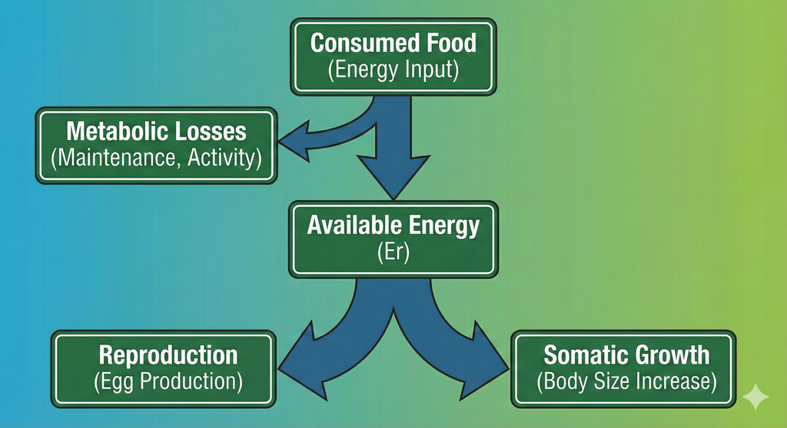
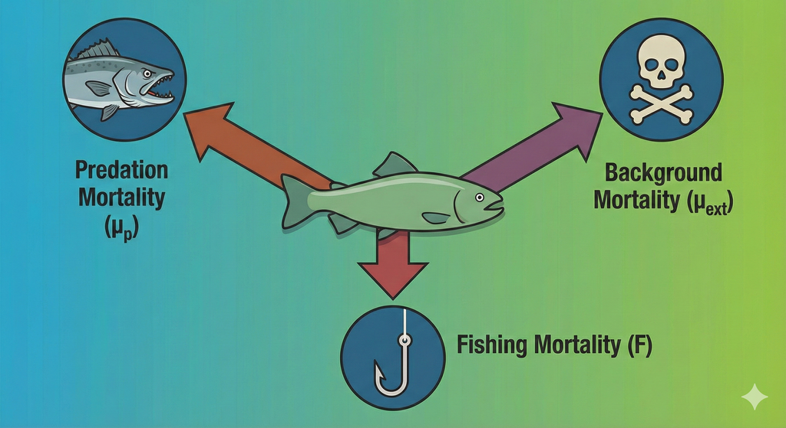

```{r setup, include = FALSE}
knitr::opts_chunk$set(
  collapse = TRUE,
  comment = "#>"
)
```

On this page we present the details of the mizer model, taking care to separate
the essential features of the model that are hard-coded and the various possible
specialisations for which mizer provides setup functions. We will provide links
to the functions that can be used to set or change the various model parameters
(all collected together in `setParams()`) as well as to the functions that
calculate the various ecological rates in the model (all collected together in
`mizerRates()`) because the help pages of these functions will provide useful
additional details.

This is probably not the best place to start learning about the mizer model.
Mizer is complicated because at the same time it introduces dynamical size-spectrum modelling, where the size-distribution of the population is shaped by the the 
size-dependent growth and mortality rates of individuals, and it describes how multi-species interactions determine those density-dependent rates. If you are new to dynamical size-spectrum models,
we suggest you start by reading about [the single-species model](single_species_size-spectrum_dynamics.html).

We will not go into detail of how this model is 
realised in code. Such detail will be provided in the [developer guide](https://sizespectrum.org/mizer/articles/developer_vignette.html). However some details are hidden on this page
and you can see them by clicking on links like the following:
<details>
And clicking again will hide the details again.
</details>

# Size spectrum dynamics

## Consumer densities
The model assumes that, to a first approximation, an individual can be
characterized by its weight $w$ and its species number $i$ only. The aim of the
model is to calculate the size spectrum $N_i(w)$, which is the *density* of
individuals of species $i$ such that $\int_w^{w+dw}N_i(w)dw$ is the *number* of
individuals of species $i$ in the size interval $[w,w+dw]$. In other words: the
number of individuals in a size range is the area under the number density
$N_i(w)$.

<details>
Here is a plot of an example size spectrum for two species with
$N_i(w)$ on the vertical axis for $i=1,2$ and $w$ on the horizontal axis.
```{r, message=FALSE}
library(mizer)
params <- newTraitParams(no_sp = 2, min_w = 1e-3)
plotSpectra(params, resource = FALSE, power = 0)
```

To represent this continuous size spectrum in the computer, the size
variable $w$ is discretized into a vector `w` of discrete weights,
providing a grid of sizes spanning the range from the smallest egg size
to the largest maximum size. These grid values divide the full size
range into a finite number of size bins. The size bins should be chosen
small enough to avoid the discretisation errors from becoming too big.
You can fetch this vector with `w()` and the vector of bin sizes with
`dw()`.

The weight grid is set up to be logarithmically spaced, so that
`w[j]=w[1]*10^(j*dx)` for some fixed `dx`. This means that the bin widths
increase with size: `dw[j] = w[j+1] - w[j] = w[j] * (10^dx - 1)`.
This grid is set up automatically when creating a MizerParams object.

In the code the size spectrum is stored as an array `N` such that `N[i, a]`
holds the density $N_i(w_a)$ at weights $w_a=$`w[a]`, or, if time
dependence is included, an array such that `N[i, a, u]`
holds $N_i(w_a,t_u)$. See `N()`.

Note that, contrary to what one might have expected,
`N[i, a]` is not the *number* of individuals in a size bin
but the *density* at a grid point.
The number of individuals in the size bin between `w[a]` and
`w[a+1]=w[a]+dw[a]` is only approximately given as `N[i, a]*dw[a]`,
where `dw[a]= w[a+1]-w[a]`.

Of course all these calculations with discrete sizes and size bins are
only giving approximations to the continuous values, and these approximations
get better the smaller the size bins are, i.e., the more size bins are
used. This is why the functions setting up MizerParams objects allow you to
choose the number of size bins `no_w`.

</details>

## Traffic on the road to adulthood
A good way to think about the time evolution of the number density 
$N_i(w)$ is to consider the familiar situation of traffic density on the roads.
A fish's life is a journey along the size axis from egg size to size at death.
There are many other fish making the same journey. The speed with which the
fish move along the size axis is their growth rate. This is quite analogous
to the speed of traffic on a road. Just as the speed of cars depends on the 
density of other cars on the road, the growth rate of fish depends on the
density of other fish. When the density of cars on a stretch of road is high,
their speed decreases, and this leads to a pile-up and can lead to traffic 
jams. Similarly when the density of fish in a size interval is high, their
growth rate goes down due to competition for the same food sources, and this
too can lead to pile-ups and bottlenecks. So one just has to replace the space
variable in a traffic model by size to get an equation for the fish size spectra.

The additional feature in the
evolution of fish densities that is not present in road traffic density is
that fish can die while they are growing up, and this death rate is also
dependent on the density of other fish. 

The time evolution of the number density $N_i(w)$ is described by the 
McKendrick-von Foerster equation with diffusion, which is a transport equation (as one would
use for traffic density) but with an additional loss term due to fish 
mortality:

$$
  \frac{\partial N_i(t,w)}{\partial t} + \frac{J_i(t,w)}{\partial w} 
  = -\mu_i(t,w) N_i(t,w),
$$
where $J_i(w)$ is the rate at which individuals of species $i$ grow from sizes
smaller than $w$ to sizes larger than $w$. This is also know as the _flux_ and
is given in terms of the growth and diffusion rates:
$$
J_i(t,w)= g_i(t,w) N_i(t,w) - 
\frac12 \frac{\partial D_i(t,w)N_i(t,w)}{\partial w}.
$$

The growth rate $g_i(t, w)$ and diffusion rate $D_i(t, w)$ are described below in the [Growth](#growth)
section and mortality $\mu_i(w)$ is described in the [Mortality](#mortality)
section.

There is no need for you to understand the mathematical notation used in
this equation to understand its origin: it just says that the rate at which the
number of fish in a size bracket changes is the rate at which fish grow into the
size bracket from a smaller size minus the rate at which fish grow out of it to
a larger size minus the rate at which the fish in the size bracket die. So to
simulate the size spectrum dynamics we need to specify the growth rates and the
mortality rates. This we will do below. The important point is that these rates
depend on the density of other fish of other sizes, making the size-spectrum
dynamics non-linear and non-local in very interesting ways. The resulting
effects are too complicated to disentangle by pure thought. This is where
simulations with the mizer package come in.

This McKendrick-von Foerster equation is approximated in mizer by a
finite-difference method. This allows the
`project()` function in mizer to project the size
spectrum forwards in time: Given the spectrum at one time the `project()`
function calculates it at a set of later times.

Of course there also needs to be reproduction into the smallest size class,
otherwise there would be no small fish any more after a while. So for the
smallest size class instead of a rate of growth into the size class there is
a rate of reproduction of new individuals into that size class. This
reproduction will be described below in the [Reproduction](#reproduction)
section.


## Resource density

Besides the fish spectrum there is also a resource spectrum $N_R(w)$,
representing for example the phytoplankton. This spectrum starts at a smaller
size than the fish spectrum, in order to provide food also for the smallest
individuals (larvae) of the fish spectrum.
By default the time evolution of the resource spectrum is described by a 
semi-chemostat equation.

<details>
The semichemostat dynamics are given by
$$
  \frac{\partial N_R(w,t)}{\partial t} 
  = r_R(w) \Big[ c_R (w) - N_R(w,t) \Big] - \mu_R(w) N_R(w,t).
$$
Here $r_R(w)$ is the resource regeneration rate and $c_R(w)$ is the carrying
capacity in the absence of predation. These parameters are changed with
`setResource()`. By default mizer assumes allometric forms
$$r_R(w)= r_R\, w^{n-1}.$$

$$c_R(w)=\kappa\, w^{-\lambda}.$$

You can retrieve these with `getResourceRate()` and `getResourceCapacity()`
respectively. It is also possible to implement other resource dynamics, as
described in the help page for `setResource()`. The mortality $\mu_R(w)$ is
due to predation by consumers and is described in the subsection 
[Resource mortality].

Because the resource spectrum spans a larger range of sizes these sizes
Because the resource spectrum spans a larger range of sizes these sizes
Because the resource spectrum spans a larger range of sizes these sizes
are discretized into a different vector of weights

The resource spectrum is then represented by a vector `NResource` such that
`NResource[c]` =$N_R($`w_full[c]`$)$.

</details>


# Growth

Consumers can grow only by consuming prey. In the next few subsections we will
build towards determining the growth rate resulting from predation.
We will discuss how we model the [predator-prey encounter rate], the resulting rate
of [consumption], the rate of [metabolic losses], and the partitioning of the
remaining energy into [reproduction](#sec:repro) and [growth](#resulting-growth).

{width=60%}

## Predator-prey encounter rate {#sec:pref}

The rate at which a predator of species $i$ and weight $w$ encounters food 
(mass per time) is
determined by summing over all prey species and the resource spectrum and
integrating over all prey sizes $w_p$, weighted by the selectivity factors:
$$
  E_{i}(w) = \gamma_i(w) \int \left(\sum_{j} \theta_{ij} N_j(w_p) +
   \theta_{iR} N_R(w_p) \right) 
  \phi_i(w,w_p) w_p \, dw_p + E_{ext.i}(w).
$$
This is calculated by `getEncounter()`. The external encounter rate $E_{ext.i}(w)$ describes the encounter of food that
is not explicitly modelled by mizer.
The overall prefactor $\gamma_i(w)$ sets the predation power of the predator. It
could be interpreted as a search volume. It is set by `setSearchVolume()`. By 
default it is assumed to scale allometrically as
$\gamma_i(w) = \gamma_i\, w^q.$

The $\theta$ matrix sets the interaction strength between predators and the
various prey species and resource. It is changed with `setInteraction()`.

The size selectivity is encoded in the predation kernel $\phi_i(w,w_p)$. This is
changed with `setPredKernel()`.

<details>
An important simplification occurs when the predation kernel $\phi_i(w,w_p)$
depends on the size of the prey **only** through the predator/prey size ratio
$w_p/w$,
$$\phi_i(w, w_p)=\tilde{\phi}_i(w/w_p).$$
This is assumed by default but can be overruled.
The default for the predation kernel is the truncated log-normal function
$$
  \tilde{\phi}_i(x) = \begin{cases}
  \exp \left[ \dfrac{-(\ln(x / \beta_i))^2}{2\sigma_i^2} \right]
  &\text{ if }x\in\left[0,\beta_i\exp(3\sigma_i)\right]\\
  0&\text{ otherwise,}
  \end{cases}
$$
where $\beta_i$ is the preferred predator-prey mass ratio and $\sigma_i$ sets
the width of the predation kernel.

The integral in the expression for the encounter rate is approximated by a 
Riemann sum over all weight brackets:
$$
{\tt encounter}[i,a] = {\tt search\_vol}[i,a]\sum_{k}
\left( n_{R}[k] + \sum_{j} \theta[i,j] n[j,k] \right) 
  \phi_i\left(w[a],w[k]\right) w[k]\, dw[k].
$$
In the case of a predation kernel that depends on $w/w_p$ only, this becomes
a convolution sum and can be [evaluated efficiently via fast Fourier transform](fft.html).

</details>


## Consumption

The encountered food is consumed subject to a standard Holling functional 
response type II to represent satiation. This determines the 
*feeding level* $f_i(w)$, which is a dimensionless number between 0 
(no food) and 1 (fully satiated) so that $1-f_i(w)$ is the proportion of the
encountered food that is consumed. The feeding level is given by

$$
  f_i(w) = \frac{E_i(w)}{E_i(w) + h_i(w)},
$$

where $h_i(w)$ is the maximum consumption rate. This is changed with
`setMaxIntakeRate()`. By default mizer assumes an allometric form
$h_i(w) = h_i\, w^n.$
The feeding level is calculated with the function `getFeedingLevel()`.

The rate at which food is consumed and then also absorbed is
$$
A_i(w)= \alpha_i(1-f_i(w))E_{i}(w)=\alpha_i\,f_i(w)\, h_i(w),
$$
where $\alpha_i$ is the proportion of the consumed food that is absorbed.

## Diffusion

The rate at which an individual fish consumes prey biomass is somewhat random.
Sometimes fish are lucky and encounter many large fish, sometimes they are 
unlucky. There are may unknown environmental effects that contribute to this
randomness and it is impossible to model them in detail. However there is one
cause of randomness that mizer can model (since version 3.0): the variability
in prey size. As was derived in [@datta2010], this leads to a diffusion rate
$$
D_{pred.i}(w) = (1-f_i(w))\,\gamma_i(w) \int \left(\sum_{j} \theta_{ij} N_j(w_p) +
   \theta_{iR} N_R(w_p) \right)\phi_i(w/w_p)(\alpha_i\,w_p)^2\,dw_p.
$$
This has exactly the same form as the rate at which prey biomass is absorbed, as described above,
except that in the expression for the diffusion rate the factor $\alpha_i\,w_p$
is squared.


This diffusion rate captures only the randomness in the size of encountered prey. There will be many other sources of stochasticity that we do not model explicitly in mizer. They should be added as external diffusion $D_{ext.i}$ (that you can set with `ext_diffusion()`), so $$D_i(w)=D_{pred.i}(w)+D_{ext.i}(w).$$
This is calculated with `getDiffusion()`.

<details>

The increase $\alpha\,w_p$ in predator mass is typically only a small proportion of the predator mass because the preferred prey are typically much smaller than the predator and also $\alpha$ is smaller than $1$. Because this factor is squared in the expression for $D_{pred.i}(w)$ it might be expected that that rate is small. However it is worth testing this intuition. We will do this by determining that diffusion rate in a model with allometric encounter and mortality rates.

Let us assume that the prey abundance is given by a power law: $N_c(w)=N_0w^{-\lambda}$ and that the predation kernel is
$$
\phi(w/w_p) = \exp\left(-\frac{\log(w/w_p/\beta)^2}{2\sigma^2}\right).
$$ {#eq-phi}

and hence the integral in the expression for the assimilation rate $A(w)$ becomes
$$
\begin{split}
I_A&:=\int N_c(w_p)\phi(w/w_p)\alpha\,w_p\,dw_p\\
&=\alpha\int w_p^{1-\lambda}\exp\left(-\frac{\log(w/w_p/\beta)^2}{2\sigma^2}\right)dw_p.
\end{split}
$$ {#eq-Ig}
This integral can be evaluated most easily by changing integration variable to $x=\log(w_p/w_0)$ for an arbitrary reference weight $w_0$ and then recognising the resulting integral
$$
I_A=\alpha\, w_0^{2-\lambda}\int e^{(2-\lambda)x}\exp\left(-\frac{(x-\log(w/w_0)+\log(\beta))^2}{2\sigma^2}\right)dx
$$ {#eq-Ig2}
as a Gaussian integral. Using the general result that
$$
\int e^{ax}\exp\left(-\frac{(x-\mu)^2}{2\sigma^2}\right)dx = \sqrt{\frac{2\pi}{\sigma^2}}\exp\left(a\mu+\frac{a^2\sigma^2}{2}\right)
$$ {#eq-gaussian}
with $a = 2-\lambda$ and $\mu = \log(w/w_0)-\log(\beta)$ we find that 
$$
\begin{split}
I_A&=
\alpha\, w_0^{2-\lambda}\sqrt{\frac{2\pi}{\sigma^2}}\exp\left((2-\lambda)(\log(w/w_0)-\log(\beta))+\frac{(2-\lambda)^2\sigma^2}{2}\right)\\
&=\alpha w^{2-\lambda}\sqrt{\frac{2\pi}{\sigma^2}}\beta^{\lambda - 2}\exp\left(\frac{(2-\lambda)^2\sigma^2}{2}\right)
\end{split}
$$ {#eq-Ig3}

Assuming an allometric search volume $\gamma(w)=\gamma w^q$ with an exponent of $q = n - 2 + \lambda$ we obtain
$$
A(w) = (1-f(w))\,\gamma  \alpha \sqrt{\frac{2\pi}{\sigma^2}}\beta^{\lambda - 2}\exp\left(\frac{(2-\lambda)^2\sigma^2}{2}\right) w^{n}.
$$ {#eq-gw2}

We can evaluate the diffusion rate $D(w)$ in the same manner. The extra factor of $w_p$ changes $a$ from $2-\lambda$ to $3-\lambda$ and we obtain
$$
D_{pred}(w) = (1-f(w))\gamma \alpha^2 \sqrt{\frac{2\pi}{\sigma^2}}\beta^{\lambda - 3}\exp\left(\frac{(3-\lambda)^2\sigma^2}{2}\right) w^{n+1}.
$$ {#eq-dw2}
Comparing this to the expression @eq-gw2 for $A(w)$ we find that
$$
D(w) = A(w)w\frac{\alpha}{\beta}\exp\left(\frac{(5-2\lambda)\sigma^2}{2}\right).
$$ {#eq-dw3}

To get a feel for the typical magnitude of the factor let's consider concrete values 
$$
f=0.6, \qquad\alpha = 0.8, \qquad\beta = 10, \qquad\sigma = 2, \qquad\lambda = 2.
$$ {#eq-params}
```{r}
#| include: false
feeding_coeff <- 0.6
alpha <- 0.8
beta <- 10
sigma <- 2
lambda <- 2
factor <- alpha / beta * exp((5 - 2 * lambda) * sigma^2 / 2)
```

Then
$$
D(w) \approx `r round(factor, digits = 2)` A(w)w.
$$ {#eq-dw4}

```{r}
#| include: false
sigma <- 1
beta <- 100
factor_1 <- alpha / beta * exp((5 - 2 * lambda) * sigma^2 / 2)
```

However we see that the value of $D(w)/A(w)$ is strongly influenced by the location and width of the feeding kernel. It decreases with increasing $\beta$ and decreasing $\sigma$ If we choose $\beta = 100$ and $\sigma = 1$ then $D(w)\approx `r round(factor_1, digits = 2)` A(w)w$. This relative decrease in the diffusion rate with increasing $\beta$ and decreasing $\sigma$ may explains the result from [@datta2010a] about how the stability of the system depends on these parameters.

For an illustration of the effect of the diffusion on the solution of the model see the article
[Cohort dynamics and diffusion](cohort_dynamics_and_diffusion.html)

</details>

## Metabolic losses

Some of the absorbed food is used to fuel the needs for metabolism and 
activity and movement, at a rate ${\tt metab}_i(w)$. By default 
this is made up out of standard metabolism, scaling with exponent $p$, and
loss due to activity and movement, scaling with exponent $1$:
$${\tt metab}_i(w) = k_{s.i}\,w^p + k_i\,w.$$
See the help page for `setMetabolicRate()`. 

The remaining rate, if any,  
is then available for growth and reproduction. So the rate at which energy
becomes available for growth and reproduction is
$$
  \label{eq:Er}
  E_{r.i}(w) = \max(0, \alpha_i f_i(w)\, h_i(w) - {\tt metab}_i(w))
$$
This is calculated with the `getEReproAndGrowth()` function.


## Investment into reproduction  {#sec:repro}
A proportion $\psi_i(w)$ of the energy available for growth and reproduction is
used for reproduction. This proportion should change from zero below the weight
$w_{m.i}$ of maturation to one at the maximum weight $w_{max.i}$, where
all available energy is used for reproduction. This function is changed with
`setReproduction()`. Mizer provides a default form for the function which you
can however overrule.


## Growth
What is left over after metabolism and reproduction is taken into account
is invested in somatic growth. Thus the growth rate is
$$
  \label{eq:growth}
  g_i(w) = E_{r.i}(w)\left(1-\psi_i(w)\right).
$$
It is calculated by the `getEGrowth()` function.

When food supply does not cover the requirements of metabolism and activity, 
growth and reproduction stops, i.e. there is no negative growth.
The individual should then be subjected to a starvation mortality, but starvation
mortality is not implemented in core mizer but is provided
by the [mizerStarvation](https://sizespectrum.org/mizerStarvation)
extension package.


# Mortality
The mortality rate of an individual $\mu_i(w)$ has three sources: 
predation mortality $\mu_{p.i}(w)$, background mortality $\mu_{ext.i}(w)$ and 
fishing mortality $\mu_{f.i}(w)$. 

{width=50%}

Predation mortality is calculated such that all that is eaten translates into 
corresponding predation mortalities on the ingested prey individuals. 
Recalling that $1-f_j(w)$ is the proportion of the food encountered by a 
predator of species $j$ and weight $w$ that is actually consumed, the
rate at which all predators of species $j$ consume prey of size $w_p$ is
$$
  \label{eq:pred_rated}
  {\tt pred\_rate}_j(w_p) = \int \phi_j(w,w_p) (1-f_j(w))
  \gamma_j(w) N_j(w) \, dw.
$$
This predation rate is calculated by the function `getPredRate()`.

<details>
The integral is approximated by a Riemann sum over all fish weight brackets.
$$
{\tt pred\_rate}[j,c] = \sum_{a}
  {\tt pred_kernel}[j,a,c]\,(1-{\tt feeding_level}[j,a])\,
  \gamma[j,a]\,n[j,a]\,dw[a].
$$

</details>

The mortality rate due to predation is then obtained as
$$
  \label{eq:mup}
  \mu_{p.i}(w_p) = \sum_j {\tt pred\_rate}_j(w_p)\, \theta_{ji}.
$$
This predation mortality rate is calculated by the function `getPredMort()`.

External mortality $\mu_{ext.i}(w)$ is independent of the abundances and is
changed with `setExtMort()`. By default mizer assumes that the external
mortality for each species is a constant $z0_i$ independent of size. The value
of $z0_i$ is either specified as a species parameter or it is assumed to
depend allometrically on the maximum size:
$$z0_i = z0_{pre} w_{\infty.i}^{1-n}.$$


## Fishing mortality
The fishing parameters for the model are set up with `setFishing()`, where
you can find the details of how to set up gears with different selectivities
and the capabilities of different species.
Fishing mortality $F_i(w)$ is calculated with the function `getFMort()`.

## Total mortality
The total mortality rate
$$\mu_i(w)=\mu_{p.i}(w)+\mu_{ext.i}(w)+F_i(w)$$
is calculated with the function `getMort()`.


## Resource Mortality

The predation mortality rate on resource is given by a similar expression
as the predation mortality on fish:
$$
  \label{eq:mupp}
  \mu_{p}(w_p) = \sum_j {\tt pred\_rate}_j(w_p)\, \theta_{jp}.
$$
This is the only mortality on resource currently implemented in mizer.
It is calculated with the function `getResourceMort()`.


# Reproduction

## Energy invested into reproduction

The total rate of investment into reproduction (grams/year) is
found by integrating the contribution from all individuals of species $i$,
each of which invests a proportion $\psi_i(w)$ of their consumption. This
total rate of energy investment can then be converted to a total rate of
egg production $R_{p.i}$ (numbers per year):
$$
  \label{eq:Rp}
  R_{p.i} = \frac{\epsilon_i}{2 w_{0.i}} \int N_i(w)  E_{r.i}(w) \psi_i(w) \, dw,
$$
Here the total rate of investment is multiplied by an efficiency factor $\epsilon_i$ 
and then dividing by the egg weight $w_{0.i}$ to convert the energy into number of eggs.
The result is multiplied by a factor $1/2$ to take into account that only 
females reproduce. This rate of potential egg production is calculated with
`getRDI()`.


## Density-dependence in reproduction

Three important density-dependent mechanisms widely assumed in fisheries models are 
automatically captured in the mizer model that lead to an emergent stock-recruitment relationship:

1. High density of spawners leads to a reduced
food income of the spawners and consequently reduced per-capita reproduction.
2. High density of larvae leads to slower growth of larvae due to food 
competition, exposing the larvae to high mortality for a longer time, thereby
decreasing the survivorship to recruitment size.
3. High density of fish leads to more predation on eggs and fish larvae by
other fish species or by cannibalism.

However there are other sources of density dependence that are not explicitly
modelled mechanistically in mizer. An example would be a limited carrying capacity of suitable
spawning grounds and other spatial effects.

This requires additional phenomenological density dependent contributions to the stock-recruitment. In mizer this type of density dependence is modelled through constraints on egg production and survival. 
The default functional form of this density dependence is represented by
a reproduction rate $R_i$ (numbers per time) that approaches a maximum as the 
energy invested in reproduction increases, modelled mathematically it is analogous to 
a *Beverton-Holt* type function:

$$
  \label{eq:R}
  R_i = R_{\max.i} \frac{R_{p.i}}{R_{p.i} + R_{\max.i}},
$$
where $R_{\max.i}$ is the maximum reproduction rate of each trait class. 
This final rate of reproduction is calculated with `getRDD()`.

This default *Beverton-Holt* type is implemented by `BervertonHoldRDD()` but
mizer also provides alternatives `RickerRDD()`, `SheperdRDD()`, `constantRDD()`
and `noRDD()`. Also, users are able to write their own functions, e.g.
*hockey-stick*. See `setReproduction()` for details.

## Flux at egg size

The reproduction rate $R_i$ determines the flux of individuals into the smallest size class:
$$J_i(w_{0.i}) = R_i.$$
See the [section on boundary conditions](https://sizespectrum.org/mizer/articles/numerical_details.html#boundary-conditions) in the vignette on the numerical scheme for the details on how this is implemented.
