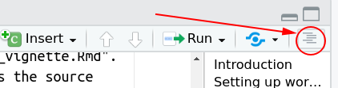
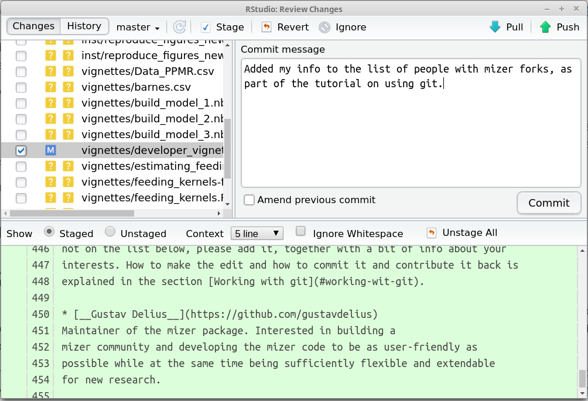
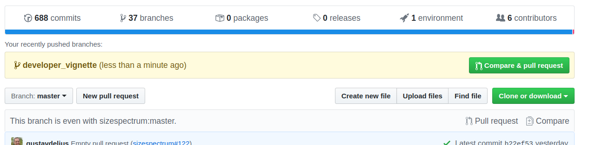

```{r setup, include = FALSE}
knitr::opts_chunk$set(
  collapse = TRUE,
  comment = "#>"
)
```

# Introduction

It initially takes a bit of effort to get the hang of how this works. Therefore
here we will take you through a little exercise that will see you create a
feature branch, make a change to a mizer file, commit that file and push it to
GitHub, and then make a pull request to contribute the change back to the core
mizer code. The change that you will be making consists of adding your name to
the list of people who have set up a fork of mizer.

We assume that you have set up your working environment and checked out your
mizer fork to your local computer as described in the section 
[Setting up working environment](developer_vignette.html#setting-up-working-environment) in
the mizer developer guide. If you have not yet read that section, please do so
now and follow all the instructions there before continuing with this tutorial.

# Creating a branch
Initially you will be on the "master" branch of your repository. The code
in this branch of your repository is a perfect copy of the code in the master
branch of the main mizer repository at https://github.com/sizespectrum/mizer.
You should always keep it that way and not commit any changes to this branch.

You should do all our development work in branches that have been branched off
from the master branch. When you start working on a feature or on a bug fix, start a new branch with a
name suggestive of the feature or fix. In this example, where you will be adding
your info to the list of people who have set up a fork of mizer, let's call the
branch "add_my_info".

To create the new branch, first make sure you have selected the master branch
on the "Switch branch" dropdown in RStudio Git panel and then click the button
to the left of that dropdown.
<center>
{width=30%}
</center>

In the dialog box enter the name for your new branch: "add_my_info". Leave 
the remote as "origin" and make sure the "Sync branch with remote" checkbox is
ticked. This means that the new branch will be created not only on your local
repository but also on your GitHub repository. Click "Create". You are now on
a new branch in your repository, but so far this branch contains only exactly
the same content as the master branch that you have branched off from.

# Editing a file

Next you will make an edit to a file. In the "Files" tab in RStudio, navigate
to the "vignette" subdirectory and click on the name "developer_vignette.Rmd".
That will open that file in the Source editor pane. That file is the source
file for this developer guide, written in [RMarkdown](https://rmarkdown.rstudio.com/) format.

A good way to navigate within files is to use the document outline which will
be displayed when you hit the right-most icon on the editor pane toolbar.
<center>
{width=30%}
</center>

You will find the subheading "People with a mizer fork" towards the bottom of
the outline. Clicking on it will move to the corresponding section of the file.
You can now add another bullet point with your name and interests. 

This is an RMarkdown file, so you can compile it by clicking on the "Knit"
button on the editor toolbar. This will also save your changes to the disk.
After a short while the resulting html file will be displayed in an RStudio
viewer which will allow you to check the formatting of your bullet point.

If you had made changes to the actual R code of mizer, then you would of course
also rebuild mizer from that new code by clicking "Install and Restart" on
the "Build" pane of RStudio to test it, and would in particular run the
automated unit tests by hitting Ctrl+Shift+T.

# Committing your changes

So far you have only saved your changes to your local disc, but have not yet
committed it to your local repository. To do that you click on the "Commit"
button on the toolbar in the "Git" pane in RStudio:
<center>
{width=40%}
</center>

This will pop up a screen like the following:
<center>
{width=70%}
</center>

The blue M to the left of the file vignettes/developer_vignette.Rmd indicates 
that this file has been modified on your hard disc. The files with the question
mark are files that are in the project directory but not part of the repository.
You now tick the file that you want to commit to the repository. In the above
screenshot the file vignettes/developer_vignette.Rmd has already been selected
and as a consequence, the lower half of the pop-up window shows the modifications
that have been made in the file. You should see your additions in green.

At the top right of the pop-up window you enter the commit message that will
allow you and others later to understand the purpose of this commit. It is
really useful to put a meaningful message here. The first time you make a commit
to a new branch, you may want to write an extended commit message that explains
what the new branch is for.

When you are happy with everything, hit the "Commit" button. Now your changes
are forever saved in the history of your local repository.

# Pushing and pulling

So far you have only committed your changes to the local repository on your
computer. The changes have not yet been synchronised with your repository on
GitHub. To do that, you click on the "Push" button on the toolbar of
the "Git" pane, the one that looks like an up arrow. A window will pop up that
will confirm if that push worked alright. You can then close that window.

After you have pushed your changes, you will be able to see them also on GitHub.
If you go to the home page of your GitHub repository you will see a comment
that you made a commit a little while ago:
<center>
{width=80%}
</center>

It may be that you have several computers on which you work an you can have a
local repository on every one of them. In that scenario, it may be that you 
have pushed changes onto your GitHub repository from another computer. You will
then not be able to push your new changes from your current computer until you have
pulled those changes onto your current computer. You do that by hitting the
"Pull" button that looks like a down arrow right next to the "Push" button.
That will incorporate any changes from GitHub into your local repository and
this will generally go smoothly. Only in the case where you have edited the 
same lines of the same file on different machines can you run into conflicts
that git can not resolve automatically. In order to avoid such conflicts,
you should pull and push frequently.


# Making a pull request

Once a feature is developed and tested, you will want to merge it into the master
branch of the upstream repository at https://github.com/sizespectrum/mizer. 
You can however not push your changes directly to that repository. Instead you
create a GitHub pull request. 
This will then get a code review from another mizer developer before one of the
developers with write access to the main repository merges your changes.

Due to this extra code review before any changes are integrated into the core
mizer code, you do not have to be hesitant with making pull requests. In case
there is anything wrong with your changes, you will get friendly feedback from
other developers. You can then make more changes and commit them to the same
branch and your pull request will automatically get updated.

The pull request is easy to create using the github web interface:

1. Go to the home page of your forked repository on GitHub
2. Select the branch via the "Branch" drop-down.
3. Click the "New pull request" button next to that drop-down.

Go ahead an create a pull request for your "add_my_info" branch.

Once your pull request has been reviewed and accepted by a developer and your
changes have thus been merged into the upstream master branch, you can
delete your development branch. There is a delete button on github to delete a
branch (for example on the page listing all your branches). You also need to
delete the branch separately in your local repository by issuing
```
git branch -d add_my_info
```
from the terminal, where `add_my_info' is the name of the development branch. 
In addition you may want to tell your local repository that the
remote branch has disappeared as well:
```
git remote prune origin
```
Otherwise it will stay in RStudio's list of remote branches.

# Merging from upstream

Once your pull request, or any pull request by anyone else with a mizer fork, has been merged into the upstream repository, the master
branch in your fork is no longer in sync with the upstream master branch.
So you will want to merge those upstream changes into our master branch.
To do that you can use the "Terminal" pane in RStudio, where you execute the
following git commands:
```
git fetch upstream
git checkout master
git merge upstream/master
```
Again, unless you locally changed the same line in the same file that someone
else changed in the upstream repository, the merging will be automatic.
You should then push the merged master branch back to your GitHub repository
with the "Push" button.

If you get an error when attempting to fetch from upstream then the upstream
repository may not yet have been set for your repository. You can check with
```
git remote -v
```
If that does not list an upstream, then execute the command
```
git remote add upstream https://github.com/sizespectrum/mizer.git
```
and then try the above again.

The first time you go through all the above steps, you will think that you will
never grow to like git. What a lot of fuss. What a circuitous route for your 
change to make it into the master branch of your GitHub repository:

1. from your editor to your 
2. from your harddrive into your development branch in your local repository via Commit
3. from you local repository to your GitHub repository via Push
4. from your GitHub repository to the main mizer repository via Pull Request
5. from the main mizer repository to you local master branch via merge
6. from your local master branch to the master branch of your GitHub repository via Push

But this is the best system software developers have come up with to allow
many people to collaborate on the same code.

You may have more than one development branch because you may be working on
several features at the same time or some of your features are still waiting
to have their pull request merged. In that case,
after merging the upstream changes into our master branch, you may also want to
merge them from your master branch into some of your development branches. For
that you just go to the development branch and do
```
git merge master
```


# People with a mizer fork

Here we information about the 
[people who have made a mizer fork](https://github.com/sizespectrum/mizer/network/members). 
If your name is
not on the list below, please add it, together with a bit of info about your
interests. How to make the edit and how to commit it and contribute it back is
explained in the section [Working with git](#working-wit-git).

* [__Gustav Delius__](https://github.com/gustavdelius) 
Maintainer of the mizer package. Interested in building a
mizer community and developing the mizer code to be as user-friendly as
possible while at the same time being sufficiently flexible and extendable 
for new research.

* [__Mariella Canales__](https://github.com/Mlla) Interested in a multispecies
size-based analysis for the pelagic fish community off Northern Chile.

